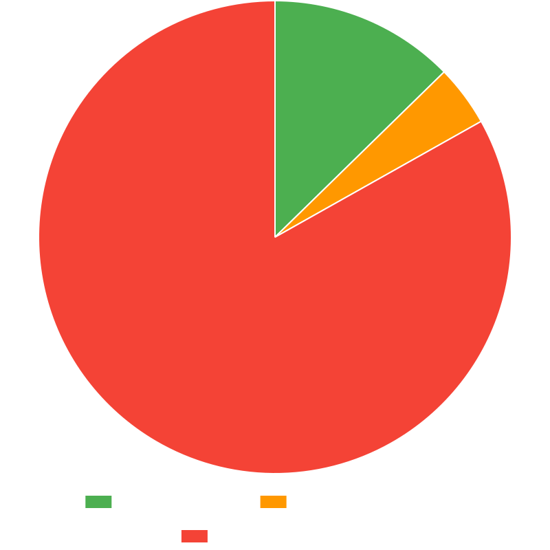

# Provenance of High Impact on npm

This repository stores the provenance status of high-impact npm packages. The package list is sourced from [wooorm/npm-high-impact](https://github.com/wooorm/npm-high-impact).

The results are generated by checking the provenance information for each package and are saved in `results.json`.

<!-- START -->

## Results

Generated time: 2025-12-11T00:24:01.284Z

Total packages: 14899

Full results in [results.json](./results.json)

### Trusted

Click to show first 500 of 1145 in total

| Package                                                                                                                                              |                                                                                                                                                                                                                                                    Downloads |
| ---------------------------------------------------------------------------------------------------------------------------------------------------- | -----------------------------------------------------------------------------------------------------------------------------------------------------------------------------------------------------------------------------------------------------------: |
| [`semver`](https://www.npmjs.com/package/semver)                                                                                                     |                                                                                                                    |
| [`emoji-regex`](https://www.npmjs.com/package/emoji-regex)                                                                                           |                                                                                                     |
| [`which`](https://www.npmjs.com/package/which)                                                                                                       |                                                                                                                       |
| [`eslint-visitor-keys`](https://www.npmjs.com/package/eslint-visitor-keys)                                                                           |                                                                             |
| [`eslint-scope`](https://www.npmjs.com/package/eslint-scope)                                                                                         |                                                                                                  |
| [`@babel/types`](https://www.npmjs.com/package/@babel/types)                                                                                         |                                                                                                  |
| [`chokidar`](https://www.npmjs.com/package/chokidar)                                                                                                 |                                                                                                              |
| [`undici-types`](https://www.npmjs.com/package/undici-types)                                                                                         |                                                                                                  |
| [`@babel/parser`](https://www.npmjs.com/package/@babel/parser)                                                                                       |                                                                                               |
| [`readdirp`](https://www.npmjs.com/package/readdirp)                                                                                                 |                                                                                                              |
| [`@babel/helper-validator-identifier`](https://www.npmjs.com/package/@babel/helper-validator-identifier)                                             |                                |
| [`ci-info`](https://www.npmjs.com/package/ci-info)                                                                                                   |                                                                                                                 |
| [`@babel/generator`](https://www.npmjs.com/package/@babel/generator)                                                                                 |                                                                                      |
| [`@babel/traverse`](https://www.npmjs.com/package/@babel/traverse)                                                                                   |                                                                                         |
| [`caniuse-lite`](https://www.npmjs.com/package/caniuse-lite)                                                                                         |                                                                                                  |
| [`@babel/core`](https://www.npmjs.com/package/@babel/core)                                                                                           |                                                                                                     |
| [`ini`](https://www.npmjs.com/package/ini)                                                                                                           |                                                                                                                             |
| [`espree`](https://www.npmjs.com/package/espree)                                                                                                     |                                                                                                                    |
| [`esbuild`](https://www.npmjs.com/package/esbuild)                                                                                                   |                                                                                                                 |
| [`@rollup/rollup-linux-x64-musl`](https://www.npmjs.com/package/@rollup/rollup-linux-x64-musl)                                                       |                                               |
| [`json-parse-even-better-errors`](https://www.npmjs.com/package/json-parse-even-better-errors)                                                       |                                               |
| [`write-file-atomic`](https://www.npmjs.com/package/write-file-atomic)                                                                               |                                                                                   |
| [`magic-string`](https://www.npmjs.com/package/magic-string)                                                                                         |                                                                                                  |
| [`hosted-git-info`](https://www.npmjs.com/package/hosted-git-info)                                                                                   |                                                                                         |
| [`@babel/compat-data`](https://www.npmjs.com/package/@babel/compat-data)                                                                             |                                                                                |
| [`@esbuild/linux-x64`](https://www.npmjs.com/package/@esbuild/linux-x64)                                                                             |                                                                                |
| [`@eslint/eslintrc`](https://www.npmjs.com/package/@eslint/eslintrc)                                                                                 |                                                                                      |
| [`@typescript-eslint/typescript-estree`](https://www.npmjs.com/package/@typescript-eslint/typescript-estree)                                         |                          |
| [`@typescript-eslint/types`](https://www.npmjs.com/package/@typescript-eslint/types)                                                                 |                                                              |
| [`prettier`](https://www.npmjs.com/package/prettier)                                                                                                 |                                                                                                              |
| [`@typescript-eslint/visitor-keys`](https://www.npmjs.com/package/@typescript-eslint/visitor-keys)                                                   |                                         |
| [`detect-libc`](https://www.npmjs.com/package/detect-libc)                                                                                           |                                                                                                     |
| [`@typescript-eslint/scope-manager`](https://www.npmjs.com/package/@typescript-eslint/scope-manager)                                                 |                                      |
| [`@eslint-community/regexpp`](https://www.npmjs.com/package/@eslint-community/regexpp)                                                               |                                                           |
| [`@img/sharp-linuxmusl-x64`](https://www.npmjs.com/package/@img/sharp-linuxmusl-x64)                                                                 |                                                              |
| [`mute-stream`](https://www.npmjs.com/package/mute-stream)                                                                                           |                                                                                                     |
| [`rollup`](https://www.npmjs.com/package/rollup)                                                                                                     |                                                                                                                    |
| [`@opentelemetry/semantic-conventions`](https://www.npmjs.com/package/@opentelemetry/semantic-conventions)                                           |                             |
| [`mdn-data`](https://www.npmjs.com/package/mdn-data)                                                                                                 |                                                                                                              |
| [`@opentelemetry/core`](https://www.npmjs.com/package/@opentelemetry/core)                                                                           |                                                                             |
| [`serialize-javascript`](https://www.npmjs.com/package/serialize-javascript)                                                                         |                                                                          |
| [`@typescript-eslint/utils`](https://www.npmjs.com/package/@typescript-eslint/utils)                                                                 |                                                              |
| [`vite`](https://www.npmjs.com/package/vite)                                                                                                         |                                                                                                                          |
| [`nopt`](https://www.npmjs.com/package/nopt)                                                                                                         |                                                                                                                          |
| [`@babel/helper-member-expression-to-functions`](https://www.npmjs.com/package/@babel/helper-member-expression-to-functions)                         |  |
| [`@typescript-eslint/parser`](https://www.npmjs.com/package/@typescript-eslint/parser)                                                               |                                                           |
| [`@rollup/rollup-linux-x64-gnu`](https://www.npmjs.com/package/@rollup/rollup-linux-x64-gnu)                                                         |                                                  |
| [`tinyglobby`](https://www.npmjs.com/package/tinyglobby)                                                                                             |                                                                                                        |
| [`abbrev`](https://www.npmjs.com/package/abbrev)                                                                                                     |                                                                                                                    |
| [`dom-accessibility-api`](https://www.npmjs.com/package/dom-accessibility-api)                                                                       |                                                                       |
| [`@typescript-eslint/eslint-plugin`](https://www.npmjs.com/package/@typescript-eslint/eslint-plugin)                                                 |                                                                                                                                                                             <a href="http://npmcharts.com/compare/@typescript-eslint/eslint-plugin">View</a> |
| [`@babel/helper-create-class-features-plugin`](https://www.npmjs.com/package/@babel/helper-create-class-features-plugin)                             |                                                                                                                                                                   <a href="http://npmcharts.com/compare/@babel/helper-create-class-features-plugin">View</a> |
| [`pnpm`](https://www.npmjs.com/package/pnpm)                                                                                                         |                                                                                                                                                                                                         <a href="http://npmcharts.com/compare/pnpm">View</a> |
| [`cacache`](https://www.npmjs.com/package/cacache)                                                                                                   |                                                                                                                                                                                                      <a href="http://npmcharts.com/compare/cacache">View</a> |
| [`ssri`](https://www.npmjs.com/package/ssri)                                                                                                         |                                                                                                                                                                                                         <a href="http://npmcharts.com/compare/ssri">View</a> |
| [`@opentelemetry/api-logs`](https://www.npmjs.com/package/@opentelemetry/api-logs)                                                                   |                                                                                                                                                                                      <a href="http://npmcharts.com/compare/@opentelemetry/api-logs">View</a> |
| [`@eslint/core`](https://www.npmjs.com/package/@eslint/core)                                                                                         |                                                                                                                                                                                                 <a href="http://npmcharts.com/compare/@eslint/core">View</a> |
| [`@typescript-eslint/type-utils`](https://www.npmjs.com/package/@typescript-eslint/type-utils)                                                       |                                                                                                                                                                                <a href="http://npmcharts.com/compare/@typescript-eslint/type-utils">View</a> |
| [`@babel/plugin-transform-destructuring`](https://www.npmjs.com/package/@babel/plugin-transform-destructuring)                                       |                                                                                                                                                                        <a href="http://npmcharts.com/compare/@babel/plugin-transform-destructuring">View</a> |
| [`@babel/helper-create-regexp-features-plugin`](https://www.npmjs.com/package/@babel/helper-create-regexp-features-plugin)                           |                                                                                                                                                                  <a href="http://npmcharts.com/compare/@babel/helper-create-regexp-features-plugin">View</a> |
| [`chai`](https://www.npmjs.com/package/chai)                                                                                                         |                                                                                                                                                                                                         <a href="http://npmcharts.com/compare/chai">View</a> |
| [`@babel/plugin-transform-block-scoping`](https://www.npmjs.com/package/@babel/plugin-transform-block-scoping)                                       |                                                                                                                                                                        <a href="http://npmcharts.com/compare/@babel/plugin-transform-block-scoping">View</a> |
| [`@eslint/plugin-kit`](https://www.npmjs.com/package/@eslint/plugin-kit)                                                                             |                                                                                                                                                                                           <a href="http://npmcharts.com/compare/@eslint/plugin-kit">View</a> |
| [`@opentelemetry/instrumentation`](https://www.npmjs.com/package/@opentelemetry/instrumentation)                                                     |                                                                                                                                                                               <a href="http://npmcharts.com/compare/@opentelemetry/instrumentation">View</a> |
| [`@img/sharp-libvips-linuxmusl-x64`](https://www.npmjs.com/package/@img/sharp-libvips-linuxmusl-x64)                                                 |                                                                                                                                                                             <a href="http://npmcharts.com/compare/@img/sharp-libvips-linuxmusl-x64">View</a> |
| [`@babel/plugin-transform-modules-systemjs`](https://www.npmjs.com/package/@babel/plugin-transform-modules-systemjs)                                 |                                                                                                                                                                     <a href="http://npmcharts.com/compare/@babel/plugin-transform-modules-systemjs">View</a> |
| [`tinyexec`](https://www.npmjs.com/package/tinyexec)                                                                                                 |                                                                                                                                                                                                     <a href="http://npmcharts.com/compare/tinyexec">View</a> |
| [`@vitest/utils`](https://www.npmjs.com/package/@vitest/utils)                                                                                       |                                                                                                                                                                                                <a href="http://npmcharts.com/compare/@vitest/utils">View</a> |
| [`immutable`](https://www.npmjs.com/package/immutable)                                                                                               |                                                                                                                                                                                                    <a href="http://npmcharts.com/compare/immutable">View</a> |
| [`@babel/plugin-transform-exponentiation-operator`](https://www.npmjs.com/package/@babel/plugin-transform-exponentiation-operator)                   |                                                                                                                                                              <a href="http://npmcharts.com/compare/@babel/plugin-transform-exponentiation-operator">View</a> |
| [`@babel/preset-env`](https://www.npmjs.com/package/@babel/preset-env)                                                                               |                                                                                                                                                                                            <a href="http://npmcharts.com/compare/@babel/preset-env">View</a> |
| [`@opentelemetry/resources`](https://www.npmjs.com/package/@opentelemetry/resources)                                                                 |                                                                                                                                                                                     <a href="http://npmcharts.com/compare/@opentelemetry/resources">View</a> |
| [`@typescript-eslint/tsconfig-utils`](https://www.npmjs.com/package/@typescript-eslint/tsconfig-utils)                                               |                                                                                                                                                                            <a href="http://npmcharts.com/compare/@typescript-eslint/tsconfig-utils">View</a> |
| [`@typescript-eslint/project-service`](https://www.npmjs.com/package/@typescript-eslint/project-service)                                             |                                                                                                                                                                           <a href="http://npmcharts.com/compare/@typescript-eslint/project-service">View</a> |
| [`unique-slug`](https://www.npmjs.com/package/unique-slug)                                                                                           |                                                                                                                                                                                                  <a href="http://npmcharts.com/compare/unique-slug">View</a> |
| [`proc-log`](https://www.npmjs.com/package/proc-log)                                                                                                 |                                                                                                                                                                                                     <a href="http://npmcharts.com/compare/proc-log">View</a> |
| [`undici`](https://www.npmjs.com/package/undici)                                                                                                     |                                                                                                                                                                                                       <a href="http://npmcharts.com/compare/undici">View</a> |
| [`@emnapi/runtime`](https://www.npmjs.com/package/@emnapi/runtime)                                                                                   |                                                                                                                                                                                              <a href="http://npmcharts.com/compare/@emnapi/runtime">View</a> |
| [`make-fetch-happen`](https://www.npmjs.com/package/make-fetch-happen)                                                                               |                                                                                                                                                                                            <a href="http://npmcharts.com/compare/make-fetch-happen">View</a> |
| [`@vitest/pretty-format`](https://www.npmjs.com/package/@vitest/pretty-format)                                                                       |                                                                                                                                                                                        <a href="http://npmcharts.com/compare/@vitest/pretty-format">View</a> |
| [`unique-filename`](https://www.npmjs.com/package/unique-filename)                                                                                   |                                                                                                                                                                                              <a href="http://npmcharts.com/compare/unique-filename">View</a> |
| [`@npmcli/fs`](https://www.npmjs.com/package/@npmcli/fs)                                                                                             |                                                                                                                                                                                                   <a href="http://npmcharts.com/compare/@npmcli/fs">View</a> |
| [`@eslint/object-schema`](https://www.npmjs.com/package/@eslint/object-schema)                                                                       |                                                                                                                                                                                        <a href="http://npmcharts.com/compare/@eslint/object-schema">View</a> |
| [`@eslint/config-array`](https://www.npmjs.com/package/@eslint/config-array)                                                                         |                                                                                                                                                                                         <a href="http://npmcharts.com/compare/@eslint/config-array">View</a> |
| [`@opentelemetry/sdk-trace-base`](https://www.npmjs.com/package/@opentelemetry/sdk-trace-base)                                                       |                                                                                                                                                                                <a href="http://npmcharts.com/compare/@opentelemetry/sdk-trace-base">View</a> |
| [`@babel/plugin-transform-typescript`](https://www.npmjs.com/package/@babel/plugin-transform-typescript)                                             |                                                                                                                                                                           <a href="http://npmcharts.com/compare/@babel/plugin-transform-typescript">View</a> |
| [`@babel/plugin-transform-optional-chaining`](https://www.npmjs.com/package/@babel/plugin-transform-optional-chaining)                               |                                                                                                                                                                    <a href="http://npmcharts.com/compare/@babel/plugin-transform-optional-chaining">View</a> |
| [`@napi-rs/wasm-runtime`](https://www.npmjs.com/package/@napi-rs/wasm-runtime)                                                                       |                                                                                                                                                                                        <a href="http://npmcharts.com/compare/@napi-rs/wasm-runtime">View</a> |
| [`@vitest/spy`](https://www.npmjs.com/package/@vitest/spy)                                                                                           |                                                                                                                                                                                                  <a href="http://npmcharts.com/compare/@vitest/spy">View</a> |
| [`@vitest/expect`](https://www.npmjs.com/package/@vitest/expect)                                                                                     |                                                                                                                                                                                               <a href="http://npmcharts.com/compare/@vitest/expect">View</a> |
| [`@babel/plugin-transform-logical-assignment-operators`](https://www.npmjs.com/package/@babel/plugin-transform-logical-assignment-operators)         |                                                                                                                                                         <a href="http://npmcharts.com/compare/@babel/plugin-transform-logical-assignment-operators">View</a> |
| [`minipass-fetch`](https://www.npmjs.com/package/minipass-fetch)                                                                                     |                                                                                                                                                                                               <a href="http://npmcharts.com/compare/minipass-fetch">View</a> |
| [`jose`](https://www.npmjs.com/package/jose)                                                                                                         |                                                                                                                                                                                                         <a href="http://npmcharts.com/compare/jose">View</a> |
| [`validate-npm-package-name`](https://www.npmjs.com/package/validate-npm-package-name)                                                               |                                                                                                                                                                                    <a href="http://npmcharts.com/compare/validate-npm-package-name">View</a> |
| [`@eslint/config-helpers`](https://www.npmjs.com/package/@eslint/config-helpers)                                                                     |                                                                                                                                                                                       <a href="http://npmcharts.com/compare/@eslint/config-helpers">View</a> |
| [`@babel/preset-typescript`](https://www.npmjs.com/package/@babel/preset-typescript)                                                                 |                                                                                                                                                                                     <a href="http://npmcharts.com/compare/@babel/preset-typescript">View</a> |
| [`npm-package-arg`](https://www.npmjs.com/package/npm-package-arg)                                                                                   |                                                                                                                                                                                              <a href="http://npmcharts.com/compare/npm-package-arg">View</a> |
| [`@emnapi/core`](https://www.npmjs.com/package/@emnapi/core)                                                                                         |                                                                                                                                                                                                 <a href="http://npmcharts.com/compare/@emnapi/core">View</a> |
| [`sharp`](https://www.npmjs.com/package/sharp)                                                                                                       |                                                                                                                                                                                                        <a href="http://npmcharts.com/compare/sharp">View</a> |
| [`node-gyp`](https://www.npmjs.com/package/node-gyp)                                                                                                 |                                                                                                                                                                                                     <a href="http://npmcharts.com/compare/node-gyp">View</a> |
| [`tinyspy`](https://www.npmjs.com/package/tinyspy)                                                                                                   |                                                                                                                                                                                                      <a href="http://npmcharts.com/compare/tinyspy">View</a> |
| [`@babel/plugin-bugfix-firefox-class-in-computed-class-key`](https://www.npmjs.com/package/@babel/plugin-bugfix-firefox-class-in-computed-class-key) |                                                                                                                                                     <a href="http://npmcharts.com/compare/@babel/plugin-bugfix-firefox-class-in-computed-class-key">View</a> |
| [`react-router-dom`](https://www.npmjs.com/package/react-router-dom)                                                                                 |                                                                                                                                                                                             <a href="http://npmcharts.com/compare/react-router-dom">View</a> |
| [`@babel/plugin-transform-runtime`](https://www.npmjs.com/package/@babel/plugin-transform-runtime)                                                   |                                                                                                                                                                              <a href="http://npmcharts.com/compare/@babel/plugin-transform-runtime">View</a> |
| [`@vitest/snapshot`](https://www.npmjs.com/package/@vitest/snapshot)                                                                                 |                                                                                                                                                                                             <a href="http://npmcharts.com/compare/@vitest/snapshot">View</a> |
| [`import-in-the-middle`](https://www.npmjs.com/package/import-in-the-middle)                                                                         |                                                                                                                                                                                         <a href="http://npmcharts.com/compare/import-in-the-middle">View</a> |
| [`@vitest/runner`](https://www.npmjs.com/package/@vitest/runner)                                                                                     |                                                                                                                                                                                               <a href="http://npmcharts.com/compare/@vitest/runner">View</a> |
| [`npm-normalize-package-bin`](https://www.npmjs.com/package/npm-normalize-package-bin)                                                               |                                                                                                                                                                                    <a href="http://npmcharts.com/compare/npm-normalize-package-bin">View</a> |
| [`sass`](https://www.npmjs.com/package/sass)                                                                                                         |                                                                                                                                                                                                         <a href="http://npmcharts.com/compare/sass">View</a> |
| [`vitest`](https://www.npmjs.com/package/vitest)                                                                                                     |                                                                                                                                                                                                       <a href="http://npmcharts.com/compare/vitest">View</a> |
| [`typescript-eslint`](https://www.npmjs.com/package/typescript-eslint)                                                                               |                                                                                                                                                                                            <a href="http://npmcharts.com/compare/typescript-eslint">View</a> |
| [`@babel/preset-react`](https://www.npmjs.com/package/@babel/preset-react)                                                                           |                                                                                                                                                                                          <a href="http://npmcharts.com/compare/@babel/preset-react">View</a> |
| [`@img/sharp-linux-x64`](https://www.npmjs.com/package/@img/sharp-linux-x64)                                                                         |                                                                                                                                                                                         <a href="http://npmcharts.com/compare/@img/sharp-linux-x64">View</a> |
| [`unplugin`](https://www.npmjs.com/package/unplugin)                                                                                                 |                                                                                                                                                                                                     <a href="http://npmcharts.com/compare/unplugin">View</a> |
| [`validator`](https://www.npmjs.com/package/validator)                                                                                               |                                                                                                                                                                                                    <a href="http://npmcharts.com/compare/validator">View</a> |
| [`@vitest/mocker`](https://www.npmjs.com/package/@vitest/mocker)                                                                                     |                                                                                                                                                                                               <a href="http://npmcharts.com/compare/@vitest/mocker">View</a> |
| [`require-in-the-middle`](https://www.npmjs.com/package/require-in-the-middle)                                                                       |                                                                                                                                                                                        <a href="http://npmcharts.com/compare/require-in-the-middle">View</a> |
| [`@img/sharp-libvips-linux-x64`](https://www.npmjs.com/package/@img/sharp-libvips-linux-x64)                                                         |                                                                                                                                                                                 <a href="http://npmcharts.com/compare/@img/sharp-libvips-linux-x64">View</a> |
| [`napi-postinstall`](https://www.npmjs.com/package/napi-postinstall)                                                                                 |                                                                                                                                                                                             <a href="http://npmcharts.com/compare/napi-postinstall">View</a> |
| [`vite-node`](https://www.npmjs.com/package/vite-node)                                                                                               |                                                                                                                                                                                                    <a href="http://npmcharts.com/compare/vite-node">View</a> |
| [`@rolldown/pluginutils`](https://www.npmjs.com/package/@rolldown/pluginutils)                                                                       |                                                                                                                                                                                        <a href="http://npmcharts.com/compare/@rolldown/pluginutils">View</a> |
| [`pino`](https://www.npmjs.com/package/pino)                                                                                                         |                                                                                                                                                                                                         <a href="http://npmcharts.com/compare/pino">View</a> |
| [`@vitejs/plugin-react`](https://www.npmjs.com/package/@vitejs/plugin-react)                                                                         |                                                                                                                                                                                         <a href="http://npmcharts.com/compare/@vitejs/plugin-react">View</a> |
| [`exponential-backoff`](https://www.npmjs.com/package/exponential-backoff)                                                                           |                                                                                                                                                                                          <a href="http://npmcharts.com/compare/exponential-backoff">View</a> |
| [`tinybench`](https://www.npmjs.com/package/tinybench)                                                                                               |                                                                                                                                                                                                    <a href="http://npmcharts.com/compare/tinybench">View</a> |
| [`tinypool`](https://www.npmjs.com/package/tinypool)                                                                                                 |                                                                                                                                                                                                     <a href="http://npmcharts.com/compare/tinypool">View</a> |
| [`@opentelemetry/sdk-metrics`](https://www.npmjs.com/package/@opentelemetry/sdk-metrics)                                                             |                                                                                                                                                                                   <a href="http://npmcharts.com/compare/@opentelemetry/sdk-metrics">View</a> |
| [`lint-staged`](https://www.npmjs.com/package/lint-staged)                                                                                           |                                                                                                                                                                                                  <a href="http://npmcharts.com/compare/lint-staged">View</a> |
| [`@swc/core`](https://www.npmjs.com/package/@swc/core)                                                                                               |                                                                                                                                                                                                    <a href="http://npmcharts.com/compare/@swc/core">View</a> |
| [`postcss-merge-rules`](https://www.npmjs.com/package/postcss-merge-rules)                                                                           |                                                                                                                                                                                          <a href="http://npmcharts.com/compare/postcss-merge-rules">View</a> |
| [`tailwind-merge`](https://www.npmjs.com/package/tailwind-merge)                                                                                     |                                                                                                                                                                                               <a href="http://npmcharts.com/compare/tailwind-merge">View</a> |
| [`postcss-minify-params`](https://www.npmjs.com/package/postcss-minify-params)                                                                       |                                                                                                                                                                                        <a href="http://npmcharts.com/compare/postcss-minify-params">View</a> |
| [`lucide-react`](https://www.npmjs.com/package/lucide-react)                                                                                         |                                                                                                                                                                                                 <a href="http://npmcharts.com/compare/lucide-react">View</a> |
| [`postcss-discard-comments`](https://www.npmjs.com/package/postcss-discard-comments)                                                                 |                                                                                                                                                                                     <a href="http://npmcharts.com/compare/postcss-discard-comments">View</a> |
| [`@vue/shared`](https://www.npmjs.com/package/@vue/shared)                                                                                           |                                                                                                                                                                                                  <a href="http://npmcharts.com/compare/@vue/shared">View</a> |
| [`eslint-plugin-jest`](https://www.npmjs.com/package/eslint-plugin-jest)                                                                             |                                                                                                                                                                                           <a href="http://npmcharts.com/compare/eslint-plugin-jest">View</a> |
| [`stylehacks`](https://www.npmjs.com/package/stylehacks)                                                                                             |                                                                                                                                                                                                   <a href="http://npmcharts.com/compare/stylehacks">View</a> |
| [`cssnano`](https://www.npmjs.com/package/cssnano)                                                                                                   |                                                                                                                                                                                                      <a href="http://npmcharts.com/compare/cssnano">View</a> |
| [`postcss-normalize-unicode`](https://www.npmjs.com/package/postcss-normalize-unicode)                                                               |                                                                                                                                                                                    <a href="http://npmcharts.com/compare/postcss-normalize-unicode">View</a> |
| [`@swc/core-linux-x64-gnu`](https://www.npmjs.com/package/@swc/core-linux-x64-gnu)                                                                   |                                                                                                                                                                                      <a href="http://npmcharts.com/compare/@swc/core-linux-x64-gnu">View</a> |
| [`devtools-protocol`](https://www.npmjs.com/package/devtools-protocol)                                                                               |                                                                                                                                                                                            <a href="http://npmcharts.com/compare/devtools-protocol">View</a> |
| [`@opentelemetry/context-async-hooks`](https://www.npmjs.com/package/@opentelemetry/context-async-hooks)                                             |                                                                                                                                                                           <a href="http://npmcharts.com/compare/@opentelemetry/context-async-hooks">View</a> |
| [`postcss-colormin`](https://www.npmjs.com/package/postcss-colormin)                                                                                 |                                                                                                                                                                                             <a href="http://npmcharts.com/compare/postcss-colormin">View</a> |
| [`postcss-reduce-initial`](https://www.npmjs.com/package/postcss-reduce-initial)                                                                     |                                                                                                                                                                                       <a href="http://npmcharts.com/compare/postcss-reduce-initial">View</a> |
| [`postcss-convert-values`](https://www.npmjs.com/package/postcss-convert-values)                                                                     |                                                                                                                                                                                       <a href="http://npmcharts.com/compare/postcss-convert-values">View</a> |
| [`strip-literal`](https://www.npmjs.com/package/strip-literal)                                                                                       |                                                                                                                                                                                                <a href="http://npmcharts.com/compare/strip-literal">View</a> |
| [`zustand`](https://www.npmjs.com/package/zustand)                                                                                                   |                                                                                                                                                                                                      <a href="http://npmcharts.com/compare/zustand">View</a> |
| [`cssnano-preset-default`](https://www.npmjs.com/package/cssnano-preset-default)                                                                     |                                                                                                                                                                                       <a href="http://npmcharts.com/compare/cssnano-preset-default">View</a> |
| [`@vue/compiler-core`](https://www.npmjs.com/package/@vue/compiler-core)                                                                             |                                                                                                                                                                                           <a href="http://npmcharts.com/compare/@vue/compiler-core">View</a> |
| [`@npmcli/agent`](https://www.npmjs.com/package/@npmcli/agent)                                                                                       |                                                                                                                                                                                                <a href="http://npmcharts.com/compare/@npmcli/agent">View</a> |
| [`node-abi`](https://www.npmjs.com/package/node-abi)                                                                                                 |                                                                                                                                                                                                     <a href="http://npmcharts.com/compare/node-abi">View</a> |
| [`npm-pick-manifest`](https://www.npmjs.com/package/npm-pick-manifest)                                                                               |                                                                                                                                                                                            <a href="http://npmcharts.com/compare/npm-pick-manifest">View</a> |
| [`playwright-core`](https://www.npmjs.com/package/playwright-core)                                                                                   |                                                                                                                                                                                              <a href="http://npmcharts.com/compare/playwright-core">View</a> |
| [`@opentelemetry/sdk-logs`](https://www.npmjs.com/package/@opentelemetry/sdk-logs)                                                                   |                                                                                                                                                                                      <a href="http://npmcharts.com/compare/@opentelemetry/sdk-logs">View</a> |
| [`@vue/compiler-dom`](https://www.npmjs.com/package/@vue/compiler-dom)                                                                               |                                                                                                                                                                                            <a href="http://npmcharts.com/compare/@vue/compiler-dom">View</a> |
| [`@vue/compiler-sfc`](https://www.npmjs.com/package/@vue/compiler-sfc)                                                                               |                                                                                                                                                                                            <a href="http://npmcharts.com/compare/@vue/compiler-sfc">View</a> |
| [`npm-packlist`](https://www.npmjs.com/package/npm-packlist)                                                                                         |                                                                                                                                                                                                 <a href="http://npmcharts.com/compare/npm-packlist">View</a> |
| [`npm-bundled`](https://www.npmjs.com/package/npm-bundled)                                                                                           |                                                                                                                                                                                                  <a href="http://npmcharts.com/compare/npm-bundled">View</a> |
| [`react-router`](https://www.npmjs.com/package/react-router)                                                                                         |                                                                                                                                                                                                 <a href="http://npmcharts.com/compare/react-router">View</a> |
| [`@npmcli/promise-spawn`](https://www.npmjs.com/package/@npmcli/promise-spawn)                                                                       |                                                                                                                                                                                        <a href="http://npmcharts.com/compare/@npmcli/promise-spawn">View</a> |
| [`@esbuild/linux-arm64`](https://www.npmjs.com/package/@esbuild/linux-arm64)                                                                         |                                                                                                                                                                                         <a href="http://npmcharts.com/compare/@esbuild/linux-arm64">View</a> |
| [`@opentelemetry/otlp-transformer`](https://www.npmjs.com/package/@opentelemetry/otlp-transformer)                                                   |                                                                                                                                                                              <a href="http://npmcharts.com/compare/@opentelemetry/otlp-transformer">View</a> |
| [`npm-install-checks`](https://www.npmjs.com/package/npm-install-checks)                                                                             |                                                                                                                                                                                           <a href="http://npmcharts.com/compare/npm-install-checks">View</a> |
| [`@vue/compiler-ssr`](https://www.npmjs.com/package/@vue/compiler-ssr)                                                                               |                                                                                                                                                                                            <a href="http://npmcharts.com/compare/@vue/compiler-ssr">View</a> |
| [`@opentelemetry/otlp-exporter-base`](https://www.npmjs.com/package/@opentelemetry/otlp-exporter-base)                                               |                                                                                                                                                                            <a href="http://npmcharts.com/compare/@opentelemetry/otlp-exporter-base">View</a> |
| [`playwright`](https://www.npmjs.com/package/playwright)                                                                                             |                                                                                                                                                                                                   <a href="http://npmcharts.com/compare/playwright">View</a> |
| [`@swc/core-linux-x64-musl`](https://www.npmjs.com/package/@swc/core-linux-x64-musl)                                                                 |                                                                                                                                                                                     <a href="http://npmcharts.com/compare/@swc/core-linux-x64-musl">View</a> |
| [`magicast`](https://www.npmjs.com/package/magicast)                                                                                                 |                                                                                                                                                                                                     <a href="http://npmcharts.com/compare/magicast">View</a> |
| [`@npmcli/git`](https://www.npmjs.com/package/@npmcli/git)                                                                                           |                                                                                                                                                                                                  <a href="http://npmcharts.com/compare/@npmcli/git">View</a> |
| [`@opentelemetry/instrumentation-http`](https://www.npmjs.com/package/@opentelemetry/instrumentation-http)                                           |                                                                                                                                                                          <a href="http://npmcharts.com/compare/@opentelemetry/instrumentation-http">View</a> |
| [`puppeteer-core`](https://www.npmjs.com/package/puppeteer-core)                                                                                     |                                                                                                                                                                                               <a href="http://npmcharts.com/compare/puppeteer-core">View</a> |
| [`npm-registry-fetch`](https://www.npmjs.com/package/npm-registry-fetch)                                                                             |                                                                                                                                                                                           <a href="http://npmcharts.com/compare/npm-registry-fetch">View</a> |
| [`@mui/utils`](https://www.npmjs.com/package/@mui/utils)                                                                                             |                                                                                                                                                                                                   <a href="http://npmcharts.com/compare/@mui/utils">View</a> |
| [`@esbuild/darwin-arm64`](https://www.npmjs.com/package/@esbuild/darwin-arm64)                                                                       |                                                                                                                                                                                        <a href="http://npmcharts.com/compare/@esbuild/darwin-arm64">View</a> |
| [`local-pkg`](https://www.npmjs.com/package/local-pkg)                                                                                               |                                                                                                                                                                                                    <a href="http://npmcharts.com/compare/local-pkg">View</a> |
| [`@aws/lambda-invoke-store`](https://www.npmjs.com/package/@aws/lambda-invoke-store)                                                                 |                                                                                                                                                                                     <a href="http://npmcharts.com/compare/@aws/lambda-invoke-store">View</a> |
| [`@esbuild/win32-x64`](https://www.npmjs.com/package/@esbuild/win32-x64)                                                                             |                                                                                                                                                                                           <a href="http://npmcharts.com/compare/@esbuild/win32-x64">View</a> |
| [`@babel/eslint-parser`](https://www.npmjs.com/package/@babel/eslint-parser)                                                                         |                                                                                                                                                                                         <a href="http://npmcharts.com/compare/@babel/eslint-parser">View</a> |
| [`pacote`](https://www.npmjs.com/package/pacote)                                                                                                     |                                                                                                                                                                                                       <a href="http://npmcharts.com/compare/pacote">View</a> |
| [`@opentelemetry/instrumentation-express`](https://www.npmjs.com/package/@opentelemetry/instrumentation-express)                                     |                                                                                                                                                                       <a href="http://npmcharts.com/compare/@opentelemetry/instrumentation-express">View</a> |
| [`@npmcli/run-script`](https://www.npmjs.com/package/@npmcli/run-script)                                                                             |                                                                                                                                                                                           <a href="http://npmcharts.com/compare/@npmcli/run-script">View</a> |
| [`@npmcli/package-json`](https://www.npmjs.com/package/@npmcli/package-json)                                                                         |                                                                                                                                                                                         <a href="http://npmcharts.com/compare/@npmcli/package-json">View</a> |
| [`@opentelemetry/instrumentation-pg`](https://www.npmjs.com/package/@opentelemetry/instrumentation-pg)                                               |                                                                                                                                                                            <a href="http://npmcharts.com/compare/@opentelemetry/instrumentation-pg">View</a> |
| [`@opentelemetry/instrumentation-mongodb`](https://www.npmjs.com/package/@opentelemetry/instrumentation-mongodb)                                     |                                                                                                                                                                       <a href="http://npmcharts.com/compare/@opentelemetry/instrumentation-mongodb">View</a> |
| [`@esbuild/darwin-x64`](https://www.npmjs.com/package/@esbuild/darwin-x64)                                                                           |                                                                                                                                                                                          <a href="http://npmcharts.com/compare/@esbuild/darwin-x64">View</a> |
| [`@mui/types`](https://www.npmjs.com/package/@mui/types)                                                                                             |                                                                                                                                                                                                   <a href="http://npmcharts.com/compare/@mui/types">View</a> |
| [`isbinaryfile`](https://www.npmjs.com/package/isbinaryfile)                                                                                         |                                                                                                                                                                                                 <a href="http://npmcharts.com/compare/isbinaryfile">View</a> |
| [`@opentelemetry/instrumentation-mongoose`](https://www.npmjs.com/package/@opentelemetry/instrumentation-mongoose)                                   |                                                                                                                                                                      <a href="http://npmcharts.com/compare/@opentelemetry/instrumentation-mongoose">View</a> |
| [`@opentelemetry/redis-common`](https://www.npmjs.com/package/@opentelemetry/redis-common)                                                           |                                                                                                                                                                                  <a href="http://npmcharts.com/compare/@opentelemetry/redis-common">View</a> |
| [`@puppeteer/browsers`](https://www.npmjs.com/package/@puppeteer/browsers)                                                                           |                                                                                                                                                                                          <a href="http://npmcharts.com/compare/@puppeteer/browsers">View</a> |
| [`@opentelemetry/instrumentation-hapi`](https://www.npmjs.com/package/@opentelemetry/instrumentation-hapi)                                           |                                                                                                                                                                          <a href="http://npmcharts.com/compare/@opentelemetry/instrumentation-hapi">View</a> |
| [`@npmcli/node-gyp`](https://www.npmjs.com/package/@npmcli/node-gyp)                                                                                 |                                                                                                                                                                                             <a href="http://npmcharts.com/compare/@npmcli/node-gyp">View</a> |
| [`@vitest/coverage-v8`](https://www.npmjs.com/package/@vitest/coverage-v8)                                                                           |                                                                                                                                                                                          <a href="http://npmcharts.com/compare/@vitest/coverage-v8">View</a> |
| [`@esbuild/linux-loong64`](https://www.npmjs.com/package/@esbuild/linux-loong64)                                                                     |                                                                                                                                                                                       <a href="http://npmcharts.com/compare/@esbuild/linux-loong64">View</a> |
| [`@opentelemetry/instrumentation-knex`](https://www.npmjs.com/package/@opentelemetry/instrumentation-knex)                                           |                                                                                                                                                                          <a href="http://npmcharts.com/compare/@opentelemetry/instrumentation-knex">View</a> |
| [`@opentelemetry/instrumentation-mysql`](https://www.npmjs.com/package/@opentelemetry/instrumentation-mysql)                                         |                                                                                                                                                                         <a href="http://npmcharts.com/compare/@opentelemetry/instrumentation-mysql">View</a> |
| [`@esbuild/win32-arm64`](https://www.npmjs.com/package/@esbuild/win32-arm64)                                                                         |                                                                                                                                                                                         <a href="http://npmcharts.com/compare/@esbuild/win32-arm64">View</a> |
| [`@opentelemetry/instrumentation-fs`](https://www.npmjs.com/package/@opentelemetry/instrumentation-fs)                                               |                                                                                                                                                                            <a href="http://npmcharts.com/compare/@opentelemetry/instrumentation-fs">View</a> |
| [`@esbuild/openbsd-x64`](https://www.npmjs.com/package/@esbuild/openbsd-x64)                                                                         |                                                                                                                                                                                         <a href="http://npmcharts.com/compare/@esbuild/openbsd-x64">View</a> |
| [`@esbuild/win32-ia32`](https://www.npmjs.com/package/@esbuild/win32-ia32)                                                                           |                                                                                                                                                                                          <a href="http://npmcharts.com/compare/@esbuild/win32-ia32">View</a> |
| [`@esbuild/linux-ppc64`](https://www.npmjs.com/package/@esbuild/linux-ppc64)                                                                         |                                                                                                                                                                                         <a href="http://npmcharts.com/compare/@esbuild/linux-ppc64">View</a> |
| [`@esbuild/netbsd-x64`](https://www.npmjs.com/package/@esbuild/netbsd-x64)                                                                           |                                                                                                                                                                                          <a href="http://npmcharts.com/compare/@esbuild/netbsd-x64">View</a> |
| [`@opentelemetry/instrumentation-ioredis`](https://www.npmjs.com/package/@opentelemetry/instrumentation-ioredis)                                     |                                                                                                                                                                       <a href="http://npmcharts.com/compare/@opentelemetry/instrumentation-ioredis">View</a> |
| [`@npmcli/installed-package-contents`](https://www.npmjs.com/package/@npmcli/installed-package-contents)                                             |                                                                                                                                                                           <a href="http://npmcharts.com/compare/@npmcli/installed-package-contents">View</a> |
| [`@opentelemetry/instrumentation-graphql`](https://www.npmjs.com/package/@opentelemetry/instrumentation-graphql)                                     |                                                                                                                                                                       <a href="http://npmcharts.com/compare/@opentelemetry/instrumentation-graphql">View</a> |
| [`@opentelemetry/instrumentation-connect`](https://www.npmjs.com/package/@opentelemetry/instrumentation-connect)                                     |                                                                                                                                                                       <a href="http://npmcharts.com/compare/@opentelemetry/instrumentation-connect">View</a> |
| [`@esbuild/linux-arm`](https://www.npmjs.com/package/@esbuild/linux-arm)                                                                             |                                                                                                                                                                                           <a href="http://npmcharts.com/compare/@esbuild/linux-arm">View</a> |
| [`@esbuild/android-arm64`](https://www.npmjs.com/package/@esbuild/android-arm64)                                                                     |                                                                                                                                                                                       <a href="http://npmcharts.com/compare/@esbuild/android-arm64">View</a> |
| [`@esbuild/linux-riscv64`](https://www.npmjs.com/package/@esbuild/linux-riscv64)                                                                     |                                                                                                                                                                                       <a href="http://npmcharts.com/compare/@esbuild/linux-riscv64">View</a> |
| [`@opentelemetry/instrumentation-tedious`](https://www.npmjs.com/package/@opentelemetry/instrumentation-tedious)                                     |                                                                                                                                                                       <a href="http://npmcharts.com/compare/@opentelemetry/instrumentation-tedious">View</a> |
| [`@opentelemetry/instrumentation-koa`](https://www.npmjs.com/package/@opentelemetry/instrumentation-koa)                                             |                                                                                                                                                                           <a href="http://npmcharts.com/compare/@opentelemetry/instrumentation-koa">View</a> |
| [`@opentelemetry/instrumentation-mysql2`](https://www.npmjs.com/package/@opentelemetry/instrumentation-mysql2)                                       |                                                                                                                                                                        <a href="http://npmcharts.com/compare/@opentelemetry/instrumentation-mysql2">View</a> |
| [`@opentelemetry/instrumentation-lru-memoizer`](https://www.npmjs.com/package/@opentelemetry/instrumentation-lru-memoizer)                           |                                                                                                                                                                  <a href="http://npmcharts.com/compare/@opentelemetry/instrumentation-lru-memoizer">View</a> |
| [`@esbuild/freebsd-x64`](https://www.npmjs.com/package/@esbuild/freebsd-x64)                                                                         |                                                                                                                                                                                         <a href="http://npmcharts.com/compare/@esbuild/freebsd-x64">View</a> |
| [`@opentelemetry/instrumentation-generic-pool`](https://www.npmjs.com/package/@opentelemetry/instrumentation-generic-pool)                           |                                                                                                                                                                  <a href="http://npmcharts.com/compare/@opentelemetry/instrumentation-generic-pool">View</a> |
| [`@esbuild/linux-mips64el`](https://www.npmjs.com/package/@esbuild/linux-mips64el)                                                                   |                                                                                                                                                                                      <a href="http://npmcharts.com/compare/@esbuild/linux-mips64el">View</a> |
| [`@esbuild/freebsd-arm64`](https://www.npmjs.com/package/@esbuild/freebsd-arm64)                                                                     |                                                                                                                                                                                       <a href="http://npmcharts.com/compare/@esbuild/freebsd-arm64">View</a> |
| [`vue`](https://www.npmjs.com/package/vue)                                                                                                           |                                                                                                                                                                                                          <a href="http://npmcharts.com/compare/vue">View</a> |
| [`chromium-bidi`](https://www.npmjs.com/package/chromium-bidi)                                                                                       |                                                                                                                                                                                                <a href="http://npmcharts.com/compare/chromium-bidi">View</a> |
| [`eslint-plugin-react-refresh`](https://www.npmjs.com/package/eslint-plugin-react-refresh)                                                           |                                                                                                                                                                                  <a href="http://npmcharts.com/compare/eslint-plugin-react-refresh">View</a> |
| [`@opentelemetry/instrumentation-amqplib`](https://www.npmjs.com/package/@opentelemetry/instrumentation-amqplib)                                     |                                                                                                                                                                       <a href="http://npmcharts.com/compare/@opentelemetry/instrumentation-amqplib">View</a> |
| [`@esbuild/linux-ia32`](https://www.npmjs.com/package/@esbuild/linux-ia32)                                                                           |                                                                                                                                                                                          <a href="http://npmcharts.com/compare/@esbuild/linux-ia32">View</a> |
| [`@esbuild/android-arm`](https://www.npmjs.com/package/@esbuild/android-arm)                                                                         |                                                                                                                                                                                         <a href="http://npmcharts.com/compare/@esbuild/android-arm">View</a> |
| [`@esbuild/linux-s390x`](https://www.npmjs.com/package/@esbuild/linux-s390x)                                                                         |                                                                                                                                                                                         <a href="http://npmcharts.com/compare/@esbuild/linux-s390x">View</a> |
| [`zod-validation-error`](https://www.npmjs.com/package/zod-validation-error)                                                                         |                                                                                                                                                                                         <a href="http://npmcharts.com/compare/zod-validation-error">View</a> |
| [`eslint-plugin-testing-library`](https://www.npmjs.com/package/eslint-plugin-testing-library)                                                       |                                                                                                                                                                                <a href="http://npmcharts.com/compare/eslint-plugin-testing-library">View</a> |
| [`nodemailer`](https://www.npmjs.com/package/nodemailer)                                                                                             |                                                                                                                                                                                                   <a href="http://npmcharts.com/compare/nodemailer">View</a> |
| [`@opentelemetry/sdk-trace-node`](https://www.npmjs.com/package/@opentelemetry/sdk-trace-node)                                                       |                                                                                                                                                                                <a href="http://npmcharts.com/compare/@opentelemetry/sdk-trace-node">View</a> |
| [`@esbuild/android-x64`](https://www.npmjs.com/package/@esbuild/android-x64)                                                                         |                                                                                                                                                                                         <a href="http://npmcharts.com/compare/@esbuild/android-x64">View</a> |
| [`@esbuild/sunos-x64`](https://www.npmjs.com/package/@esbuild/sunos-x64)                                                                             |                                                                                                                                                                                           <a href="http://npmcharts.com/compare/@esbuild/sunos-x64">View</a> |
| [`@mui/system`](https://www.npmjs.com/package/@mui/system)                                                                                           |                                                                                                                                                                                                  <a href="http://npmcharts.com/compare/@mui/system">View</a> |
| [`@opentelemetry/exporter-trace-otlp-http`](https://www.npmjs.com/package/@opentelemetry/exporter-trace-otlp-http)                                   |                                                                                                                                                                      <a href="http://npmcharts.com/compare/@opentelemetry/exporter-trace-otlp-http">View</a> |
| [`@prisma/engines-version`](https://www.npmjs.com/package/@prisma/engines-version)                                                                   |                                                                                                                                                                                      <a href="http://npmcharts.com/compare/@prisma/engines-version">View</a> |
| [`tuf-js`](https://www.npmjs.com/package/tuf-js)                                                                                                     |                                                                                                                                                                                                       <a href="http://npmcharts.com/compare/tuf-js">View</a> |
| [`@sigstore/tuf`](https://www.npmjs.com/package/@sigstore/tuf)                                                                                       |                                                                                                                                                                                                <a href="http://npmcharts.com/compare/@sigstore/tuf">View</a> |
| [`read-package-json-fast`](https://www.npmjs.com/package/read-package-json-fast)                                                                     |                                                                                                                                                                                       <a href="http://npmcharts.com/compare/read-package-json-fast">View</a> |
| [`@opentelemetry/propagator-b3`](https://www.npmjs.com/package/@opentelemetry/propagator-b3)                                                         |                                                                                                                                                                                 <a href="http://npmcharts.com/compare/@opentelemetry/propagator-b3">View</a> |
| [`@opentelemetry/sql-common`](https://www.npmjs.com/package/@opentelemetry/sql-common)                                                               |                                                                                                                                                                                    <a href="http://npmcharts.com/compare/@opentelemetry/sql-common">View</a> |
| [`@mui/private-theming`](https://www.npmjs.com/package/@mui/private-theming)                                                                         |                                                                                                                                                                                         <a href="http://npmcharts.com/compare/@mui/private-theming">View</a> |
| [`@sigstore/bundle`](https://www.npmjs.com/package/@sigstore/bundle)                                                                                 |                                                                                                                                                                                             <a href="http://npmcharts.com/compare/@sigstore/bundle">View</a> |
| [`sigstore`](https://www.npmjs.com/package/sigstore)                                                                                                 |                                                                                                                                                                                                     <a href="http://npmcharts.com/compare/sigstore">View</a> |
| [`fast-check`](https://www.npmjs.com/package/fast-check)                                                                                             |                                                                                                                                                                                                   <a href="http://npmcharts.com/compare/fast-check">View</a> |
| [`@opentelemetry/propagator-jaeger`](https://www.npmjs.com/package/@opentelemetry/propagator-jaeger)                                                 |                                                                                                                                                                             <a href="http://npmcharts.com/compare/@opentelemetry/propagator-jaeger">View</a> |
| [`@mui/material`](https://www.npmjs.com/package/@mui/material)                                                                                       |                                                                                                                                                                                                <a href="http://npmcharts.com/compare/@mui/material">View</a> |
| [`@sigstore/sign`](https://www.npmjs.com/package/@sigstore/sign)                                                                                     |                                                                                                                                                                                               <a href="http://npmcharts.com/compare/@sigstore/sign">View</a> |
| [`@playwright/test`](https://www.npmjs.com/package/@playwright/test)                                                                                 |                                                                                                                                                                                             <a href="http://npmcharts.com/compare/@playwright/test">View</a> |
| [`@opentelemetry/instrumentation-dataloader`](https://www.npmjs.com/package/@opentelemetry/instrumentation-dataloader)                               |                                                                                                                                                                    <a href="http://npmcharts.com/compare/@opentelemetry/instrumentation-dataloader">View</a> |
| [`@opentelemetry/instrumentation-undici`](https://www.npmjs.com/package/@opentelemetry/instrumentation-undici)                                       |                                                                                                                                                                        <a href="http://npmcharts.com/compare/@opentelemetry/instrumentation-undici">View</a> |
| [`@mui/styled-engine`](https://www.npmjs.com/package/@mui/styled-engine)                                                                             |                                                                                                                                                                                           <a href="http://npmcharts.com/compare/@mui/styled-engine">View</a> |
| [`read`](https://www.npmjs.com/package/read)                                                                                                         |                                                                                                                                                                                                         <a href="http://npmcharts.com/compare/read">View</a> |
| [`@tufjs/models`](https://www.npmjs.com/package/@tufjs/models)                                                                                       |                                                                                                                                                                                                <a href="http://npmcharts.com/compare/@tufjs/models">View</a> |
| [`@vue/server-renderer`](https://www.npmjs.com/package/@vue/server-renderer)                                                                         |                                                                                                                                                                                         <a href="http://npmcharts.com/compare/@vue/server-renderer">View</a> |
| [`stylelint`](https://www.npmjs.com/package/stylelint)                                                                                               |                                                                                                                                                                                                    <a href="http://npmcharts.com/compare/stylelint">View</a> |
| [`puppeteer`](https://www.npmjs.com/package/puppeteer)                                                                                               |                                                                                                                                                                                                    <a href="http://npmcharts.com/compare/puppeteer">View</a> |
| [`turbo`](https://www.npmjs.com/package/turbo)                                                                                                       |                                                                                                                                                                                                        <a href="http://npmcharts.com/compare/turbo">View</a> |
| [`@vue/reactivity`](https://www.npmjs.com/package/@vue/reactivity)                                                                                   |                                                                                                                                                                                              <a href="http://npmcharts.com/compare/@vue/reactivity">View</a> |
| [`@opentelemetry/instrumentation-kafkajs`](https://www.npmjs.com/package/@opentelemetry/instrumentation-kafkajs)                                     |                                                                                                                                                                       <a href="http://npmcharts.com/compare/@opentelemetry/instrumentation-kafkajs">View</a> |
| [`@supabase/storage-js`](https://www.npmjs.com/package/@supabase/storage-js)                                                                         |                                                                                                                                                                                         <a href="http://npmcharts.com/compare/@supabase/storage-js">View</a> |
| [`@supabase/postgrest-js`](https://www.npmjs.com/package/@supabase/postgrest-js)                                                                     |                                                                                                                                                                                       <a href="http://npmcharts.com/compare/@supabase/postgrest-js">View</a> |
| [`@supabase/functions-js`](https://www.npmjs.com/package/@supabase/functions-js)                                                                     |                                                                                                                                                                                       <a href="http://npmcharts.com/compare/@supabase/functions-js">View</a> |
| [`effect`](https://www.npmjs.com/package/effect)                                                                                                     |                                                                                                                                                                                                       <a href="http://npmcharts.com/compare/effect">View</a> |
| [`@vue/runtime-dom`](https://www.npmjs.com/package/@vue/runtime-dom)                                                                                 |                                                                                                                                                                                             <a href="http://npmcharts.com/compare/@vue/runtime-dom">View</a> |
| [`@module-federation/sdk`](https://www.npmjs.com/package/@module-federation/sdk)                                                                     |                                                                                                                                                                                       <a href="http://npmcharts.com/compare/@module-federation/sdk">View</a> |
| [`@nx/devkit`](https://www.npmjs.com/package/@nx/devkit)                                                                                             |                                                                                                                                                                                                   <a href="http://npmcharts.com/compare/@nx/devkit">View</a> |
| [`@supabase/auth-js`](https://www.npmjs.com/package/@supabase/auth-js)                                                                               |                                                                                                                                                                                            <a href="http://npmcharts.com/compare/@supabase/auth-js">View</a> |
| [`@vue/runtime-core`](https://www.npmjs.com/package/@vue/runtime-core)                                                                               |                                                                                                                                                                                            <a href="http://npmcharts.com/compare/@vue/runtime-core">View</a> |
| [`@storybook/icons`](https://www.npmjs.com/package/@storybook/icons)                                                                                 |                                                                                                                                                                                             <a href="http://npmcharts.com/compare/@storybook/icons">View</a> |
| [`@esbuild/aix-ppc64`](https://www.npmjs.com/package/@esbuild/aix-ppc64)                                                                             |                                                                                                                                                                                           <a href="http://npmcharts.com/compare/@esbuild/aix-ppc64">View</a> |
| [`@supabase/realtime-js`](https://www.npmjs.com/package/@supabase/realtime-js)                                                                       |                                                                                                                                                                                        <a href="http://npmcharts.com/compare/@supabase/realtime-js">View</a> |
| [`@mui/core-downloads-tracker`](https://www.npmjs.com/package/@mui/core-downloads-tracker)                                                           |                                                                                                                                                                                  <a href="http://npmcharts.com/compare/@mui/core-downloads-tracker">View</a> |
| [`@tanstack/react-virtual`](https://www.npmjs.com/package/@tanstack/react-virtual)                                                                   |                                                                                                                                                                                      <a href="http://npmcharts.com/compare/@tanstack/react-virtual">View</a> |
| [`@supabase/supabase-js`](https://www.npmjs.com/package/@supabase/supabase-js)                                                                       |                                                                                                                                                                                        <a href="http://npmcharts.com/compare/@supabase/supabase-js">View</a> |
| [`@opentelemetry/otlp-grpc-exporter-base`](https://www.npmjs.com/package/@opentelemetry/otlp-grpc-exporter-base)                                     |                                                                                                                                                                       <a href="http://npmcharts.com/compare/@opentelemetry/otlp-grpc-exporter-base">View</a> |
| [`@storybook/addon-docs`](https://www.npmjs.com/package/@storybook/addon-docs)                                                                       |                                                                                                                                                                                        <a href="http://npmcharts.com/compare/@storybook/addon-docs">View</a> |
| [`quansync`](https://www.npmjs.com/package/quansync)                                                                                                 |                                                                                                                                                                                                     <a href="http://npmcharts.com/compare/quansync">View</a> |
| [`@storybook/react`](https://www.npmjs.com/package/@storybook/react)                                                                                 |                                                                                                                                                                                             <a href="http://npmcharts.com/compare/@storybook/react">View</a> |
| [`koa`](https://www.npmjs.com/package/koa)                                                                                                           |                                                                                                                                                                                                          <a href="http://npmcharts.com/compare/koa">View</a> |
| [`pdfjs-dist`](https://www.npmjs.com/package/pdfjs-dist)                                                                                             |                                                                                                                                                                                                   <a href="http://npmcharts.com/compare/pdfjs-dist">View</a> |
| [`read-cmd-shim`](https://www.npmjs.com/package/read-cmd-shim)                                                                                       |                                                                                                                                                                                                <a href="http://npmcharts.com/compare/read-cmd-shim">View</a> |
| [`package-manager-detector`](https://www.npmjs.com/package/package-manager-detector)                                                                 |                                                                                                                                                                                     <a href="http://npmcharts.com/compare/package-manager-detector">View</a> |
| [`@module-federation/runtime`](https://www.npmjs.com/package/@module-federation/runtime)                                                             |                                                                                                                                                                                   <a href="http://npmcharts.com/compare/@module-federation/runtime">View</a> |
| [`@nx/nx-linux-x64-gnu`](https://www.npmjs.com/package/@nx/nx-linux-x64-gnu)                                                                         |                                                                                                                                                                                         <a href="http://npmcharts.com/compare/@nx/nx-linux-x64-gnu">View</a> |
| [`@opentelemetry/exporter-trace-otlp-grpc`](https://www.npmjs.com/package/@opentelemetry/exporter-trace-otlp-grpc)                                   |                                                                                                                                                                      <a href="http://npmcharts.com/compare/@opentelemetry/exporter-trace-otlp-grpc">View</a> |
| [`@rollup/rollup-linux-arm64-gnu`](https://www.npmjs.com/package/@rollup/rollup-linux-arm64-gnu)                                                     |                                                                                                                                                                               <a href="http://npmcharts.com/compare/@rollup/rollup-linux-arm64-gnu">View</a> |
| [`eslint-plugin-storybook`](https://www.npmjs.com/package/eslint-plugin-storybook)                                                                   |                                                                                                                                                                                      <a href="http://npmcharts.com/compare/eslint-plugin-storybook">View</a> |
| [`@sigstore/core`](https://www.npmjs.com/package/@sigstore/core)                                                                                     |                                                                                                                                                                                               <a href="http://npmcharts.com/compare/@sigstore/core">View</a> |
| [`@rollup/rollup-win32-x64-msvc`](https://www.npmjs.com/package/@rollup/rollup-win32-x64-msvc)                                                       |                                                                                                                                                                                <a href="http://npmcharts.com/compare/@rollup/rollup-win32-x64-msvc">View</a> |
| [`cmd-shim`](https://www.npmjs.com/package/cmd-shim)                                                                                                 |                                                                                                                                                                                                     <a href="http://npmcharts.com/compare/cmd-shim">View</a> |
| [`@module-federation/runtime-tools`](https://www.npmjs.com/package/@module-federation/runtime-tools)                                                 |                                                                                                                                                                             <a href="http://npmcharts.com/compare/@module-federation/runtime-tools">View</a> |
| [`turbo-linux-64`](https://www.npmjs.com/package/turbo-linux-64)                                                                                     |                                                                                                                                                                                               <a href="http://npmcharts.com/compare/turbo-linux-64">View</a> |
| [`@tanstack/virtual-core`](https://www.npmjs.com/package/@tanstack/virtual-core)                                                                     |                                                                                                                                                                                       <a href="http://npmcharts.com/compare/@tanstack/virtual-core">View</a> |
| [`@npmcli/redact`](https://www.npmjs.com/package/@npmcli/redact)                                                                                     |                                                                                                                                                                                               <a href="http://npmcharts.com/compare/@npmcli/redact">View</a> |
| [`@opentelemetry/instrumentation-redis`](https://www.npmjs.com/package/@opentelemetry/instrumentation-redis)                                         |                                                                                                                                                                         <a href="http://npmcharts.com/compare/@opentelemetry/instrumentation-redis">View</a> |
| [`@sigstore/verify`](https://www.npmjs.com/package/@sigstore/verify)                                                                                 |                                                                                                                                                                                             <a href="http://npmcharts.com/compare/@sigstore/verify">View</a> |
| [`@storybook/react-dom-shim`](https://www.npmjs.com/package/@storybook/react-dom-shim)                                                               |                                                                                                                                                                                    <a href="http://npmcharts.com/compare/@storybook/react-dom-shim">View</a> |
| [`@module-federation/error-codes`](https://www.npmjs.com/package/@module-federation/error-codes)                                                     |                                                                                                                                                                               <a href="http://npmcharts.com/compare/@module-federation/error-codes">View</a> |
| [`@prisma/config`](https://www.npmjs.com/package/@prisma/config)                                                                                     |                                                                                                                                                                                               <a href="http://npmcharts.com/compare/@prisma/config">View</a> |
| [`nx`](https://www.npmjs.com/package/nx)                                                                                                             |                                                                                                                                                                                                           <a href="http://npmcharts.com/compare/nx">View</a> |
| [`@opentelemetry/exporter-metrics-otlp-http`](https://www.npmjs.com/package/@opentelemetry/exporter-metrics-otlp-http)                               |                                                                                                                                                                    <a href="http://npmcharts.com/compare/@opentelemetry/exporter-metrics-otlp-http">View</a> |
| [`@opentelemetry/exporter-trace-otlp-proto`](https://www.npmjs.com/package/@opentelemetry/exporter-trace-otlp-proto)                                 |                                                                                                                                                                     <a href="http://npmcharts.com/compare/@opentelemetry/exporter-trace-otlp-proto">View</a> |
| [`smol-toml`](https://www.npmjs.com/package/smol-toml)                                                                                               |                                                                                                                                                                                                    <a href="http://npmcharts.com/compare/smol-toml">View</a> |
| [`@module-federation/runtime-core`](https://www.npmjs.com/package/@module-federation/runtime-core)                                                   |                                                                                                                                                                              <a href="http://npmcharts.com/compare/@module-federation/runtime-core">View</a> |
| [`@vitest/ui`](https://www.npmjs.com/package/@vitest/ui)                                                                                             |                                                                                                                                                                                                   <a href="http://npmcharts.com/compare/@vitest/ui">View</a> |
| [`@mui/icons-material`](https://www.npmjs.com/package/@mui/icons-material)                                                                           |                                                                                                                                                                                          <a href="http://npmcharts.com/compare/@mui/icons-material">View</a> |
| [`@opentelemetry/instrumentation-fastify`](https://www.npmjs.com/package/@opentelemetry/instrumentation-fastify)                                     |                                                                                                                                                                       <a href="http://npmcharts.com/compare/@opentelemetry/instrumentation-fastify">View</a> |
| [`@cucumber/messages`](https://www.npmjs.com/package/@cucumber/messages)                                                                             |                                                                                                                                                                                           <a href="http://npmcharts.com/compare/@cucumber/messages">View</a> |
| [`storybook`](https://www.npmjs.com/package/storybook)                                                                                               |                                                                                                                                                                                                    <a href="http://npmcharts.com/compare/storybook">View</a> |
| [`@rollup/rollup-linux-arm64-musl`](https://www.npmjs.com/package/@rollup/rollup-linux-arm64-musl)                                                   |                                                                                                                                                                              <a href="http://npmcharts.com/compare/@rollup/rollup-linux-arm64-musl">View</a> |
| [`@esbuild/openbsd-arm64`](https://www.npmjs.com/package/@esbuild/openbsd-arm64)                                                                     |                                                                                                                                                                                       <a href="http://npmcharts.com/compare/@esbuild/openbsd-arm64">View</a> |
| [`@module-federation/webpack-bundler-runtime`](https://www.npmjs.com/package/@module-federation/webpack-bundler-runtime)                             |                                                                                                                                                                   <a href="http://npmcharts.com/compare/@module-federation/webpack-bundler-runtime">View</a> |
| [`@opentelemetry/instrumentation-nestjs-core`](https://www.npmjs.com/package/@opentelemetry/instrumentation-nestjs-core)                             |                                                                                                                                                                   <a href="http://npmcharts.com/compare/@opentelemetry/instrumentation-nestjs-core">View</a> |
| [`@storybook/csf-plugin`](https://www.npmjs.com/package/@storybook/csf-plugin)                                                                       |                                                                                                                                                                                        <a href="http://npmcharts.com/compare/@storybook/csf-plugin">View</a> |
| [`@storybook/addon-links`](https://www.npmjs.com/package/@storybook/addon-links)                                                                     |                                                                                                                                                                                       <a href="http://npmcharts.com/compare/@storybook/addon-links">View</a> |
| [`@rollup/rollup-darwin-arm64`](https://www.npmjs.com/package/@rollup/rollup-darwin-arm64)                                                           |                                                                                                                                                                                  <a href="http://npmcharts.com/compare/@rollup/rollup-darwin-arm64">View</a> |
| [`ast-v8-to-istanbul`](https://www.npmjs.com/package/ast-v8-to-istanbul)                                                                             |                                                                                                                                                                                           <a href="http://npmcharts.com/compare/ast-v8-to-istanbul">View</a> |
| [`@storybook/builder-webpack5`](https://www.npmjs.com/package/@storybook/builder-webpack5)                                                           |                                                                                                                                                                                  <a href="http://npmcharts.com/compare/@storybook/builder-webpack5">View</a> |
| [`oxc-resolver`](https://www.npmjs.com/package/oxc-resolver)                                                                                         |                                                                                                                                                                                                 <a href="http://npmcharts.com/compare/oxc-resolver">View</a> |
| [`eslint-plugin-vue`](https://www.npmjs.com/package/eslint-plugin-vue)                                                                               |                                                                                                                                                                                            <a href="http://npmcharts.com/compare/eslint-plugin-vue">View</a> |
| [`@datadog/pprof`](https://www.npmjs.com/package/@datadog/pprof)                                                                                     |                                                                                                                                                                                               <a href="http://npmcharts.com/compare/@datadog/pprof">View</a> |
| [`@shikijs/types`](https://www.npmjs.com/package/@shikijs/types)                                                                                     |                                                                                                                                                                                               <a href="http://npmcharts.com/compare/@shikijs/types">View</a> |
| [`stylelint-config-standard`](https://www.npmjs.com/package/stylelint-config-standard)                                                               |                                                                                                                                                                                    <a href="http://npmcharts.com/compare/stylelint-config-standard">View</a> |
| [`@opentelemetry/sdk-node`](https://www.npmjs.com/package/@opentelemetry/sdk-node)                                                                   |                                                                                                                                                                                      <a href="http://npmcharts.com/compare/@opentelemetry/sdk-node">View</a> |
| [`@esbuild/netbsd-arm64`](https://www.npmjs.com/package/@esbuild/netbsd-arm64)                                                                       |                                                                                                                                                                                        <a href="http://npmcharts.com/compare/@esbuild/netbsd-arm64">View</a> |
| [`bin-links`](https://www.npmjs.com/package/bin-links)                                                                                               |                                                                                                                                                                                                    <a href="http://npmcharts.com/compare/bin-links">View</a> |
| [`@vueuse/shared`](https://www.npmjs.com/package/@vueuse/shared)                                                                                     |                                                                                                                                                                                               <a href="http://npmcharts.com/compare/@vueuse/shared">View</a> |
| [`@eslint/compat`](https://www.npmjs.com/package/@eslint/compat)                                                                                     |                                                                                                                                                                                               <a href="http://npmcharts.com/compare/@eslint/compat">View</a> |
| [`@shikijs/engine-oniguruma`](https://www.npmjs.com/package/@shikijs/engine-oniguruma)                                                               |                                                                                                                                                                                    <a href="http://npmcharts.com/compare/@shikijs/engine-oniguruma">View</a> |
| [`@vitejs/plugin-vue`](https://www.npmjs.com/package/@vitejs/plugin-vue)                                                                             |                                                                                                                                                                                           <a href="http://npmcharts.com/compare/@vitejs/plugin-vue">View</a> |
| [`@vueuse/metadata`](https://www.npmjs.com/package/@vueuse/metadata)                                                                                 |                                                                                                                                                                                             <a href="http://npmcharts.com/compare/@vueuse/metadata">View</a> |
| [`@npmcli/name-from-folder`](https://www.npmjs.com/package/@npmcli/name-from-folder)                                                                 |                                                                                                                                                                                     <a href="http://npmcharts.com/compare/@npmcli/name-from-folder">View</a> |
| [`shiki`](https://www.npmjs.com/package/shiki)                                                                                                       |                                                                                                                                                                                                        <a href="http://npmcharts.com/compare/shiki">View</a> |
| [`@npmcli/map-workspaces`](https://www.npmjs.com/package/@npmcli/map-workspaces)                                                                     |                                                                                                                                                                                       <a href="http://npmcharts.com/compare/@npmcli/map-workspaces">View</a> |
| [`@rollup/rollup-darwin-x64`](https://www.npmjs.com/package/@rollup/rollup-darwin-x64)                                                               |                                                                                                                                                                                    <a href="http://npmcharts.com/compare/@rollup/rollup-darwin-x64">View</a> |
| [`dd-trace`](https://www.npmjs.com/package/dd-trace)                                                                                                 |                                                                                                                                                                                                     <a href="http://npmcharts.com/compare/dd-trace">View</a> |
| [`@nx/nx-linux-x64-musl`](https://www.npmjs.com/package/@nx/nx-linux-x64-musl)                                                                       |                                                                                                                                                                                        <a href="http://npmcharts.com/compare/@nx/nx-linux-x64-musl">View</a> |
| [`@vueuse/core`](https://www.npmjs.com/package/@vueuse/core)                                                                                         |                                                                                                                                                                                                 <a href="http://npmcharts.com/compare/@vueuse/core">View</a> |
| [`@oxc-resolver/binding-linux-x64-gnu`](https://www.npmjs.com/package/@oxc-resolver/binding-linux-x64-gnu)                                           |                                                                                                                                                                          <a href="http://npmcharts.com/compare/@oxc-resolver/binding-linux-x64-gnu">View</a> |
| [`@apollo/client`](https://www.npmjs.com/package/@apollo/client)                                                                                     |                                                                                                                                                                                               <a href="http://npmcharts.com/compare/@apollo/client">View</a> |
| [`@datadog/native-iast-taint-tracking`](https://www.npmjs.com/package/@datadog/native-iast-taint-tracking)                                           |                                                                                                                                                                          <a href="http://npmcharts.com/compare/@datadog/native-iast-taint-tracking">View</a> |
| [`@opentelemetry/exporter-metrics-otlp-proto`](https://www.npmjs.com/package/@opentelemetry/exporter-metrics-otlp-proto)                             |                                                                                                                                                                   <a href="http://npmcharts.com/compare/@opentelemetry/exporter-metrics-otlp-proto">View</a> |
| [`@datadog/native-appsec`](https://www.npmjs.com/package/@datadog/native-appsec)                                                                     |                                                                                                                                                                                       <a href="http://npmcharts.com/compare/@datadog/native-appsec">View</a> |
| [`@nx/js`](https://www.npmjs.com/package/@nx/js)                                                                                                     |                                                                                                                                                                                                       <a href="http://npmcharts.com/compare/@nx/js">View</a> |
| [`@opentelemetry/exporter-metrics-otlp-grpc`](https://www.npmjs.com/package/@opentelemetry/exporter-metrics-otlp-grpc)                               |                                                                                                                                                                    <a href="http://npmcharts.com/compare/@opentelemetry/exporter-metrics-otlp-grpc">View</a> |
| [`@opentelemetry/instrumentation-grpc`](https://www.npmjs.com/package/@opentelemetry/instrumentation-grpc)                                           |                                                                                                                                                                          <a href="http://npmcharts.com/compare/@opentelemetry/instrumentation-grpc">View</a> |
| [`@cucumber/gherkin`](https://www.npmjs.com/package/@cucumber/gherkin)                                                                               |                                                                                                                                                                                            <a href="http://npmcharts.com/compare/@cucumber/gherkin">View</a> |
| [`@opentelemetry/exporter-logs-otlp-http`](https://www.npmjs.com/package/@opentelemetry/exporter-logs-otlp-http)                                     |                                                                                                                                                                       <a href="http://npmcharts.com/compare/@opentelemetry/exporter-logs-otlp-http">View</a> |
| [`@antfu/utils`](https://www.npmjs.com/package/@antfu/utils)                                                                                         |                                                                                                                                                                                                 <a href="http://npmcharts.com/compare/@antfu/utils">View</a> |
| [`@opentelemetry/exporter-zipkin`](https://www.npmjs.com/package/@opentelemetry/exporter-zipkin)                                                     |                                                                                                                                                                               <a href="http://npmcharts.com/compare/@opentelemetry/exporter-zipkin">View</a> |
| [`@rollup/rollup-win32-arm64-msvc`](https://www.npmjs.com/package/@rollup/rollup-win32-arm64-msvc)                                                   |                                                                                                                                                                              <a href="http://npmcharts.com/compare/@rollup/rollup-win32-arm64-msvc">View</a> |
| [`jsonc-eslint-parser`](https://www.npmjs.com/package/jsonc-eslint-parser)                                                                           |                                                                                                                                                                                          <a href="http://npmcharts.com/compare/jsonc-eslint-parser">View</a> |
| [`@rollup/rollup-win32-ia32-msvc`](https://www.npmjs.com/package/@rollup/rollup-win32-ia32-msvc)                                                     |                                                                                                                                                                               <a href="http://npmcharts.com/compare/@rollup/rollup-win32-ia32-msvc">View</a> |
| [`@rollup/rollup-android-arm-eabi`](https://www.npmjs.com/package/@rollup/rollup-android-arm-eabi)                                                   |                                                                                                                                                                              <a href="http://npmcharts.com/compare/@rollup/rollup-android-arm-eabi">View</a> |
| [`@shikijs/langs`](https://www.npmjs.com/package/@shikijs/langs)                                                                                     |                                                                                                                                                                                               <a href="http://npmcharts.com/compare/@shikijs/langs">View</a> |
| [`@shikijs/themes`](https://www.npmjs.com/package/@shikijs/themes)                                                                                   |                                                                                                                                                                                              <a href="http://npmcharts.com/compare/@shikijs/themes">View</a> |
| [`@biomejs/biome`](https://www.npmjs.com/package/@biomejs/biome)                                                                                     |                                                                                                                                                                                               <a href="http://npmcharts.com/compare/@biomejs/biome">View</a> |
| [`@rollup/rollup-android-arm64`](https://www.npmjs.com/package/@rollup/rollup-android-arm64)                                                         |                                                                                                                                                                                 <a href="http://npmcharts.com/compare/@rollup/rollup-android-arm64">View</a> |
| [`@rollup/rollup-linux-arm-musleabihf`](https://www.npmjs.com/package/@rollup/rollup-linux-arm-musleabihf)                                           |                                                                                                                                                                          <a href="http://npmcharts.com/compare/@rollup/rollup-linux-arm-musleabihf">View</a> |
| [`cron`](https://www.npmjs.com/package/cron)                                                                                                         |                                                                                                                                                                                                         <a href="http://npmcharts.com/compare/cron">View</a> |
| [`esbuild-wasm`](https://www.npmjs.com/package/esbuild-wasm)                                                                                         |                                                                                                                                                                                                 <a href="http://npmcharts.com/compare/esbuild-wasm">View</a> |
| [`@vitejs/plugin-react-swc`](https://www.npmjs.com/package/@vitejs/plugin-react-swc)                                                                 |                                                                                                                                                                                     <a href="http://npmcharts.com/compare/@vitejs/plugin-react-swc">View</a> |
| [`@rollup/rollup-linux-riscv64-gnu`](https://www.npmjs.com/package/@rollup/rollup-linux-riscv64-gnu)                                                 |                                                                                                                                                                             <a href="http://npmcharts.com/compare/@rollup/rollup-linux-riscv64-gnu">View</a> |
| [`@noble/ciphers`](https://www.npmjs.com/package/@noble/ciphers)                                                                                     |                                                                                                                                                                                               <a href="http://npmcharts.com/compare/@noble/ciphers">View</a> |
| [`@oxc-resolver/binding-linux-x64-musl`](https://www.npmjs.com/package/@oxc-resolver/binding-linux-x64-musl)                                         |                                                                                                                                                                         <a href="http://npmcharts.com/compare/@oxc-resolver/binding-linux-x64-musl">View</a> |
| [`@opentelemetry/exporter-prometheus`](https://www.npmjs.com/package/@opentelemetry/exporter-prometheus)                                             |                                                                                                                                                                           <a href="http://npmcharts.com/compare/@opentelemetry/exporter-prometheus">View</a> |
| [`birpc`](https://www.npmjs.com/package/birpc)                                                                                                       |                                                                                                                                                                                                        <a href="http://npmcharts.com/compare/birpc">View</a> |
| [`@rollup/rollup-linux-arm-gnueabihf`](https://www.npmjs.com/package/@rollup/rollup-linux-arm-gnueabihf)                                             |                                                                                                                                                                           <a href="http://npmcharts.com/compare/@rollup/rollup-linux-arm-gnueabihf">View</a> |
| [`@opentelemetry/exporter-logs-otlp-grpc`](https://www.npmjs.com/package/@opentelemetry/exporter-logs-otlp-grpc)                                     |                                                                                                                                                                       <a href="http://npmcharts.com/compare/@opentelemetry/exporter-logs-otlp-grpc">View</a> |
| [`eslint-plugin-es-x`](https://www.npmjs.com/package/eslint-plugin-es-x)                                                                             |                                                                                                                                                                                           <a href="http://npmcharts.com/compare/eslint-plugin-es-x">View</a> |
| [`@opentelemetry/exporter-logs-otlp-proto`](https://www.npmjs.com/package/@opentelemetry/exporter-logs-otlp-proto)                                   |                                                                                                                                                                      <a href="http://npmcharts.com/compare/@opentelemetry/exporter-logs-otlp-proto">View</a> |
| [`parse-conflict-json`](https://www.npmjs.com/package/parse-conflict-json)                                                                           |                                                                                                                                                                                          <a href="http://npmcharts.com/compare/parse-conflict-json">View</a> |
| [`@napi-rs/nice`](https://www.npmjs.com/package/@napi-rs/nice)                                                                                       |                                                                                                                                                                                                <a href="http://npmcharts.com/compare/@napi-rs/nice">View</a> |
| [`@rollup/rollup-linux-s390x-gnu`](https://www.npmjs.com/package/@rollup/rollup-linux-s390x-gnu)                                                     |                                                                                                                                                                               <a href="http://npmcharts.com/compare/@rollup/rollup-linux-s390x-gnu">View</a> |
| [`@mui/x-date-pickers`](https://www.npmjs.com/package/@mui/x-date-pickers)                                                                           |                                                                                                                                                                                          <a href="http://npmcharts.com/compare/@mui/x-date-pickers">View</a> |
| [`unplugin-utils`](https://www.npmjs.com/package/unplugin-utils)                                                                                     |                                                                                                                                                                                               <a href="http://npmcharts.com/compare/unplugin-utils">View</a> |
| [`@opentelemetry/instrumentation-aws-sdk`](https://www.npmjs.com/package/@opentelemetry/instrumentation-aws-sdk)                                     |                                                                                                                                                                       <a href="http://npmcharts.com/compare/@opentelemetry/instrumentation-aws-sdk">View</a> |
| [`@shikijs/core`](https://www.npmjs.com/package/@shikijs/core)                                                                                       |                                                                                                                                                                                                <a href="http://npmcharts.com/compare/@shikijs/core">View</a> |
| [`@opentelemetry/instrumentation-bunyan`](https://www.npmjs.com/package/@opentelemetry/instrumentation-bunyan)                                       |                                                                                                                                                                        <a href="http://npmcharts.com/compare/@opentelemetry/instrumentation-bunyan">View</a> |
| [`sass-embedded`](https://www.npmjs.com/package/sass-embedded)                                                                                       |                                                                                                                                                                                                <a href="http://npmcharts.com/compare/sass-embedded">View</a> |
| [`@rollup/rollup-freebsd-x64`](https://www.npmjs.com/package/@rollup/rollup-freebsd-x64)                                                             |                                                                                                                                                                                   <a href="http://npmcharts.com/compare/@rollup/rollup-freebsd-x64">View</a> |
| [`@rollup/rollup-freebsd-arm64`](https://www.npmjs.com/package/@rollup/rollup-freebsd-arm64)                                                         |                                                                                                                                                                                 <a href="http://npmcharts.com/compare/@rollup/rollup-freebsd-arm64">View</a> |
| [`@opentelemetry/instrumentation-winston`](https://www.npmjs.com/package/@opentelemetry/instrumentation-winston)                                     |                                                                                                                                                                       <a href="http://npmcharts.com/compare/@opentelemetry/instrumentation-winston">View</a> |
| [`rollup-plugin-visualizer`](https://www.npmjs.com/package/rollup-plugin-visualizer)                                                                 |                                                                                                                                                                                     <a href="http://npmcharts.com/compare/rollup-plugin-visualizer">View</a> |
| [`@module-federation/managers`](https://www.npmjs.com/package/@module-federation/managers)                                                           |                                                                                                                                                                                  <a href="http://npmcharts.com/compare/@module-federation/managers">View</a> |
| [`@module-federation/dts-plugin`](https://www.npmjs.com/package/@module-federation/dts-plugin)                                                       |                                                                                                                                                                                <a href="http://npmcharts.com/compare/@module-federation/dts-plugin">View</a> |
| [`@biomejs/cli-linux-x64`](https://www.npmjs.com/package/@biomejs/cli-linux-x64)                                                                     |                                                                                                                                                                                       <a href="http://npmcharts.com/compare/@biomejs/cli-linux-x64">View</a> |
| [`prosemirror-tables`](https://www.npmjs.com/package/prosemirror-tables)                                                                             |                                                                                                                                                                                           <a href="http://npmcharts.com/compare/prosemirror-tables">View</a> |
| [`@npmcli/metavuln-calculator`](https://www.npmjs.com/package/@npmcli/metavuln-calculator)                                                           |                                                                                                                                                                                  <a href="http://npmcharts.com/compare/@npmcli/metavuln-calculator">View</a> |
| [`@opentelemetry/instrumentation-pino`](https://www.npmjs.com/package/@opentelemetry/instrumentation-pino)                                           |                                                                                                                                                                          <a href="http://npmcharts.com/compare/@opentelemetry/instrumentation-pino">View</a> |
| [`devalue`](https://www.npmjs.com/package/devalue)                                                                                                   |                                                                                                                                                                                                      <a href="http://npmcharts.com/compare/devalue">View</a> |
| [`eslint-import-context`](https://www.npmjs.com/package/eslint-import-context)                                                                       |                                                                                                                                                                                        <a href="http://npmcharts.com/compare/eslint-import-context">View</a> |
| [`@shikijs/engine-javascript`](https://www.npmjs.com/package/@shikijs/engine-javascript)                                                             |                                                                                                                                                                                   <a href="http://npmcharts.com/compare/@shikijs/engine-javascript">View</a> |
| [`@nuxt/kit`](https://www.npmjs.com/package/@nuxt/kit)                                                                                               |                                                                                                                                                                                                    <a href="http://npmcharts.com/compare/@nuxt/kit">View</a> |
| [`@stylistic/eslint-plugin`](https://www.npmjs.com/package/@stylistic/eslint-plugin)                                                                 |                                                                                                                                                                                     <a href="http://npmcharts.com/compare/@stylistic/eslint-plugin">View</a> |
| [`@module-federation/third-party-dts-extractor`](https://www.npmjs.com/package/@module-federation/third-party-dts-extractor)                         |                                                                                                                                                                 <a href="http://npmcharts.com/compare/@module-federation/third-party-dts-extractor">View</a> |
| [`@pnpm/types`](https://www.npmjs.com/package/@pnpm/types)                                                                                           |                                                                                                                                                                                                  <a href="http://npmcharts.com/compare/@pnpm/types">View</a> |
| [`oidc-token-hash`](https://www.npmjs.com/package/oidc-token-hash)                                                                                   |                                                                                                                                                                                              <a href="http://npmcharts.com/compare/oidc-token-hash">View</a> |
| [`@opentelemetry/instrumentation-net`](https://www.npmjs.com/package/@opentelemetry/instrumentation-net)                                             |                                                                                                                                                                           <a href="http://npmcharts.com/compare/@opentelemetry/instrumentation-net">View</a> |
| [`@storybook/core-webpack`](https://www.npmjs.com/package/@storybook/core-webpack)                                                                   |                                                                                                                                                                                      <a href="http://npmcharts.com/compare/@storybook/core-webpack">View</a> |
| [`@mui/x-internals`](https://www.npmjs.com/package/@mui/x-internals)                                                                                 |                                                                                                                                                                                             <a href="http://npmcharts.com/compare/@mui/x-internals">View</a> |
| [`@oxc-project/types`](https://www.npmjs.com/package/@oxc-project/types)                                                                             |                                                                                                                                                                                           <a href="http://npmcharts.com/compare/@oxc-project/types">View</a> |
| [`preact-render-to-string`](https://www.npmjs.com/package/preact-render-to-string)                                                                   |                                                                                                                                                                                      <a href="http://npmcharts.com/compare/preact-render-to-string">View</a> |
| [`@module-federation/enhanced`](https://www.npmjs.com/package/@module-federation/enhanced)                                                           |                                                                                                                                                                                  <a href="http://npmcharts.com/compare/@module-federation/enhanced">View</a> |
| [`@opentelemetry/resource-detector-aws`](https://www.npmjs.com/package/@opentelemetry/resource-detector-aws)                                         |                                                                                                                                                                         <a href="http://npmcharts.com/compare/@opentelemetry/resource-detector-aws">View</a> |
| [`sass-embedded-linux-x64`](https://www.npmjs.com/package/sass-embedded-linux-x64)                                                                   |                                                                                                                                                                                      <a href="http://npmcharts.com/compare/sass-embedded-linux-x64">View</a> |
| [`oauth4webapi`](https://www.npmjs.com/package/oauth4webapi)                                                                                         |                                                                                                                                                                                                 <a href="http://npmcharts.com/compare/oauth4webapi">View</a> |
| [`@storybook/codemod`](https://www.npmjs.com/package/@storybook/codemod)                                                                             |                                                                                                                                                                                           <a href="http://npmcharts.com/compare/@storybook/codemod">View</a> |
| [`@module-federation/bridge-react-webpack-plugin`](https://www.npmjs.com/package/@module-federation/bridge-react-webpack-plugin)                     |                                                                                                                                                               <a href="http://npmcharts.com/compare/@module-federation/bridge-react-webpack-plugin">View</a> |
| [`@swc/core-linux-arm64-gnu`](https://www.npmjs.com/package/@swc/core-linux-arm64-gnu)                                                               |                                                                                                                                                                                    <a href="http://npmcharts.com/compare/@swc/core-linux-arm64-gnu">View</a> |
| [`@module-federation/rspack`](https://www.npmjs.com/package/@module-federation/rspack)                                                               |                                                                                                                                                                                    <a href="http://npmcharts.com/compare/@module-federation/rspack">View</a> |
| [`@module-federation/manifest`](https://www.npmjs.com/package/@module-federation/manifest)                                                           |                                                                                                                                                                                  <a href="http://npmcharts.com/compare/@module-federation/manifest">View</a> |
| [`@opentelemetry/instrumentation-restify`](https://www.npmjs.com/package/@opentelemetry/instrumentation-restify)                                     |                                                                                                                                                                       <a href="http://npmcharts.com/compare/@opentelemetry/instrumentation-restify">View</a> |
| [`@napi-rs/nice-linux-x64-musl`](https://www.npmjs.com/package/@napi-rs/nice-linux-x64-musl)                                                         |                                                                                                                                                                                 <a href="http://npmcharts.com/compare/@napi-rs/nice-linux-x64-musl">View</a> |
| [`@napi-rs/nice-linux-x64-gnu`](https://www.npmjs.com/package/@napi-rs/nice-linux-x64-gnu)                                                           |                                                                                                                                                                                  <a href="http://npmcharts.com/compare/@napi-rs/nice-linux-x64-gnu">View</a> |
| [`@opentelemetry/instrumentation-memcached`](https://www.npmjs.com/package/@opentelemetry/instrumentation-memcached)                                 |                                                                                                                                                                     <a href="http://npmcharts.com/compare/@opentelemetry/instrumentation-memcached">View</a> |
| [`@redocly/openapi-core`](https://www.npmjs.com/package/@redocly/openapi-core)                                                                       |                                                                                                                                                                                        <a href="http://npmcharts.com/compare/@redocly/openapi-core">View</a> |
| [`@opentelemetry/instrumentation-aws-lambda`](https://www.npmjs.com/package/@opentelemetry/instrumentation-aws-lambda)                               |                                                                                                                                                                    <a href="http://npmcharts.com/compare/@opentelemetry/instrumentation-aws-lambda">View</a> |
| [`@dual-bundle/import-meta-resolve`](https://www.npmjs.com/package/@dual-bundle/import-meta-resolve)                                                 |                                                                                                                                                                             <a href="http://npmcharts.com/compare/@dual-bundle/import-meta-resolve">View</a> |
| [`use-latest-callback`](https://www.npmjs.com/package/use-latest-callback)                                                                           |                                                                                                                                                                                          <a href="http://npmcharts.com/compare/use-latest-callback">View</a> |
| [`better-sqlite3`](https://www.npmjs.com/package/better-sqlite3)                                                                                     |                                                                                                                                                                                               <a href="http://npmcharts.com/compare/better-sqlite3">View</a> |
| [`@opentelemetry/resource-detector-gcp`](https://www.npmjs.com/package/@opentelemetry/resource-detector-gcp)                                         |                                                                                                                                                                         <a href="http://npmcharts.com/compare/@opentelemetry/resource-detector-gcp">View</a> |
| [`@prisma/debug`](https://www.npmjs.com/package/@prisma/debug)                                                                                       |                                                                                                                                                                                                <a href="http://npmcharts.com/compare/@prisma/debug">View</a> |
| [`@prisma/engines`](https://www.npmjs.com/package/@prisma/engines)                                                                                   |                                                                                                                                                                                              <a href="http://npmcharts.com/compare/@prisma/engines">View</a> |
| [`@module-federation/data-prefetch`](https://www.npmjs.com/package/@module-federation/data-prefetch)                                                 |                                                                                                                                                                             <a href="http://npmcharts.com/compare/@module-federation/data-prefetch">View</a> |
| [`@opentelemetry/instrumentation-cassandra-driver`](https://www.npmjs.com/package/@opentelemetry/instrumentation-cassandra-driver)                   |                                                                                                                                                              <a href="http://npmcharts.com/compare/@opentelemetry/instrumentation-cassandra-driver">View</a> |
| [`sass-embedded-linux-musl-x64`](https://www.npmjs.com/package/sass-embedded-linux-musl-x64)                                                         |                                                                                                                                                                                 <a href="http://npmcharts.com/compare/sass-embedded-linux-musl-x64">View</a> |
| [`@opentelemetry/instrumentation-socket.io`](https://www.npmjs.com/package/@opentelemetry/instrumentation-socket.io)                                 |                                                                                                                                                                     <a href="http://npmcharts.com/compare/@opentelemetry/instrumentation-socket.io">View</a> |
| [`constructs`](https://www.npmjs.com/package/constructs)                                                                                             |                                                                                                                                                                                                   <a href="http://npmcharts.com/compare/constructs">View</a> |
| [`@redocly/ajv`](https://www.npmjs.com/package/@redocly/ajv)                                                                                         |                                                                                                                                                                                                 <a href="http://npmcharts.com/compare/@redocly/ajv">View</a> |
| [`@cloudflare/kv-asset-handler`](https://www.npmjs.com/package/@cloudflare/kv-asset-handler)                                                         |                                                                                                                                                                                 <a href="http://npmcharts.com/compare/@cloudflare/kv-asset-handler">View</a> |
| [`@nx/eslint`](https://www.npmjs.com/package/@nx/eslint)                                                                                             |                                                                                                                                                                                                   <a href="http://npmcharts.com/compare/@nx/eslint">View</a> |
| [`iron-webcrypto`](https://www.npmjs.com/package/iron-webcrypto)                                                                                     |                                                                                                                                                                                               <a href="http://npmcharts.com/compare/iron-webcrypto">View</a> |
| [`react-native-gesture-handler`](https://www.npmjs.com/package/react-native-gesture-handler)                                                         |                                                                                                                                                                                 <a href="http://npmcharts.com/compare/react-native-gesture-handler">View</a> |
| [`@opentelemetry/resource-detector-container`](https://www.npmjs.com/package/@opentelemetry/resource-detector-container)                             |                                                                                                                                                                   <a href="http://npmcharts.com/compare/@opentelemetry/resource-detector-container">View</a> |
| [`@rollup/rollup-linux-riscv64-musl`](https://www.npmjs.com/package/@rollup/rollup-linux-riscv64-musl)                                               |                                                                                                                                                                            <a href="http://npmcharts.com/compare/@rollup/rollup-linux-riscv64-musl">View</a> |
| [`xstate`](https://www.npmjs.com/package/xstate)                                                                                                     |                                                                                                                                                                                                       <a href="http://npmcharts.com/compare/xstate">View</a> |
| [`@swc/cli`](https://www.npmjs.com/package/@swc/cli)                                                                                                 |                                                                                                                                                                                                     <a href="http://npmcharts.com/compare/@swc/cli">View</a> |
| [`@swc/core-linux-arm64-musl`](https://www.npmjs.com/package/@swc/core-linux-arm64-musl)                                                             |                                                                                                                                                                                   <a href="http://npmcharts.com/compare/@swc/core-linux-arm64-musl">View</a> |
| [`@redocly/config`](https://www.npmjs.com/package/@redocly/config)                                                                                   |                                                                                                                                                                                              <a href="http://npmcharts.com/compare/@redocly/config">View</a> |
| [`@img/colour`](https://www.npmjs.com/package/@img/colour)                                                                                           |                                                                                                                                                                                                  <a href="http://npmcharts.com/compare/@img/colour">View</a> |
| [`@biomejs/cli-linux-x64-musl`](https://www.npmjs.com/package/@biomejs/cli-linux-x64-musl)                                                           |                                                                                                                                                                                  <a href="http://npmcharts.com/compare/@biomejs/cli-linux-x64-musl">View</a> |
| [`@datadog/wasm-js-rewriter`](https://www.npmjs.com/package/@datadog/wasm-js-rewriter)                                                               |                                                                                                                                                                                    <a href="http://npmcharts.com/compare/@datadog/wasm-js-rewriter">View</a> |
| [`prisma`](https://www.npmjs.com/package/prisma)                                                                                                     |                                                                                                                                                                                                       <a href="http://npmcharts.com/compare/prisma">View</a> |
| [`ox`](https://www.npmjs.com/package/ox)                                                                                                             |                                                                                                                                                                                                           <a href="http://npmcharts.com/compare/ox">View</a> |
| [`aws-cdk`](https://www.npmjs.com/package/aws-cdk)                                                                                                   |                                                                                                                                                                                                      <a href="http://npmcharts.com/compare/aws-cdk">View</a> |
| [`match-sorter`](https://www.npmjs.com/package/match-sorter)                                                                                         |                                                                                                                                                                                                 <a href="http://npmcharts.com/compare/match-sorter">View</a> |
| [`@esbuild/openharmony-arm64`](https://www.npmjs.com/package/@esbuild/openharmony-arm64)                                                             |                                                                                                                                                                                   <a href="http://npmcharts.com/compare/@esbuild/openharmony-arm64">View</a> |
| [`@angular-eslint/bundled-angular-compiler`](https://www.npmjs.com/package/@angular-eslint/bundled-angular-compiler)                                 |                                                                                                                                                                     <a href="http://npmcharts.com/compare/@angular-eslint/bundled-angular-compiler">View</a> |
| [`@storybook/preset-react-webpack`](https://www.npmjs.com/package/@storybook/preset-react-webpack)                                                   |                                                                                                                                                                              <a href="http://npmcharts.com/compare/@storybook/preset-react-webpack">View</a> |
| [`@angular-eslint/utils`](https://www.npmjs.com/package/@angular-eslint/utils)                                                                       |                                                                                                                                                                                        <a href="http://npmcharts.com/compare/@angular-eslint/utils">View</a> |
| [`@npmcli/query`](https://www.npmjs.com/package/@npmcli/query)                                                                                       |                                                                                                                                                                                                <a href="http://npmcharts.com/compare/@npmcli/query">View</a> |
| [`corepack`](https://www.npmjs.com/package/corepack)                                                                                                 |                                                                                                                                                                                                     <a href="http://npmcharts.com/compare/corepack">View</a> |
| [`@module-federation/inject-external-runtime-core-plugin`](https://www.npmjs.com/package/@module-federation/inject-external-runtime-core-plugin)     |                                                                                                                                                       <a href="http://npmcharts.com/compare/@module-federation/inject-external-runtime-core-plugin">View</a> |
| [`lru.min`](https://www.npmjs.com/package/lru.min)                                                                                                   |                                                                                                                                                                                                      <a href="http://npmcharts.com/compare/lru.min">View</a> |
| [`@opentelemetry/instrumentation-router`](https://www.npmjs.com/package/@opentelemetry/instrumentation-router)                                       |                                                                                                                                                                        <a href="http://npmcharts.com/compare/@opentelemetry/instrumentation-router">View</a> |
| [`@opentelemetry/resource-detector-azure`](https://www.npmjs.com/package/@opentelemetry/resource-detector-azure)                                     |                                                                                                                                                                       <a href="http://npmcharts.com/compare/@opentelemetry/resource-detector-azure">View</a> |
| [`@img/sharp-linux-arm64`](https://www.npmjs.com/package/@img/sharp-linux-arm64)                                                                     |                                                                                                                                                                                       <a href="http://npmcharts.com/compare/@img/sharp-linux-arm64">View</a> |
| [`abitype`](https://www.npmjs.com/package/abitype)                                                                                                   |                                                                                                                                                                                                      <a href="http://npmcharts.com/compare/abitype">View</a> |
| [`@img/sharp-libvips-linux-arm64`](https://www.npmjs.com/package/@img/sharp-libvips-linux-arm64)                                                     |                                                                                                                                                                               <a href="http://npmcharts.com/compare/@img/sharp-libvips-linux-arm64">View</a> |
| [`@prisma/get-platform`](https://www.npmjs.com/package/@prisma/get-platform)                                                                         |                                                                                                                                                                                         <a href="http://npmcharts.com/compare/@prisma/get-platform">View</a> |
| [`@swc-node/register`](https://www.npmjs.com/package/@swc-node/register)                                                                             |                                                                                                                                                                                           <a href="http://npmcharts.com/compare/@swc-node/register">View</a> |
| [`tsup`](https://www.npmjs.com/package/tsup)                                                                                                         |                                                                                                                                                                                                         <a href="http://npmcharts.com/compare/tsup">View</a> |
| [`@prisma/fetch-engine`](https://www.npmjs.com/package/@prisma/fetch-engine)                                                                         |                                                                                                                                                                                         <a href="http://npmcharts.com/compare/@prisma/fetch-engine">View</a> |
| [`init-package-json`](https://www.npmjs.com/package/init-package-json)                                                                               |                                                                                                                                                                                            <a href="http://npmcharts.com/compare/init-package-json">View</a> |
| [`@angular-eslint/eslint-plugin-template`](https://www.npmjs.com/package/@angular-eslint/eslint-plugin-template)                                     |                                                                                                                                                                       <a href="http://npmcharts.com/compare/@angular-eslint/eslint-plugin-template">View</a> |
| [`@swc-node/sourcemap-support`](https://www.npmjs.com/package/@swc-node/sourcemap-support)                                                           |                                                                                                                                                                                  <a href="http://npmcharts.com/compare/@swc-node/sourcemap-support">View</a> |
| [`miniflare`](https://www.npmjs.com/package/miniflare)                                                                                               |                                                                                                                                                                                                    <a href="http://npmcharts.com/compare/miniflare">View</a> |
| [`@storybook/cli`](https://www.npmjs.com/package/@storybook/cli)                                                                                     |                                                                                                                                                                                               <a href="http://npmcharts.com/compare/@storybook/cli">View</a> |
| [`@swc/core-darwin-arm64`](https://www.npmjs.com/package/@swc/core-darwin-arm64)                                                                     |                                                                                                                                                                                       <a href="http://npmcharts.com/compare/@swc/core-darwin-arm64">View</a> |
| [`chromatic`](https://www.npmjs.com/package/chromatic)                                                                                               |                                                                                                                                                                                                    <a href="http://npmcharts.com/compare/chromatic">View</a> |
| [`@opentelemetry/instrumentation-dns`](https://www.npmjs.com/package/@opentelemetry/instrumentation-dns)                                             |                                                                                                                                                                           <a href="http://npmcharts.com/compare/@opentelemetry/instrumentation-dns">View</a> |
| [`@angular-eslint/eslint-plugin`](https://www.npmjs.com/package/@angular-eslint/eslint-plugin)                                                       |                                                                                                                                                                                <a href="http://npmcharts.com/compare/@angular-eslint/eslint-plugin">View</a> |
| [`@opentelemetry/resource-detector-alibaba-cloud`](https://www.npmjs.com/package/@opentelemetry/resource-detector-alibaba-cloud)                     |                                                                                                                                                               <a href="http://npmcharts.com/compare/@opentelemetry/resource-detector-alibaba-cloud">View</a> |
| [`@angular-eslint/template-parser`](https://www.npmjs.com/package/@angular-eslint/template-parser)                                                   |                                                                                                                                                                              <a href="http://npmcharts.com/compare/@angular-eslint/template-parser">View</a> |
| [`@rspack/binding`](https://www.npmjs.com/package/@rspack/binding)                                                                                   |                                                                                                                                                                                              <a href="http://npmcharts.com/compare/@rspack/binding">View</a> |
| [`jotai`](https://www.npmjs.com/package/jotai)                                                                                                       |                                                                                                                                                                                                        <a href="http://npmcharts.com/compare/jotai">View</a> |
| [`unimport`](https://www.npmjs.com/package/unimport)                                                                                                 |                                                                                                                                                                                                     <a href="http://npmcharts.com/compare/unimport">View</a> |
| [`sort-package-json`](https://www.npmjs.com/package/sort-package-json)                                                                               |                                                                                                                                                                                            <a href="http://npmcharts.com/compare/sort-package-json">View</a> |
| [`@opentelemetry/instrumentation-cucumber`](https://www.npmjs.com/package/@opentelemetry/instrumentation-cucumber)                                   |                                                                                                                                                                      <a href="http://npmcharts.com/compare/@opentelemetry/instrumentation-cucumber">View</a> |
| [`@rspack/binding-linux-x64-gnu`](https://www.npmjs.com/package/@rspack/binding-linux-x64-gnu)                                                       |                                                                                                                                                                                <a href="http://npmcharts.com/compare/@rspack/binding-linux-x64-gnu">View</a> |
| [`@prisma/client`](https://www.npmjs.com/package/@prisma/client)                                                                                     |                                                                                                                                                                                               <a href="http://npmcharts.com/compare/@prisma/client">View</a> |
| [`@semantic-release/npm`](https://www.npmjs.com/package/@semantic-release/npm)                                                                       |                                                                                                                                                                                        <a href="http://npmcharts.com/compare/@semantic-release/npm">View</a> |
| [`@napi-rs/canvas`](https://www.npmjs.com/package/@napi-rs/canvas)                                                                                   |                                                                                                                                                                                              <a href="http://npmcharts.com/compare/@napi-rs/canvas">View</a> |
| [`@opentelemetry/auto-instrumentations-node`](https://www.npmjs.com/package/@opentelemetry/auto-instrumentations-node)                               |                                                                                                                                                                    <a href="http://npmcharts.com/compare/@opentelemetry/auto-instrumentations-node">View</a> |
| [`@cloudflare/workerd-linux-64`](https://www.npmjs.com/package/@cloudflare/workerd-linux-64)                                                         |                                                                                                                                                                                 <a href="http://npmcharts.com/compare/@cloudflare/workerd-linux-64">View</a> |
| [`@opentelemetry/propagation-utils`](https://www.npmjs.com/package/@opentelemetry/propagation-utils)                                                 |                                                                                                                                                                             <a href="http://npmcharts.com/compare/@opentelemetry/propagation-utils">View</a> |
| [`promzard`](https://www.npmjs.com/package/promzard)                                                                                                 |                                                                                                                                                                                                     <a href="http://npmcharts.com/compare/promzard">View</a> |
| [`drizzle-kit`](https://www.npmjs.com/package/drizzle-kit)                                                                                           |                                                                                                                                                                                                  <a href="http://npmcharts.com/compare/drizzle-kit">View</a> |
| [`@swc/core-win32-arm64-msvc`](https://www.npmjs.com/package/@swc/core-win32-arm64-msvc)                                                             |                                                                                                                                                                                   <a href="http://npmcharts.com/compare/@swc/core-win32-arm64-msvc">View</a> |
| [`@semantic-release/github`](https://www.npmjs.com/package/@semantic-release/github)                                                                 |                                                                                                                                                                                     <a href="http://npmcharts.com/compare/@semantic-release/github">View</a> |
| [`@aws-cdk/cloud-assembly-schema`](https://www.npmjs.com/package/@aws-cdk/cloud-assembly-schema)                                                     |                                                                                                                                                                               <a href="http://npmcharts.com/compare/@aws-cdk/cloud-assembly-schema">View</a> |
| [`@nx/workspace`](https://www.npmjs.com/package/@nx/workspace)                                                                                       |                                                                                                                                                                                                <a href="http://npmcharts.com/compare/@nx/workspace">View</a> |
| [`@nx/web`](https://www.npmjs.com/package/@nx/web)                                                                                                   |                                                                                                                                                                                                      <a href="http://npmcharts.com/compare/@nx/web">View</a> |
| [`@swc/core-darwin-x64`](https://www.npmjs.com/package/@swc/core-darwin-x64)                                                                         |                                                                                                                                                                                         <a href="http://npmcharts.com/compare/@swc/core-darwin-x64">View</a> |
| [`@datadog/datadog-ci`](https://www.npmjs.com/package/@datadog/datadog-ci)                                                                           |                                                                                                                                                                                          <a href="http://npmcharts.com/compare/@datadog/datadog-ci">View</a> |
| [`@img/sharp-linuxmusl-arm64`](https://www.npmjs.com/package/@img/sharp-linuxmusl-arm64)                                                             |                                                                                                                                                                                   <a href="http://npmcharts.com/compare/@img/sharp-linuxmusl-arm64">View</a> |
| [`bullmq`](https://www.npmjs.com/package/bullmq)                                                                                                     |                                                                                                                                                                                                       <a href="http://npmcharts.com/compare/bullmq">View</a> |
| [`@vue/babel-helper-vue-transform-on`](https://www.npmjs.com/package/@vue/babel-helper-vue-transform-on)                                             |                                                                                                                                                                           <a href="http://npmcharts.com/compare/@vue/babel-helper-vue-transform-on">View</a> |
| [`@img/sharp-darwin-arm64`](https://www.npmjs.com/package/@img/sharp-darwin-arm64)                                                                   |                                                                                                                                                                                      <a href="http://npmcharts.com/compare/@img/sharp-darwin-arm64">View</a> |
| [`@storybook/builder-vite`](https://www.npmjs.com/package/@storybook/builder-vite)                                                                   |                                                                                                                                                                                      <a href="http://npmcharts.com/compare/@storybook/builder-vite">View</a> |
| [`@rspack/lite-tapable`](https://www.npmjs.com/package/@rspack/lite-tapable)                                                                         |                                                                                                                                                                                         <a href="http://npmcharts.com/compare/@rspack/lite-tapable">View</a> |

### Provenance

Click to show first 500 of 802 in total

| Package                                                                                                                              |                                                                                                                                                                                                                               Downloads |
| ------------------------------------------------------------------------------------------------------------------------------------ | --------------------------------------------------------------------------------------------------------------------------------------------------------------------------------------------------------------------------------------: |
| [`axios`](https://www.npmjs.com/package/axios)                                                                                       |                                                                                                  |
| [`tough-cookie`](https://www.npmjs.com/package/tough-cookie)                                                                         |                                                                             |
| [`zod`](https://www.npmjs.com/package/zod)                                                                                           |                                                                                                        |
| [`@eslint-community/eslint-utils`](https://www.npmjs.com/package/@eslint-community/eslint-utils)                                     |                       |
| [`@tailwindcss/oxide-linux-x64-musl`](https://www.npmjs.com/package/@tailwindcss/oxide-linux-x64-musl)                               |              |
| [`normalize-package-data`](https://www.npmjs.com/package/normalize-package-data)                                                     |                                               |
| [`ts-api-utils`](https://www.npmjs.com/package/ts-api-utils)                                                                         |                                                                             |
| [`fs-minipass`](https://www.npmjs.com/package/fs-minipass)                                                                           |                                                                                |
| [`node-addon-api`](https://www.npmjs.com/package/node-addon-api)                                                                     |                                                                       |
| [`eslint-config-prettier`](https://www.npmjs.com/package/eslint-config-prettier)                                                     |                                               |
| [`baseline-browser-mapping`](https://www.npmjs.com/package/baseline-browser-mapping)                                                 |                                         |
| [`tailwindcss`](https://www.npmjs.com/package/tailwindcss)                                                                           |                                                                                |
| [`@tsconfig/node10`](https://www.npmjs.com/package/@tsconfig/node10)                                                                 |                                                                 |
| [`pure-rand`](https://www.npmjs.com/package/pure-rand)                                                                               |                                                                                      |
| [`@tsconfig/node16`](https://www.npmjs.com/package/@tsconfig/node16)                                                                 |                                                                 |
| [`@tsconfig/node14`](https://www.npmjs.com/package/@tsconfig/node14)                                                                 |                                                                 |
| [`@octokit/types`](https://www.npmjs.com/package/@octokit/types)                                                                     |                                                                       |
| [`@tsconfig/node12`](https://www.npmjs.com/package/@tsconfig/node12)                                                                 |                                                                 |
| [`@octokit/openapi-types`](https://www.npmjs.com/package/@octokit/openapi-types)                                                     |                                               |
| [`loupe`](https://www.npmjs.com/package/loupe)                                                                                       |                                                                                                  |
| [`pathval`](https://www.npmjs.com/package/pathval)                                                                                   |                                                                                            |
| [`synckit`](https://www.npmjs.com/package/synckit)                                                                                   |                                                                                            |
| [`web-streams-polyfill`](https://www.npmjs.com/package/web-streams-polyfill)                                                         |                                                     |
| [`eslint-plugin-prettier`](https://www.npmjs.com/package/eslint-plugin-prettier)                                                     |                                               |
| [`@pkgr/core`](https://www.npmjs.com/package/@pkgr/core)                                                                             |                                                                                   |
| [`@graphql-tools/utils`](https://www.npmjs.com/package/@graphql-tools/utils)                                                         |                                                     |
| [`http-proxy-middleware`](https://www.npmjs.com/package/http-proxy-middleware)                                                       |                                                  |
| [`are-we-there-yet`](https://www.npmjs.com/package/are-we-there-yet)                                                                 |                                                                 |
| [`ua-parser-js`](https://www.npmjs.com/package/ua-parser-js)                                                                         |                                                                             |
| [`classnames`](https://www.npmjs.com/package/classnames)                                                                             |                                                                                   |
| [`husky`](https://www.npmjs.com/package/husky)                                                                                       |                                                                                                  |
| [`marked`](https://www.npmjs.com/package/marked)                                                                                     |                                                                                               |
| [`gauge`](https://www.npmjs.com/package/gauge)                                                                                       |                                                                                                  |
| [`@octokit/request-error`](https://www.npmjs.com/package/@octokit/request-error)                                                     |                                               |
| [`@noble/hashes`](https://www.npmjs.com/package/@noble/hashes)                                                                       |                                                                          |
| [`eslint-import-resolver-typescript`](https://www.npmjs.com/package/eslint-import-resolver-typescript)                               |              |
| [`@octokit/endpoint`](https://www.npmjs.com/package/@octokit/endpoint)                                                               |                                                              |
| [`@octokit/request`](https://www.npmjs.com/package/@octokit/request)                                                                 |                                                                 |
| [`redux`](https://www.npmjs.com/package/redux)                                                                                       |                                                                                                  |
| [`universal-user-agent`](https://www.npmjs.com/package/universal-user-agent)                                                         |                                                     |
| [`js-cookie`](https://www.npmjs.com/package/js-cookie)                                                                               |                                                                                      |
| [`@octokit/plugin-paginate-rest`](https://www.npmjs.com/package/@octokit/plugin-paginate-rest)                                       |                          |
| [`@octokit/auth-token`](https://www.npmjs.com/package/@octokit/auth-token)                                                           |                                                        |
| [`unrs-resolver`](https://www.npmjs.com/package/unrs-resolver)                                                                       |                                                                          |
| [`@octokit/graphql`](https://www.npmjs.com/package/@octokit/graphql)                                                                 |                                                                 |
| [`@octokit/core`](https://www.npmjs.com/package/@octokit/core)                                                                       |                                                                          |
| [`eventsource`](https://www.npmjs.com/package/eventsource)                                                                           |                                                                                |
| [`@octokit/plugin-rest-endpoint-methods`](https://www.npmjs.com/package/@octokit/plugin-rest-endpoint-methods)                       |  |
| [`react-fast-compare`](https://www.npmjs.com/package/react-fast-compare)                                                             |                                                           |
| [`@tanstack/query-core`](https://www.npmjs.com/package/@tanstack/query-core)                                                         |                                                     |
| [`mocha`](https://www.npmjs.com/package/mocha)                                                                                       |                                                                                                                                                                                   <a href="http://npmcharts.com/compare/mocha">View</a> |
| [`css-declaration-sorter`](https://www.npmjs.com/package/css-declaration-sorter)                                                     |                                                                                                                                                                  <a href="http://npmcharts.com/compare/css-declaration-sorter">View</a> |
| [`set-cookie-parser`](https://www.npmjs.com/package/set-cookie-parser)                                                               |                                                                                                                                                                       <a href="http://npmcharts.com/compare/set-cookie-parser">View</a> |
| [`inline-style-parser`](https://www.npmjs.com/package/inline-style-parser)                                                           |                                                                                                                                                                     <a href="http://npmcharts.com/compare/inline-style-parser">View</a> |
| [`@tanstack/react-query`](https://www.npmjs.com/package/@tanstack/react-query)                                                       |                                                                                                                                                                   <a href="http://npmcharts.com/compare/@tanstack/react-query">View</a> |
| [`@graphql-tools/merge`](https://www.npmjs.com/package/@graphql-tools/merge)                                                         |                                                                                                                                                                    <a href="http://npmcharts.com/compare/@graphql-tools/merge">View</a> |
| [`@graphql-tools/schema`](https://www.npmjs.com/package/@graphql-tools/schema)                                                       |                                                                                                                                                                   <a href="http://npmcharts.com/compare/@graphql-tools/schema">View</a> |
| [`engine.io-parser`](https://www.npmjs.com/package/engine.io-parser)                                                                 |                                                                                                                                                                        <a href="http://npmcharts.com/compare/engine.io-parser">View</a> |
| [`style-to-object`](https://www.npmjs.com/package/style-to-object)                                                                   |                                                                                                                                                                         <a href="http://npmcharts.com/compare/style-to-object">View</a> |
| [`ignore-walk`](https://www.npmjs.com/package/ignore-walk)                                                                           |                                                                                                                                                                             <a href="http://npmcharts.com/compare/ignore-walk">View</a> |
| [`@standard-schema/spec`](https://www.npmjs.com/package/@standard-schema/spec)                                                       |                                                                                                                                                                   <a href="http://npmcharts.com/compare/@standard-schema/spec">View</a> |
| [`is-bun-module`](https://www.npmjs.com/package/is-bun-module)                                                                       |                                                                                                                                                                           <a href="http://npmcharts.com/compare/is-bun-module">View</a> |
| [`address`](https://www.npmjs.com/package/address)                                                                                   |                                                                                                                                                                                 <a href="http://npmcharts.com/compare/address">View</a> |
| [`@octokit/rest`](https://www.npmjs.com/package/@octokit/rest)                                                                       |                                                                                                                                                                           <a href="http://npmcharts.com/compare/@octokit/rest">View</a> |
| [`@faker-js/faker`](https://www.npmjs.com/package/@faker-js/faker)                                                                   |                                                                                                                                                                         <a href="http://npmcharts.com/compare/@faker-js/faker">View</a> |
| [`@nolyfill/is-core-module`](https://www.npmjs.com/package/@nolyfill/is-core-module)                                                 |                                                                                                                                                                <a href="http://npmcharts.com/compare/@nolyfill/is-core-module">View</a> |
| [`express-rate-limit`](https://www.npmjs.com/package/express-rate-limit)                                                             |                                                                                                                                                                      <a href="http://npmcharts.com/compare/express-rate-limit">View</a> |
| [`concurrently`](https://www.npmjs.com/package/concurrently)                                                                         |                                                                                                                                                                            <a href="http://npmcharts.com/compare/concurrently">View</a> |
| [`node-emoji`](https://www.npmjs.com/package/node-emoji)                                                                             |                                                                                                                                                                              <a href="http://npmcharts.com/compare/node-emoji">View</a> |
| [`@noble/curves`](https://www.npmjs.com/package/@noble/curves)                                                                       |                                                                                                                                                                           <a href="http://npmcharts.com/compare/@noble/curves">View</a> |
| [`@tailwindcss/oxide`](https://www.npmjs.com/package/@tailwindcss/oxide)                                                             |                                                                                                                                                                      <a href="http://npmcharts.com/compare/@tailwindcss/oxide">View</a> |
| [`@tailwindcss/node`](https://www.npmjs.com/package/@tailwindcss/node)                                                               |                                                                                                                                                                       <a href="http://npmcharts.com/compare/@tailwindcss/node">View</a> |
| [`engine.io`](https://www.npmjs.com/package/engine.io)                                                                               |                                                                                                                                                                               <a href="http://npmcharts.com/compare/engine.io">View</a> |
| [`socket.io`](https://www.npmjs.com/package/socket.io)                                                                               |                                                                                                                                                                               <a href="http://npmcharts.com/compare/socket.io">View</a> |
| [`@modelcontextprotocol/sdk`](https://www.npmjs.com/package/@modelcontextprotocol/sdk)                                               |                                                                                                                                                               <a href="http://npmcharts.com/compare/@modelcontextprotocol/sdk">View</a> |
| [`@octokit/plugin-request-log`](https://www.npmjs.com/package/@octokit/plugin-request-log)                                           |                                                                                                                                                             <a href="http://npmcharts.com/compare/@octokit/plugin-request-log">View</a> |
| [`bson`](https://www.npmjs.com/package/bson)                                                                                         |                                                                                                                                                                                    <a href="http://npmcharts.com/compare/bson">View</a> |
| [`@whatwg-node/fetch`](https://www.npmjs.com/package/@whatwg-node/fetch)                                                             |                                                                                                                                                                      <a href="http://npmcharts.com/compare/@whatwg-node/fetch">View</a> |
| [`victory-vendor`](https://www.npmjs.com/package/victory-vendor)                                                                     |                                                                                                                                                                          <a href="http://npmcharts.com/compare/victory-vendor">View</a> |
| [`@tailwindcss/oxide-linux-x64-gnu`](https://www.npmjs.com/package/@tailwindcss/oxide-linux-x64-gnu)                                 |                                                                                                                                                        <a href="http://npmcharts.com/compare/@tailwindcss/oxide-linux-x64-gnu">View</a> |
| [`@next/env`](https://www.npmjs.com/package/@next/env)                                                                               |                                                                                                                                                                               <a href="http://npmcharts.com/compare/@next/env">View</a> |
| [`mongodb`](https://www.npmjs.com/package/mongodb)                                                                                   |                                                                                                                                                                                 <a href="http://npmcharts.com/compare/mongodb">View</a> |
| [`react-docgen`](https://www.npmjs.com/package/react-docgen)                                                                         |                                                                                                                                                                            <a href="http://npmcharts.com/compare/react-docgen">View</a> |
| [`next`](https://www.npmjs.com/package/next)                                                                                         |                                                                                                                                                                                    <a href="http://npmcharts.com/compare/next">View</a> |
| [`@whatwg-node/node-fetch`](https://www.npmjs.com/package/@whatwg-node/node-fetch)                                                   |                                                                                                                                                                 <a href="http://npmcharts.com/compare/@whatwg-node/node-fetch">View</a> |
| [`@reduxjs/toolkit`](https://www.npmjs.com/package/@reduxjs/toolkit)                                                                 |                                                                                                                                                                        <a href="http://npmcharts.com/compare/@reduxjs/toolkit">View</a> |
| [`simple-git`](https://www.npmjs.com/package/simple-git)                                                                             |                                                                                                                                                                              <a href="http://npmcharts.com/compare/simple-git">View</a> |
| [`msw`](https://www.npmjs.com/package/msw)                                                                                           |                                                                                                                                                                                     <a href="http://npmcharts.com/compare/msw">View</a> |
| [`@sigstore/protobuf-specs`](https://www.npmjs.com/package/@sigstore/protobuf-specs)                                                 |                                                                                                                                                                <a href="http://npmcharts.com/compare/@sigstore/protobuf-specs">View</a> |
| [`@next/swc-linux-x64-gnu`](https://www.npmjs.com/package/@next/swc-linux-x64-gnu)                                                   |                                                                                                                                                                 <a href="http://npmcharts.com/compare/@next/swc-linux-x64-gnu">View</a> |
| [`socket.io-client`](https://www.npmjs.com/package/socket.io-client)                                                                 |                                                                                                                                                                        <a href="http://npmcharts.com/compare/socket.io-client">View</a> |
| [`@ts-morph/common`](https://www.npmjs.com/package/@ts-morph/common)                                                                 |                                                                                                                                                                        <a href="http://npmcharts.com/compare/@ts-morph/common">View</a> |
| [`engine.io-client`](https://www.npmjs.com/package/engine.io-client)                                                                 |                                                                                                                                                                        <a href="http://npmcharts.com/compare/engine.io-client">View</a> |
| [`style-to-js`](https://www.npmjs.com/package/style-to-js)                                                                           |                                                                                                                                                                             <a href="http://npmcharts.com/compare/style-to-js">View</a> |
| [`ts-morph`](https://www.npmjs.com/package/ts-morph)                                                                                 |                                                                                                                                                                                <a href="http://npmcharts.com/compare/ts-morph">View</a> |
| [`@graphql-tools/relay-operation-optimizer`](https://www.npmjs.com/package/@graphql-tools/relay-operation-optimizer)                 |                                                                                                                                                <a href="http://npmcharts.com/compare/@graphql-tools/relay-operation-optimizer">View</a> |
| [`@next/swc-linux-x64-musl`](https://www.npmjs.com/package/@next/swc-linux-x64-musl)                                                 |                                                                                                                                                                <a href="http://npmcharts.com/compare/@next/swc-linux-x64-musl">View</a> |
| [`editorconfig`](https://www.npmjs.com/package/editorconfig)                                                                         |                                                                                                                                                                            <a href="http://npmcharts.com/compare/editorconfig">View</a> |
| [`mongodb-connection-string-url`](https://www.npmjs.com/package/mongodb-connection-string-url)                                       |                                                                                                                                                           <a href="http://npmcharts.com/compare/mongodb-connection-string-url">View</a> |
| [`@standard-schema/utils`](https://www.npmjs.com/package/@standard-schema/utils)                                                     |                                                                                                                                                                  <a href="http://npmcharts.com/compare/@standard-schema/utils">View</a> |
| [`@sec-ant/readable-stream`](https://www.npmjs.com/package/@sec-ant/readable-stream)                                                 |                                                                                                                                                                <a href="http://npmcharts.com/compare/@sec-ant/readable-stream">View</a> |
| [`@tanstack/table-core`](https://www.npmjs.com/package/@tanstack/table-core)                                                         |                                                                                                                                                                    <a href="http://npmcharts.com/compare/@tanstack/table-core">View</a> |
| [`@tufjs/canonical-json`](https://www.npmjs.com/package/@tufjs/canonical-json)                                                       |                                                                                                                                                                   <a href="http://npmcharts.com/compare/@tufjs/canonical-json">View</a> |
| [`swr`](https://www.npmjs.com/package/swr)                                                                                           |                                                                                                                                                                                     <a href="http://npmcharts.com/compare/swr">View</a> |
| [`detect-port`](https://www.npmjs.com/package/detect-port)                                                                           |                                                                                                                                                                             <a href="http://npmcharts.com/compare/detect-port">View</a> |
| [`@actions/http-client`](https://www.npmjs.com/package/@actions/http-client)                                                         |                                                                                                                                                                    <a href="http://npmcharts.com/compare/@actions/http-client">View</a> |
| [`@next/eslint-plugin-next`](https://www.npmjs.com/package/@next/eslint-plugin-next)                                                 |                                                                                                                                                                <a href="http://npmcharts.com/compare/@next/eslint-plugin-next">View</a> |
| [`react-day-picker`](https://www.npmjs.com/package/react-day-picker)                                                                 |                                                                                                                                                                        <a href="http://npmcharts.com/compare/react-day-picker">View</a> |
| [`@tanstack/react-table`](https://www.npmjs.com/package/@tanstack/react-table)                                                       |                                                                                                                                                                   <a href="http://npmcharts.com/compare/@tanstack/react-table">View</a> |
| [`@tailwindcss/postcss`](https://www.npmjs.com/package/@tailwindcss/postcss)                                                         |                                                                                                                                                                    <a href="http://npmcharts.com/compare/@tailwindcss/postcss">View</a> |
| [`eslint-plugin-promise`](https://www.npmjs.com/package/eslint-plugin-promise)                                                       |                                                                                                                                                                   <a href="http://npmcharts.com/compare/eslint-plugin-promise">View</a> |
| [`jwks-rsa`](https://www.npmjs.com/package/jwks-rsa)                                                                                 |                                                                                                                                                                                <a href="http://npmcharts.com/compare/jwks-rsa">View</a> |
| [`@opentelemetry/instrumentation-redis-4`](https://www.npmjs.com/package/@opentelemetry/instrumentation-redis-4)                     |                                                                                                                                                  <a href="http://npmcharts.com/compare/@opentelemetry/instrumentation-redis-4">View</a> |
| [`read-package-json`](https://www.npmjs.com/package/read-package-json)                                                               |                                                                                                                                                                       <a href="http://npmcharts.com/compare/read-package-json">View</a> |
| [`@graphql-tools/graphql-tag-pluck`](https://www.npmjs.com/package/@graphql-tools/graphql-tag-pluck)                                 |                                                                                                                                                        <a href="http://npmcharts.com/compare/@graphql-tools/graphql-tag-pluck">View</a> |
| [`@graphql-tools/load`](https://www.npmjs.com/package/@graphql-tools/load)                                                           |                                                                                                                                                                     <a href="http://npmcharts.com/compare/@graphql-tools/load">View</a> |
| [`@graphql-tools/graphql-file-loader`](https://www.npmjs.com/package/@graphql-tools/graphql-file-loader)                             |                                                                                                                                                      <a href="http://npmcharts.com/compare/@graphql-tools/graphql-file-loader">View</a> |
| [`@graphql-tools/import`](https://www.npmjs.com/package/@graphql-tools/import)                                                       |                                                                                                                                                                   <a href="http://npmcharts.com/compare/@graphql-tools/import">View</a> |
| [`@actions/core`](https://www.npmjs.com/package/@actions/core)                                                                       |                                                                                                                                                                           <a href="http://npmcharts.com/compare/@actions/core">View</a> |
| [`@graphql-tools/url-loader`](https://www.npmjs.com/package/@graphql-tools/url-loader)                                               |                                                                                                                                                               <a href="http://npmcharts.com/compare/@graphql-tools/url-loader">View</a> |
| [`eslint-config-next`](https://www.npmjs.com/package/eslint-config-next)                                                             |                                                                                                                                                                      <a href="http://npmcharts.com/compare/eslint-config-next">View</a> |
| [`@tailwindcss/typography`](https://www.npmjs.com/package/@tailwindcss/typography)                                                   |                                                                                                                                                                 <a href="http://npmcharts.com/compare/@tailwindcss/typography">View</a> |
| [`@graphql-tools/executor`](https://www.npmjs.com/package/@graphql-tools/executor)                                                   |                                                                                                                                                                 <a href="http://npmcharts.com/compare/@graphql-tools/executor">View</a> |
| [`cross-inspect`](https://www.npmjs.com/package/cross-inspect)                                                                       |                                                                                                                                                                           <a href="http://npmcharts.com/compare/cross-inspect">View</a> |
| [`@graphql-tools/code-file-loader`](https://www.npmjs.com/package/@graphql-tools/code-file-loader)                                   |                                                                                                                                                         <a href="http://npmcharts.com/compare/@graphql-tools/code-file-loader">View</a> |
| [`eslint-plugin-n`](https://www.npmjs.com/package/eslint-plugin-n)                                                                   |                                                                                                                                                                         <a href="http://npmcharts.com/compare/eslint-plugin-n">View</a> |
| [`@one-ini/wasm`](https://www.npmjs.com/package/@one-ini/wasm)                                                                       |                                                                                                                                                                           <a href="http://npmcharts.com/compare/@one-ini/wasm">View</a> |
| [`@graphql-tools/json-file-loader`](https://www.npmjs.com/package/@graphql-tools/json-file-loader)                                   |                                                                                                                                                         <a href="http://npmcharts.com/compare/@graphql-tools/json-file-loader">View</a> |
| [`@graphql-tools/executor-legacy-ws`](https://www.npmjs.com/package/@graphql-tools/executor-legacy-ws)                               |                                                                                                                                                       <a href="http://npmcharts.com/compare/@graphql-tools/executor-legacy-ws">View</a> |
| [`mysql2`](https://www.npmjs.com/package/mysql2)                                                                                     |                                                                                                                                                                                  <a href="http://npmcharts.com/compare/mysql2">View</a> |
| [`@actions/io`](https://www.npmjs.com/package/@actions/io)                                                                           |                                                                                                                                                                             <a href="http://npmcharts.com/compare/@actions/io">View</a> |
| [`@nrwl/devkit`](https://www.npmjs.com/package/@nrwl/devkit)                                                                         |                                                                                                                                                                            <a href="http://npmcharts.com/compare/@nrwl/devkit">View</a> |
| [`@tanstack/react-query-devtools`](https://www.npmjs.com/package/@tanstack/react-query-devtools)                                     |                                                                                                                                                          <a href="http://npmcharts.com/compare/@tanstack/react-query-devtools">View</a> |
| [`openid-client`](https://www.npmjs.com/package/openid-client)                                                                       |                                                                                                                                                                           <a href="http://npmcharts.com/compare/openid-client">View</a> |
| [`@nrwl/tao`](https://www.npmjs.com/package/@nrwl/tao)                                                                               |                                                                                                                                                                               <a href="http://npmcharts.com/compare/@nrwl/tao">View</a> |
| [`@scure/bip39`](https://www.npmjs.com/package/@scure/bip39)                                                                         |                                                                                                                                                                            <a href="http://npmcharts.com/compare/@scure/bip39">View</a> |
| [`@tailwindcss/vite`](https://www.npmjs.com/package/@tailwindcss/vite)                                                               |                                                                                                                                                                       <a href="http://npmcharts.com/compare/@tailwindcss/vite">View</a> |
| [`prettier-plugin-tailwindcss`](https://www.npmjs.com/package/prettier-plugin-tailwindcss)                                           |                                                                                                                                                             <a href="http://npmcharts.com/compare/prettier-plugin-tailwindcss">View</a> |
| [`@graphql-tools/apollo-engine-loader`](https://www.npmjs.com/package/@graphql-tools/apollo-engine-loader)                           |                                                                                                                                                     <a href="http://npmcharts.com/compare/@graphql-tools/apollo-engine-loader">View</a> |
| [`@graphql-tools/git-loader`](https://www.npmjs.com/package/@graphql-tools/git-loader)                                               |                                                                                                                                                               <a href="http://npmcharts.com/compare/@graphql-tools/git-loader">View</a> |
| [`fd-package-json`](https://www.npmjs.com/package/fd-package-json)                                                                   |                                                                                                                                                                         <a href="http://npmcharts.com/compare/fd-package-json">View</a> |
| [`typed-query-selector`](https://www.npmjs.com/package/typed-query-selector)                                                         |                                                                                                                                                                    <a href="http://npmcharts.com/compare/typed-query-selector">View</a> |
| [`@whatwg-node/promise-helpers`](https://www.npmjs.com/package/@whatwg-node/promise-helpers)                                         |                                                                                                                                                            <a href="http://npmcharts.com/compare/@whatwg-node/promise-helpers">View</a> |
| [`ethereum-cryptography`](https://www.npmjs.com/package/ethereum-cryptography)                                                       |                                                                                                                                                                   <a href="http://npmcharts.com/compare/ethereum-cryptography">View</a> |
| [`@graphql-tools/github-loader`](https://www.npmjs.com/package/@graphql-tools/github-loader)                                         |                                                                                                                                                            <a href="http://npmcharts.com/compare/@graphql-tools/github-loader">View</a> |
| [`@semantic-release/error`](https://www.npmjs.com/package/@semantic-release/error)                                                   |                                                                                                                                                                 <a href="http://npmcharts.com/compare/@semantic-release/error">View</a> |
| [`@octokit/plugin-retry`](https://www.npmjs.com/package/@octokit/plugin-retry)                                                       |                                                                                                                                                                   <a href="http://npmcharts.com/compare/@octokit/plugin-retry">View</a> |
| [`@whatwg-node/events`](https://www.npmjs.com/package/@whatwg-node/events)                                                           |                                                                                                                                                                     <a href="http://npmcharts.com/compare/@whatwg-node/events">View</a> |
| [`@scure/bip32`](https://www.npmjs.com/package/@scure/bip32)                                                                         |                                                                                                                                                                            <a href="http://npmcharts.com/compare/@scure/bip32">View</a> |
| [`lit`](https://www.npmjs.com/package/lit)                                                                                           |                                                                                                                                                                                     <a href="http://npmcharts.com/compare/lit">View</a> |
| [`@whatwg-node/disposablestack`](https://www.npmjs.com/package/@whatwg-node/disposablestack)                                         |                                                                                                                                                            <a href="http://npmcharts.com/compare/@whatwg-node/disposablestack">View</a> |
| [`@scure/base`](https://www.npmjs.com/package/@scure/base)                                                                           |                                                                                                                                                                             <a href="http://npmcharts.com/compare/@scure/base">View</a> |
| [`@tanstack/query-devtools`](https://www.npmjs.com/package/@tanstack/query-devtools)                                                 |                                                                                                                                                                <a href="http://npmcharts.com/compare/@tanstack/query-devtools">View</a> |
| [`lit-html`](https://www.npmjs.com/package/lit-html)                                                                                 |                                                                                                                                                                                <a href="http://npmcharts.com/compare/lit-html">View</a> |
| [`mongoose`](https://www.npmjs.com/package/mongoose)                                                                                 |                                                                                                                                                                                <a href="http://npmcharts.com/compare/mongoose">View</a> |
| [`lit-element`](https://www.npmjs.com/package/lit-element)                                                                           |                                                                                                                                                                             <a href="http://npmcharts.com/compare/lit-element">View</a> |
| [`stable-hash-x`](https://www.npmjs.com/package/stable-hash-x)                                                                       |                                                                                                                                                                           <a href="http://npmcharts.com/compare/stable-hash-x">View</a> |
| [`@octokit/plugin-throttling`](https://www.npmjs.com/package/@octokit/plugin-throttling)                                             |                                                                                                                                                              <a href="http://npmcharts.com/compare/@octokit/plugin-throttling">View</a> |
| [`@joshwooding/vite-plugin-react-docgen-typescript`](https://www.npmjs.com/package/@joshwooding/vite-plugin-react-docgen-typescript) |                                                                                                                                        <a href="http://npmcharts.com/compare/@joshwooding/vite-plugin-react-docgen-typescript">View</a> |
| [`@graphql-tools/prisma-loader`](https://www.npmjs.com/package/@graphql-tools/prisma-loader)                                         |                                                                                                                                                            <a href="http://npmcharts.com/compare/@graphql-tools/prisma-loader">View</a> |
| [`@lit/reactive-element`](https://www.npmjs.com/package/@lit/reactive-element)                                                       |                                                                                                                                                                   <a href="http://npmcharts.com/compare/@lit/reactive-element">View</a> |
| [`ylru`](https://www.npmjs.com/package/ylru)                                                                                         |                                                                                                                                                                                    <a href="http://npmcharts.com/compare/ylru">View</a> |
| [`@headlessui/react`](https://www.npmjs.com/package/@headlessui/react)                                                               |                                                                                                                                                                       <a href="http://npmcharts.com/compare/@headlessui/react">View</a> |
| [`@tiptap/pm`](https://www.npmjs.com/package/@tiptap/pm)                                                                             |                                                                                                                                                                              <a href="http://npmcharts.com/compare/@tiptap/pm">View</a> |
| [`cache-content-type`](https://www.npmjs.com/package/cache-content-type)                                                             |                                                                                                                                                                      <a href="http://npmcharts.com/compare/cache-content-type">View</a> |
| [`@actions/github`](https://www.npmjs.com/package/@actions/github)                                                                   |                                                                                                                                                                         <a href="http://npmcharts.com/compare/@actions/github">View</a> |
| [`valibot`](https://www.npmjs.com/package/valibot)                                                                                   |                                                                                                                                                                                 <a href="http://npmcharts.com/compare/valibot">View</a> |
| [`are-docs-informative`](https://www.npmjs.com/package/are-docs-informative)                                                         |                                                                                                                                                                    <a href="http://npmcharts.com/compare/are-docs-informative">View</a> |
| [`@vercel/nft`](https://www.npmjs.com/package/@vercel/nft)                                                                           |                                                                                                                                                                             <a href="http://npmcharts.com/compare/@vercel/nft">View</a> |
| [`@tiptap/extension-italic`](https://www.npmjs.com/package/@tiptap/extension-italic)                                                 |                                                                                                                                                                <a href="http://npmcharts.com/compare/@tiptap/extension-italic">View</a> |
| [`@tiptap/extension-bold`](https://www.npmjs.com/package/@tiptap/extension-bold)                                                     |                                                                                                                                                                  <a href="http://npmcharts.com/compare/@tiptap/extension-bold">View</a> |
| [`@tiptap/extension-paragraph`](https://www.npmjs.com/package/@tiptap/extension-paragraph)                                           |                                                                                                                                                             <a href="http://npmcharts.com/compare/@tiptap/extension-paragraph">View</a> |
| [`@urql/core`](https://www.npmjs.com/package/@urql/core)                                                                             |                                                                                                                                                                              <a href="http://npmcharts.com/compare/@urql/core">View</a> |
| [`@tiptap/extension-document`](https://www.npmjs.com/package/@tiptap/extension-document)                                             |                                                                                                                                                              <a href="http://npmcharts.com/compare/@tiptap/extension-document">View</a> |
| [`empathic`](https://www.npmjs.com/package/empathic)                                                                                 |                                                                                                                                                                                <a href="http://npmcharts.com/compare/empathic">View</a> |
| [`formatly`](https://www.npmjs.com/package/formatly)                                                                                 |                                                                                                                                                                                <a href="http://npmcharts.com/compare/formatly">View</a> |
| [`typeorm`](https://www.npmjs.com/package/typeorm)                                                                                   |                                                                                                                                                                                 <a href="http://npmcharts.com/compare/typeorm">View</a> |
| [`@tiptap/extension-heading`](https://www.npmjs.com/package/@tiptap/extension-heading)                                               |                                                                                                                                                               <a href="http://npmcharts.com/compare/@tiptap/extension-heading">View</a> |
| [`@tiptap/extension-ordered-list`](https://www.npmjs.com/package/@tiptap/extension-ordered-list)                                     |                                                                                                                                                          <a href="http://npmcharts.com/compare/@tiptap/extension-ordered-list">View</a> |
| [`@tiptap/core`](https://www.npmjs.com/package/@tiptap/core)                                                                         |                                                                                                                                                                            <a href="http://npmcharts.com/compare/@tiptap/core">View</a> |
| [`@tiptap/extension-bubble-menu`](https://www.npmjs.com/package/@tiptap/extension-bubble-menu)                                       |                                                                                                                                                           <a href="http://npmcharts.com/compare/@tiptap/extension-bubble-menu">View</a> |
| [`@tiptap/extension-bullet-list`](https://www.npmjs.com/package/@tiptap/extension-bullet-list)                                       |                                                                                                                                                           <a href="http://npmcharts.com/compare/@tiptap/extension-bullet-list">View</a> |
| [`@tiptap/extension-text`](https://www.npmjs.com/package/@tiptap/extension-text)                                                     |                                                                                                                                                                  <a href="http://npmcharts.com/compare/@tiptap/extension-text">View</a> |
| [`@tiptap/extension-strike`](https://www.npmjs.com/package/@tiptap/extension-strike)                                                 |                                                                                                                                                                <a href="http://npmcharts.com/compare/@tiptap/extension-strike">View</a> |
| [`@tiptap/extension-list-item`](https://www.npmjs.com/package/@tiptap/extension-list-item)                                           |                                                                                                                                                             <a href="http://npmcharts.com/compare/@tiptap/extension-list-item">View</a> |
| [`libmime`](https://www.npmjs.com/package/libmime)                                                                                   |                                                                                                                                                                                 <a href="http://npmcharts.com/compare/libmime">View</a> |
| [`@tiptap/extension-horizontal-rule`](https://www.npmjs.com/package/@tiptap/extension-horizontal-rule)                               |                                                                                                                                                       <a href="http://npmcharts.com/compare/@tiptap/extension-horizontal-rule">View</a> |
| [`@tiptap/extension-hard-break`](https://www.npmjs.com/package/@tiptap/extension-hard-break)                                         |                                                                                                                                                            <a href="http://npmcharts.com/compare/@tiptap/extension-hard-break">View</a> |
| [`tw-animate-css`](https://www.npmjs.com/package/tw-animate-css)                                                                     |                                                                                                                                                                          <a href="http://npmcharts.com/compare/tw-animate-css">View</a> |
| [`@tiptap/extension-code`](https://www.npmjs.com/package/@tiptap/extension-code)                                                     |                                                                                                                                                                  <a href="http://npmcharts.com/compare/@tiptap/extension-code">View</a> |
| [`wonka`](https://www.npmjs.com/package/wonka)                                                                                       |                                                                                                                                                                                   <a href="http://npmcharts.com/compare/wonka">View</a> |
| [`@wdio/utils`](https://www.npmjs.com/package/@wdio/utils)                                                                           |                                                                                                                                                                             <a href="http://npmcharts.com/compare/@wdio/utils">View</a> |
| [`@tiptap/extension-blockquote`](https://www.npmjs.com/package/@tiptap/extension-blockquote)                                         |                                                                                                                                                            <a href="http://npmcharts.com/compare/@tiptap/extension-blockquote">View</a> |
| [`@tiptap/extension-link`](https://www.npmjs.com/package/@tiptap/extension-link)                                                     |                                                                                                                                                                  <a href="http://npmcharts.com/compare/@tiptap/extension-link">View</a> |
| [`@tiptap/extension-floating-menu`](https://www.npmjs.com/package/@tiptap/extension-floating-menu)                                   |                                                                                                                                                         <a href="http://npmcharts.com/compare/@tiptap/extension-floating-menu">View</a> |
| [`@tiptap/extension-gapcursor`](https://www.npmjs.com/package/@tiptap/extension-gapcursor)                                           |                                                                                                                                                             <a href="http://npmcharts.com/compare/@tiptap/extension-gapcursor">View</a> |
| [`@tiptap/starter-kit`](https://www.npmjs.com/package/@tiptap/starter-kit)                                                           |                                                                                                                                                                     <a href="http://npmcharts.com/compare/@tiptap/starter-kit">View</a> |
| [`aws-ssl-profiles`](https://www.npmjs.com/package/aws-ssl-profiles)                                                                 |                                                                                                                                                                        <a href="http://npmcharts.com/compare/aws-ssl-profiles">View</a> |
| [`rehackt`](https://www.npmjs.com/package/rehackt)                                                                                   |                                                                                                                                                                                 <a href="http://npmcharts.com/compare/rehackt">View</a> |
| [`@0no-co/graphql.web`](https://www.npmjs.com/package/@0no-co/graphql.web)                                                           |                                                                                                                                                                     <a href="http://npmcharts.com/compare/@0no-co/graphql.web">View</a> |
| [`@tailwindcss/forms`](https://www.npmjs.com/package/@tailwindcss/forms)                                                             |                                                                                                                                                                      <a href="http://npmcharts.com/compare/@tailwindcss/forms">View</a> |
| [`@panva/hkdf`](https://www.npmjs.com/package/@panva/hkdf)                                                                           |                                                                                                                                                                             <a href="http://npmcharts.com/compare/@panva/hkdf">View</a> |
| [`@tiptap/extension-code-block`](https://www.npmjs.com/package/@tiptap/extension-code-block)                                         |                                                                                                                                                            <a href="http://npmcharts.com/compare/@tiptap/extension-code-block">View</a> |
| [`@wdio/config`](https://www.npmjs.com/package/@wdio/config)                                                                         |                                                                                                                                                                            <a href="http://npmcharts.com/compare/@wdio/config">View</a> |
| [`@tiptap/react`](https://www.npmjs.com/package/@tiptap/react)                                                                       |                                                                                                                                                                           <a href="http://npmcharts.com/compare/@tiptap/react">View</a> |
| [`html-react-parser`](https://www.npmjs.com/package/html-react-parser)                                                               |                                                                                                                                                                       <a href="http://npmcharts.com/compare/html-react-parser">View</a> |
| [`@lit-labs/ssr-dom-shim`](https://www.npmjs.com/package/@lit-labs/ssr-dom-shim)                                                     |                                                                                                                                                                  <a href="http://npmcharts.com/compare/@lit-labs/ssr-dom-shim">View</a> |
| [`@tiptap/extension-dropcursor`](https://www.npmjs.com/package/@tiptap/extension-dropcursor)                                         |                                                                                                                                                            <a href="http://npmcharts.com/compare/@tiptap/extension-dropcursor">View</a> |
| [`@urql/exchange-retry`](https://www.npmjs.com/package/@urql/exchange-retry)                                                         |                                                                                                                                                                    <a href="http://npmcharts.com/compare/@urql/exchange-retry">View</a> |
| [`@intlify/shared`](https://www.npmjs.com/package/@intlify/shared)                                                                   |                                                                                                                                                                         <a href="http://npmcharts.com/compare/@intlify/shared">View</a> |
| [`@semantic-release/commit-analyzer`](https://www.npmjs.com/package/@semantic-release/commit-analyzer)                               |                                                                                                                                                       <a href="http://npmcharts.com/compare/@semantic-release/commit-analyzer">View</a> |
| [`@semantic-release/release-notes-generator`](https://www.npmjs.com/package/@semantic-release/release-notes-generator)               |                                                                                                                                               <a href="http://npmcharts.com/compare/@semantic-release/release-notes-generator">View</a> |
| [`libqp`](https://www.npmjs.com/package/libqp)                                                                                       |                                                                                                                                                                                   <a href="http://npmcharts.com/compare/libqp">View</a> |
| [`@octokit/auth-app`](https://www.npmjs.com/package/@octokit/auth-app)                                                               |                                                                                                                                                                       <a href="http://npmcharts.com/compare/@octokit/auth-app">View</a> |
| [`html-dom-parser`](https://www.npmjs.com/package/html-dom-parser)                                                                   |                                                                                                                                                                         <a href="http://npmcharts.com/compare/html-dom-parser">View</a> |
| [`env-ci`](https://www.npmjs.com/package/env-ci)                                                                                     |                                                                                                                                                                                  <a href="http://npmcharts.com/compare/env-ci">View</a> |
| [`tedious`](https://www.npmjs.com/package/tedious)                                                                                   |                                                                                                                                                                                 <a href="http://npmcharts.com/compare/tedious">View</a> |
| [`@ctrl/tinycolor`](https://www.npmjs.com/package/@ctrl/tinycolor)                                                                   |                                                                                                                                                                         <a href="http://npmcharts.com/compare/@ctrl/tinycolor">View</a> |
| [`libbase64`](https://www.npmjs.com/package/libbase64)                                                                               |                                                                                                                                                                               <a href="http://npmcharts.com/compare/libbase64">View</a> |
| [`webdriver`](https://www.npmjs.com/package/webdriver)                                                                               |                                                                                                                                                                               <a href="http://npmcharts.com/compare/webdriver">View</a> |
| [`@octokit/auth-oauth-device`](https://www.npmjs.com/package/@octokit/auth-oauth-device)                                             |                                                                                                                                                              <a href="http://npmcharts.com/compare/@octokit/auth-oauth-device">View</a> |
| [`@tiptap/extension-underline`](https://www.npmjs.com/package/@tiptap/extension-underline)                                           |                                                                                                                                                             <a href="http://npmcharts.com/compare/@tiptap/extension-underline">View</a> |
| [`@heroicons/react`](https://www.npmjs.com/package/@heroicons/react)                                                                 |                                                                                                                                                                        <a href="http://npmcharts.com/compare/@heroicons/react">View</a> |
| [`@zip.js/zip.js`](https://www.npmjs.com/package/@zip.js/zip.js)                                                                     |                                                                                                                                                                          <a href="http://npmcharts.com/compare/@zip.js/zip.js">View</a> |
| [`vue-i18n`](https://www.npmjs.com/package/vue-i18n)                                                                                 |                                                                                                                                                                                <a href="http://npmcharts.com/compare/vue-i18n">View</a> |
| [`make-event-props`](https://www.npmjs.com/package/make-event-props)                                                                 |                                                                                                                                                                        <a href="http://npmcharts.com/compare/make-event-props">View</a> |
| [`@octokit/oauth-methods`](https://www.npmjs.com/package/@octokit/oauth-methods)                                                     |                                                                                                                                                                  <a href="http://npmcharts.com/compare/@octokit/oauth-methods">View</a> |
| [`@octokit/auth-oauth-app`](https://www.npmjs.com/package/@octokit/auth-oauth-app)                                                   |                                                                                                                                                                 <a href="http://npmcharts.com/compare/@octokit/auth-oauth-app">View</a> |
| [`@poppinss/dumper`](https://www.npmjs.com/package/@poppinss/dumper)                                                                 |                                                                                                                                                                        <a href="http://npmcharts.com/compare/@poppinss/dumper">View</a> |
| [`@octokit/auth-oauth-user`](https://www.npmjs.com/package/@octokit/auth-oauth-user)                                                 |                                                                                                                                                                <a href="http://npmcharts.com/compare/@octokit/auth-oauth-user">View</a> |
| [`@octokit/oauth-authorization-url`](https://www.npmjs.com/package/@octokit/oauth-authorization-url)                                 |                                                                                                                                                        <a href="http://npmcharts.com/compare/@octokit/oauth-authorization-url">View</a> |
| [`@intlify/message-compiler`](https://www.npmjs.com/package/@intlify/message-compiler)                                               |                                                                                                                                                               <a href="http://npmcharts.com/compare/@intlify/message-compiler">View</a> |
| [`@next/swc-win32-x64-msvc`](https://www.npmjs.com/package/@next/swc-win32-x64-msvc)                                                 |                                                                                                                                                                <a href="http://npmcharts.com/compare/@next/swc-win32-x64-msvc">View</a> |
| [`@nrwl/js`](https://www.npmjs.com/package/@nrwl/js)                                                                                 |                                                                                                                                                                                <a href="http://npmcharts.com/compare/@nrwl/js">View</a> |
| [`@walletconnect/types`](https://www.npmjs.com/package/@walletconnect/types)                                                         |                                                                                                                                                                    <a href="http://npmcharts.com/compare/@walletconnect/types">View</a> |
| [`merge-refs`](https://www.npmjs.com/package/merge-refs)                                                                             |                                                                                                                                                                              <a href="http://npmcharts.com/compare/merge-refs">View</a> |
| [`@next/swc-linux-arm64-gnu`](https://www.npmjs.com/package/@next/swc-linux-arm64-gnu)                                               |                                                                                                                                                               <a href="http://npmcharts.com/compare/@next/swc-linux-arm64-gnu">View</a> |
| [`webdriverio`](https://www.npmjs.com/package/webdriverio)                                                                           |                                                                                                                                                                             <a href="http://npmcharts.com/compare/webdriverio">View</a> |
| [`launchdarkly-eventsource`](https://www.npmjs.com/package/launchdarkly-eventsource)                                                 |                                                                                                                                                                <a href="http://npmcharts.com/compare/launchdarkly-eventsource">View</a> |
| [`neotraverse`](https://www.npmjs.com/package/neotraverse)                                                                           |                                                                                                                                                                             <a href="http://npmcharts.com/compare/neotraverse">View</a> |
| [`@tiptap/extension-text-style`](https://www.npmjs.com/package/@tiptap/extension-text-style)                                         |                                                                                                                                                            <a href="http://npmcharts.com/compare/@tiptap/extension-text-style">View</a> |
| [`@next/swc-darwin-arm64`](https://www.npmjs.com/package/@next/swc-darwin-arm64)                                                     |                                                                                                                                                                  <a href="http://npmcharts.com/compare/@next/swc-darwin-arm64">View</a> |
| [`@tanstack/eslint-plugin-query`](https://www.npmjs.com/package/@tanstack/eslint-plugin-query)                                       |                                                                                                                                                           <a href="http://npmcharts.com/compare/@tanstack/eslint-plugin-query">View</a> |
| [`@next/swc-linux-arm64-musl`](https://www.npmjs.com/package/@next/swc-linux-arm64-musl)                                             |                                                                                                                                                              <a href="http://npmcharts.com/compare/@next/swc-linux-arm64-musl">View</a> |
| [`uint8arrays`](https://www.npmjs.com/package/uint8arrays)                                                                           |                                                                                                                                                                             <a href="http://npmcharts.com/compare/uint8arrays">View</a> |
| [`@tiptap/extension-history`](https://www.npmjs.com/package/@tiptap/extension-history)                                               |                                                                                                                                                               <a href="http://npmcharts.com/compare/@tiptap/extension-history">View</a> |
| [`@intlify/core-base`](https://www.npmjs.com/package/@intlify/core-base)                                                             |                                                                                                                                                                      <a href="http://npmcharts.com/compare/@intlify/core-base">View</a> |
| [`@walletconnect/utils`](https://www.npmjs.com/package/@walletconnect/utils)                                                         |                                                                                                                                                                    <a href="http://npmcharts.com/compare/@walletconnect/utils">View</a> |
| [`@yarnpkg/fslib`](https://www.npmjs.com/package/@yarnpkg/fslib)                                                                     |                                                                                                                                                                          <a href="http://npmcharts.com/compare/@yarnpkg/fslib">View</a> |
| [`@electron/get`](https://www.npmjs.com/package/@electron/get)                                                                       |                                                                                                                                                                           <a href="http://npmcharts.com/compare/@electron/get">View</a> |
| [`@next/swc-darwin-x64`](https://www.npmjs.com/package/@next/swc-darwin-x64)                                                         |                                                                                                                                                                    <a href="http://npmcharts.com/compare/@next/swc-darwin-x64">View</a> |
| [`pretty-quick`](https://www.npmjs.com/package/pretty-quick)                                                                         |                                                                                                                                                                            <a href="http://npmcharts.com/compare/pretty-quick">View</a> |
| [`@tiptap/extension-placeholder`](https://www.npmjs.com/package/@tiptap/extension-placeholder)                                       |                                                                                                                                                           <a href="http://npmcharts.com/compare/@tiptap/extension-placeholder">View</a> |
| [`chai-as-promised`](https://www.npmjs.com/package/chai-as-promised)                                                                 |                                                                                                                                                                        <a href="http://npmcharts.com/compare/chai-as-promised">View</a> |
| [`@poppinss/exception`](https://www.npmjs.com/package/@poppinss/exception)                                                           |                                                                                                                                                                     <a href="http://npmcharts.com/compare/@poppinss/exception">View</a> |
| [`@walletconnect/sign-client`](https://www.npmjs.com/package/@walletconnect/sign-client)                                             |                                                                                                                                                              <a href="http://npmcharts.com/compare/@walletconnect/sign-client">View</a> |
| [`@drizzle-team/brocli`](https://www.npmjs.com/package/@drizzle-team/brocli)                                                         |                                                                                                                                                                    <a href="http://npmcharts.com/compare/@drizzle-team/brocli">View</a> |
| [`@aws-cdk/asset-node-proxy-agent-v6`](https://www.npmjs.com/package/@aws-cdk/asset-node-proxy-agent-v6)                             |                                                                                                                                                      <a href="http://npmcharts.com/compare/@aws-cdk/asset-node-proxy-agent-v6">View</a> |
| [`eslint-plugin-import-x`](https://www.npmjs.com/package/eslint-plugin-import-x)                                                     |                                                                                                                                                                  <a href="http://npmcharts.com/compare/eslint-plugin-import-x">View</a> |
| [`@next/swc-win32-arm64-msvc`](https://www.npmjs.com/package/@next/swc-win32-arm64-msvc)                                             |                                                                                                                                                              <a href="http://npmcharts.com/compare/@next/swc-win32-arm64-msvc">View</a> |
| [`launchdarkly-js-sdk-common`](https://www.npmjs.com/package/launchdarkly-js-sdk-common)                                             |                                                                                                                                                              <a href="http://npmcharts.com/compare/launchdarkly-js-sdk-common">View</a> |
| [`@poppinss/colors`](https://www.npmjs.com/package/@poppinss/colors)                                                                 |                                                                                                                                                                        <a href="http://npmcharts.com/compare/@poppinss/colors">View</a> |
| [`import-from-esm`](https://www.npmjs.com/package/import-from-esm)                                                                   |                                                                                                                                                                         <a href="http://npmcharts.com/compare/import-from-esm">View</a> |
| [`@humanwhocodes/momoa`](https://www.npmjs.com/package/@humanwhocodes/momoa)                                                         |                                                                                                                                                                    <a href="http://npmcharts.com/compare/@humanwhocodes/momoa">View</a> |
| [`@octokit/webhooks-types`](https://www.npmjs.com/package/@octokit/webhooks-types)                                                   |                                                                                                                                                                 <a href="http://npmcharts.com/compare/@octokit/webhooks-types">View</a> |
| [`make-cancellable-promise`](https://www.npmjs.com/package/make-cancellable-promise)                                                 |                                                                                                                                                                <a href="http://npmcharts.com/compare/make-cancellable-promise">View</a> |
| [`youch-core`](https://www.npmjs.com/package/youch-core)                                                                             |                                                                                                                                                                              <a href="http://npmcharts.com/compare/youch-core">View</a> |
| [`@speed-highlight/core`](https://www.npmjs.com/package/@speed-highlight/core)                                                       |                                                                                                                                                                   <a href="http://npmcharts.com/compare/@speed-highlight/core">View</a> |
| [`pdf-parse`](https://www.npmjs.com/package/pdf-parse)                                                                               |                                                                                                                                                                               <a href="http://npmcharts.com/compare/pdf-parse">View</a> |
| [`@changesets/apply-release-plan`](https://www.npmjs.com/package/@changesets/apply-release-plan)                                     |                                                                                                                                                          <a href="http://npmcharts.com/compare/@changesets/apply-release-plan">View</a> |
| [`@tanstack/match-sorter-utils`](https://www.npmjs.com/package/@tanstack/match-sorter-utils)                                         |                                                                                                                                                            <a href="http://npmcharts.com/compare/@tanstack/match-sorter-utils">View</a> |
| [`@changesets/cli`](https://www.npmjs.com/package/@changesets/cli)                                                                   |                                                                                                                                                                         <a href="http://npmcharts.com/compare/@changesets/cli">View</a> |
| [`@next/bundle-analyzer`](https://www.npmjs.com/package/@next/bundle-analyzer)                                                       |                                                                                                                                                                   <a href="http://npmcharts.com/compare/@next/bundle-analyzer">View</a> |
| [`@changesets/read`](https://www.npmjs.com/package/@changesets/read)                                                                 |                                                                                                                                                                        <a href="http://npmcharts.com/compare/@changesets/read">View</a> |
| [`@mermaid-js/parser`](https://www.npmjs.com/package/@mermaid-js/parser)                                                             |                                                                                                                                                                      <a href="http://npmcharts.com/compare/@mermaid-js/parser">View</a> |
| [`launchdarkly-js-client-sdk`](https://www.npmjs.com/package/launchdarkly-js-client-sdk)                                             |                                                                                                                                                              <a href="http://npmcharts.com/compare/launchdarkly-js-client-sdk">View</a> |
| [`@changesets/config`](https://www.npmjs.com/package/@changesets/config)                                                             |                                                                                                                                                                      <a href="http://npmcharts.com/compare/@changesets/config">View</a> |
| [`@octokit/tsconfig`](https://www.npmjs.com/package/@octokit/tsconfig)                                                               |                                                                                                                                                                       <a href="http://npmcharts.com/compare/@octokit/tsconfig">View</a> |
| [`@next/swc-win32-ia32-msvc`](https://www.npmjs.com/package/@next/swc-win32-ia32-msvc)                                               |                                                                                                                                                               <a href="http://npmcharts.com/compare/@next/swc-win32-ia32-msvc">View</a> |
| [`@changesets/assemble-release-plan`](https://www.npmjs.com/package/@changesets/assemble-release-plan)                               |                                                                                                                                                       <a href="http://npmcharts.com/compare/@changesets/assemble-release-plan">View</a> |
| [`@vercel/oidc`](https://www.npmjs.com/package/@vercel/oidc)                                                                         |                                                                                                                                                                            <a href="http://npmcharts.com/compare/@vercel/oidc">View</a> |
| [`@walletconnect/universal-provider`](https://www.npmjs.com/package/@walletconnect/universal-provider)                               |                                                                                                                                                       <a href="http://npmcharts.com/compare/@walletconnect/universal-provider">View</a> |
| [`env-cmd`](https://www.npmjs.com/package/env-cmd)                                                                                   |                                                                                                                                                                                 <a href="http://npmcharts.com/compare/env-cmd">View</a> |
| [`@tanstack/store`](https://www.npmjs.com/package/@tanstack/store)                                                                   |                                                                                                                                                                         <a href="http://npmcharts.com/compare/@tanstack/store">View</a> |
| [`mqtt`](https://www.npmjs.com/package/mqtt)                                                                                         |                                                                                                                                                                                    <a href="http://npmcharts.com/compare/mqtt">View</a> |
| [`@changesets/parse`](https://www.npmjs.com/package/@changesets/parse)                                                               |                                                                                                                                                                       <a href="http://npmcharts.com/compare/@changesets/parse">View</a> |
| [`@datadog/native-iast-rewriter`](https://www.npmjs.com/package/@datadog/native-iast-rewriter)                                       |                                                                                                                                                           <a href="http://npmcharts.com/compare/@datadog/native-iast-rewriter">View</a> |
| [`allure-js-commons`](https://www.npmjs.com/package/allure-js-commons)                                                               |                                                                                                                                                                       <a href="http://npmcharts.com/compare/allure-js-commons">View</a> |
| [`mailsplit`](https://www.npmjs.com/package/mailsplit)                                                                               |                                                                                                                                                                               <a href="http://npmcharts.com/compare/mailsplit">View</a> |
| [`@changesets/get-release-plan`](https://www.npmjs.com/package/@changesets/get-release-plan)                                         |                                                                                                                                                            <a href="http://npmcharts.com/compare/@changesets/get-release-plan">View</a> |
| [`@octokit/webhooks-methods`](https://www.npmjs.com/package/@octokit/webhooks-methods)                                               |                                                                                                                                                               <a href="http://npmcharts.com/compare/@octokit/webhooks-methods">View</a> |
| [`@xstate/react`](https://www.npmjs.com/package/@xstate/react)                                                                       |                                                                                                                                                                           <a href="http://npmcharts.com/compare/@xstate/react">View</a> |
| [`react-player`](https://www.npmjs.com/package/react-player)                                                                         |                                                                                                                                                                            <a href="http://npmcharts.com/compare/react-player">View</a> |
| [`esm-env`](https://www.npmjs.com/package/esm-env)                                                                                   |                                                                                                                                                                                 <a href="http://npmcharts.com/compare/esm-env">View</a> |
| [`@elastic/elasticsearch`](https://www.npmjs.com/package/@elastic/elasticsearch)                                                     |                                                                                                                                                                  <a href="http://npmcharts.com/compare/@elastic/elasticsearch">View</a> |
| [`@vercel/build-utils`](https://www.npmjs.com/package/@vercel/build-utils)                                                           |                                                                                                                                                                     <a href="http://npmcharts.com/compare/@vercel/build-utils">View</a> |
| [`multiformats`](https://www.npmjs.com/package/multiformats)                                                                         |                                                                                                                                                                            <a href="http://npmcharts.com/compare/multiformats">View</a> |
| [`react-virtuoso`](https://www.npmjs.com/package/react-virtuoso)                                                                     |                                                                                                                                                                          <a href="http://npmcharts.com/compare/react-virtuoso">View</a> |
| [`@tanstack/react-store`](https://www.npmjs.com/package/@tanstack/react-store)                                                       |                                                                                                                                                                   <a href="http://npmcharts.com/compare/@tanstack/react-store">View</a> |
| [`@uiw/codemirror-extensions-basic-setup`](https://www.npmjs.com/package/@uiw/codemirror-extensions-basic-setup)                     |                                                                                                                                                  <a href="http://npmcharts.com/compare/@uiw/codemirror-extensions-basic-setup">View</a> |
| [`@octokit/auth-unauthenticated`](https://www.npmjs.com/package/@octokit/auth-unauthenticated)                                       |                                                                                                                                                           <a href="http://npmcharts.com/compare/@octokit/auth-unauthenticated">View</a> |
| [`@tiptap/extension-image`](https://www.npmjs.com/package/@tiptap/extension-image)                                                   |                                                                                                                                                                 <a href="http://npmcharts.com/compare/@tiptap/extension-image">View</a> |
| [`@octokit/oauth-app`](https://www.npmjs.com/package/@octokit/oauth-app)                                                             |                                                                                                                                                                      <a href="http://npmcharts.com/compare/@octokit/oauth-app">View</a> |
| [`@uiw/react-codemirror`](https://www.npmjs.com/package/@uiw/react-codemirror)                                                       |                                                                                                                                                                   <a href="http://npmcharts.com/compare/@uiw/react-codemirror">View</a> |
| [`geckodriver`](https://www.npmjs.com/package/geckodriver)                                                                           |                                                                                                                                                                             <a href="http://npmcharts.com/compare/geckodriver">View</a> |
| [`@octokit/app`](https://www.npmjs.com/package/@octokit/app)                                                                         |                                                                                                                                                                            <a href="http://npmcharts.com/compare/@octokit/app">View</a> |
| [`mssql`](https://www.npmjs.com/package/mssql)                                                                                       |                                                                                                                                                                                   <a href="http://npmcharts.com/compare/mssql">View</a> |
| [`@auth0/auth0-spa-js`](https://www.npmjs.com/package/@auth0/auth0-spa-js)                                                           |                                                                                                                                                                     <a href="http://npmcharts.com/compare/@auth0/auth0-spa-js">View</a> |
| [`@vercel/node`](https://www.npmjs.com/package/@vercel/node)                                                                         |                                                                                                                                                                            <a href="http://npmcharts.com/compare/@vercel/node">View</a> |
| [`@whatwg-node/server`](https://www.npmjs.com/package/@whatwg-node/server)                                                           |                                                                                                                                                                     <a href="http://npmcharts.com/compare/@whatwg-node/server">View</a> |
| [`@nx/linter`](https://www.npmjs.com/package/@nx/linter)                                                                             |                                                                                                                                                                              <a href="http://npmcharts.com/compare/@nx/linter">View</a> |
| [`@nrwl/jest`](https://www.npmjs.com/package/@nrwl/jest)                                                                             |                                                                                                                                                                              <a href="http://npmcharts.com/compare/@nrwl/jest">View</a> |
| [`zx`](https://www.npmjs.com/package/zx)                                                                                             |                                                                                                                                                                                      <a href="http://npmcharts.com/compare/zx">View</a> |
| [`octokit`](https://www.npmjs.com/package/octokit)                                                                                   |                                                                                                                                                                                 <a href="http://npmcharts.com/compare/octokit">View</a> |
| [`eciesjs`](https://www.npmjs.com/package/eciesjs)                                                                                   |                                                                                                                                                                                 <a href="http://npmcharts.com/compare/eciesjs">View</a> |
| [`prism-react-renderer`](https://www.npmjs.com/package/prism-react-renderer)                                                         |                                                                                                                                                                    <a href="http://npmcharts.com/compare/prism-react-renderer">View</a> |
| [`@vue/eslint-config-typescript`](https://www.npmjs.com/package/@vue/eslint-config-typescript)                                       |                                                                                                                                                           <a href="http://npmcharts.com/compare/@vue/eslint-config-typescript">View</a> |
| [`cloudevents`](https://www.npmjs.com/package/cloudevents)                                                                           |                                                                                                                                                                             <a href="http://npmcharts.com/compare/cloudevents">View</a> |
| [`jwk-to-pem`](https://www.npmjs.com/package/jwk-to-pem)                                                                             |                                                                                                                                                                              <a href="http://npmcharts.com/compare/jwk-to-pem">View</a> |
| [`media-chrome`](https://www.npmjs.com/package/media-chrome)                                                                         |                                                                                                                                                                            <a href="http://npmcharts.com/compare/media-chrome">View</a> |
| [`next-intl`](https://www.npmjs.com/package/next-intl)                                                                               |                                                                                                                                                                               <a href="http://npmcharts.com/compare/next-intl">View</a> |
| [`use-intl`](https://www.npmjs.com/package/use-intl)                                                                                 |                                                                                                                                                                                <a href="http://npmcharts.com/compare/use-intl">View</a> |
| [`cspell-io`](https://www.npmjs.com/package/cspell-io)                                                                               |                                                                                                                                                                               <a href="http://npmcharts.com/compare/cspell-io">View</a> |
| [`cspell-glob`](https://www.npmjs.com/package/cspell-glob)                                                                           |                                                                                                                                                                             <a href="http://npmcharts.com/compare/cspell-glob">View</a> |
| [`edgedriver`](https://www.npmjs.com/package/edgedriver)                                                                             |                                                                                                                                                                              <a href="http://npmcharts.com/compare/edgedriver">View</a> |
| [`@cspell/dict-golang`](https://www.npmjs.com/package/@cspell/dict-golang)                                                           |                                                                                                                                                                     <a href="http://npmcharts.com/compare/@cspell/dict-golang">View</a> |
| [`@cspell/dict-npm`](https://www.npmjs.com/package/@cspell/dict-npm)                                                                 |                                                                                                                                                                        <a href="http://npmcharts.com/compare/@cspell/dict-npm">View</a> |
| [`@preact/signals-core`](https://www.npmjs.com/package/@preact/signals-core)                                                         |                                                                                                                                                                    <a href="http://npmcharts.com/compare/@preact/signals-core">View</a> |
| [`@cspell/dict-companies`](https://www.npmjs.com/package/@cspell/dict-companies)                                                     |                                                                                                                                                                  <a href="http://npmcharts.com/compare/@cspell/dict-companies">View</a> |
| [`@graphql-tools/mock`](https://www.npmjs.com/package/@graphql-tools/mock)                                                           |                                                                                                                                                                     <a href="http://npmcharts.com/compare/@graphql-tools/mock">View</a> |
| [`@cspell/dict-bash`](https://www.npmjs.com/package/@cspell/dict-bash)                                                               |                                                                                                                                                                       <a href="http://npmcharts.com/compare/@cspell/dict-bash">View</a> |
| [`@nrwl/eslint-plugin-nx`](https://www.npmjs.com/package/@nrwl/eslint-plugin-nx)                                                     |                                                                                                                                                                  <a href="http://npmcharts.com/compare/@nrwl/eslint-plugin-nx">View</a> |
| [`@cspell/dict-php`](https://www.npmjs.com/package/@cspell/dict-php)                                                                 |                                                                                                                                                                        <a href="http://npmcharts.com/compare/@cspell/dict-php">View</a> |
| [`@cspell/dict-filetypes`](https://www.npmjs.com/package/@cspell/dict-filetypes)                                                     |                                                                                                                                                                  <a href="http://npmcharts.com/compare/@cspell/dict-filetypes">View</a> |
| [`@cspell/dict-django`](https://www.npmjs.com/package/@cspell/dict-django)                                                           |                                                                                                                                                                     <a href="http://npmcharts.com/compare/@cspell/dict-django">View</a> |
| [`@cspell/dict-aws`](https://www.npmjs.com/package/@cspell/dict-aws)                                                                 |                                                                                                                                                                        <a href="http://npmcharts.com/compare/@cspell/dict-aws">View</a> |
| [`@cspell/dict-lua`](https://www.npmjs.com/package/@cspell/dict-lua)                                                                 |                                                                                                                                                                        <a href="http://npmcharts.com/compare/@cspell/dict-lua">View</a> |
| [`@cspell/dict-elixir`](https://www.npmjs.com/package/@cspell/dict-elixir)                                                           |                                                                                                                                                                     <a href="http://npmcharts.com/compare/@cspell/dict-elixir">View</a> |
| [`@cspell/dict-ruby`](https://www.npmjs.com/package/@cspell/dict-ruby)                                                               |                                                                                                                                                                       <a href="http://npmcharts.com/compare/@cspell/dict-ruby">View</a> |
| [`@cspell/dict-scala`](https://www.npmjs.com/package/@cspell/dict-scala)                                                             |                                                                                                                                                                      <a href="http://npmcharts.com/compare/@cspell/dict-scala">View</a> |
| [`@cspell/dict-html-symbol-entities`](https://www.npmjs.com/package/@cspell/dict-html-symbol-entities)                               |                                                                                                                                                       <a href="http://npmcharts.com/compare/@cspell/dict-html-symbol-entities">View</a> |
| [`cspell-trie-lib`](https://www.npmjs.com/package/cspell-trie-lib)                                                                   |                                                                                                                                                                         <a href="http://npmcharts.com/compare/cspell-trie-lib">View</a> |
| [`@cspell/dict-css`](https://www.npmjs.com/package/@cspell/dict-css)                                                                 |                                                                                                                                                                        <a href="http://npmcharts.com/compare/@cspell/dict-css">View</a> |
| [`@octokit/plugin-paginate-graphql`](https://www.npmjs.com/package/@octokit/plugin-paginate-graphql)                                 |                                                                                                                                                        <a href="http://npmcharts.com/compare/@octokit/plugin-paginate-graphql">View</a> |
| [`@cspell/dict-powershell`](https://www.npmjs.com/package/@cspell/dict-powershell)                                                   |                                                                                                                                                                 <a href="http://npmcharts.com/compare/@cspell/dict-powershell">View</a> |
| [`@cspell/dict-haskell`](https://www.npmjs.com/package/@cspell/dict-haskell)                                                         |                                                                                                                                                                    <a href="http://npmcharts.com/compare/@cspell/dict-haskell">View</a> |
| [`@cspell/dict-public-licenses`](https://www.npmjs.com/package/@cspell/dict-public-licenses)                                         |                                                                                                                                                            <a href="http://npmcharts.com/compare/@cspell/dict-public-licenses">View</a> |
| [`@cspell/dict-cpp`](https://www.npmjs.com/package/@cspell/dict-cpp)                                                                 |                                                                                                                                                                        <a href="http://npmcharts.com/compare/@cspell/dict-cpp">View</a> |
| [`@nrwl/workspace`](https://www.npmjs.com/package/@nrwl/workspace)                                                                   |                                                                                                                                                                         <a href="http://npmcharts.com/compare/@nrwl/workspace">View</a> |
| [`@cspell/strong-weak-map`](https://www.npmjs.com/package/@cspell/strong-weak-map)                                                   |                                                                                                                                                                 <a href="http://npmcharts.com/compare/@cspell/strong-weak-map">View</a> |
| [`@vercel/python`](https://www.npmjs.com/package/@vercel/python)                                                                     |                                                                                                                                                                          <a href="http://npmcharts.com/compare/@vercel/python">View</a> |
| [`@cspell/dict-en_us`](https://www.npmjs.com/package/@cspell/dict-en_us)                                                             |                                                                                                                                                                      <a href="http://npmcharts.com/compare/@cspell/dict-en_us">View</a> |
| [`@next/third-parties`](https://www.npmjs.com/package/@next/third-parties)                                                           |                                                                                                                                                                     <a href="http://npmcharts.com/compare/@next/third-parties">View</a> |
| [`@cspell/cspell-bundled-dicts`](https://www.npmjs.com/package/@cspell/cspell-bundled-dicts)                                         |                                                                                                                                                            <a href="http://npmcharts.com/compare/@cspell/cspell-bundled-dicts">View</a> |
| [`@cspell/dict-latex`](https://www.npmjs.com/package/@cspell/dict-latex)                                                             |                                                                                                                                                                      <a href="http://npmcharts.com/compare/@cspell/dict-latex">View</a> |
| [`cspell`](https://www.npmjs.com/package/cspell)                                                                                     |                                                                                                                                                                                  <a href="http://npmcharts.com/compare/cspell">View</a> |
| [`@ecies/ciphers`](https://www.npmjs.com/package/@ecies/ciphers)                                                                     |                                                                                                                                                                          <a href="http://npmcharts.com/compare/@ecies/ciphers">View</a> |
| [`vercel`](https://www.npmjs.com/package/vercel)                                                                                     |                                                                                                                                                                                  <a href="http://npmcharts.com/compare/vercel">View</a> |
| [`@vercel/static-build`](https://www.npmjs.com/package/@vercel/static-build)                                                         |                                                                                                                                                                    <a href="http://npmcharts.com/compare/@vercel/static-build">View</a> |
| [`cbor`](https://www.npmjs.com/package/cbor)                                                                                         |                                                                                                                                                                                    <a href="http://npmcharts.com/compare/cbor">View</a> |
| [`@cspell/dict-fullstack`](https://www.npmjs.com/package/@cspell/dict-fullstack)                                                     |                                                                                                                                                                  <a href="http://npmcharts.com/compare/@cspell/dict-fullstack">View</a> |
| [`@cspell/dynamic-import`](https://www.npmjs.com/package/@cspell/dynamic-import)                                                     |                                                                                                                                                                  <a href="http://npmcharts.com/compare/@cspell/dynamic-import">View</a> |
| [`@electron/asar`](https://www.npmjs.com/package/@electron/asar)                                                                     |                                                                                                                                                                          <a href="http://npmcharts.com/compare/@electron/asar">View</a> |
| [`@cspell/dict-fonts`](https://www.npmjs.com/package/@cspell/dict-fonts)                                                             |                                                                                                                                                                      <a href="http://npmcharts.com/compare/@cspell/dict-fonts">View</a> |
| [`cspell-lib`](https://www.npmjs.com/package/cspell-lib)                                                                             |                                                                                                                                                                              <a href="http://npmcharts.com/compare/cspell-lib">View</a> |
| [`@cspell/dict-lorem-ipsum`](https://www.npmjs.com/package/@cspell/dict-lorem-ipsum)                                                 |                                                                                                                                                                <a href="http://npmcharts.com/compare/@cspell/dict-lorem-ipsum">View</a> |
| [`@cspell/dict-en-common-misspellings`](https://www.npmjs.com/package/@cspell/dict-en-common-misspellings)                           |                                                                                                                                                     <a href="http://npmcharts.com/compare/@cspell/dict-en-common-misspellings">View</a> |
| [`@vercel/redwood`](https://www.npmjs.com/package/@vercel/redwood)                                                                   |                                                                                                                                                                         <a href="http://npmcharts.com/compare/@vercel/redwood">View</a> |
| [`@vercel/gatsby-plugin-vercel-builder`](https://www.npmjs.com/package/@vercel/gatsby-plugin-vercel-builder)                         |                                                                                                                                                    <a href="http://npmcharts.com/compare/@vercel/gatsby-plugin-vercel-builder">View</a> |
| [`@tiptap/extension-text-align`](https://www.npmjs.com/package/@tiptap/extension-text-align)                                         |                                                                                                                                                            <a href="http://npmcharts.com/compare/@tiptap/extension-text-align">View</a> |
| [`expect-webdriverio`](https://www.npmjs.com/package/expect-webdriverio)                                                             |                                                                                                                                                                      <a href="http://npmcharts.com/compare/expect-webdriverio">View</a> |
| [`@cspell/cspell-service-bus`](https://www.npmjs.com/package/@cspell/cspell-service-bus)                                             |                                                                                                                                                              <a href="http://npmcharts.com/compare/@cspell/cspell-service-bus">View</a> |
| [`@cspell/dict-data-science`](https://www.npmjs.com/package/@cspell/dict-data-science)                                               |                                                                                                                                                               <a href="http://npmcharts.com/compare/@cspell/dict-data-science">View</a> |
| [`@cspell/dict-dotnet`](https://www.npmjs.com/package/@cspell/dict-dotnet)                                                           |                                                                                                                                                                     <a href="http://npmcharts.com/compare/@cspell/dict-dotnet">View</a> |
| [`@cspell/dict-cryptocurrencies`](https://www.npmjs.com/package/@cspell/dict-cryptocurrencies)                                       |                                                                                                                                                           <a href="http://npmcharts.com/compare/@cspell/dict-cryptocurrencies">View</a> |
| [`@cspell/dict-ada`](https://www.npmjs.com/package/@cspell/dict-ada)                                                                 |                                                                                                                                                                        <a href="http://npmcharts.com/compare/@cspell/dict-ada">View</a> |
| [`@cspell/dict-docker`](https://www.npmjs.com/package/@cspell/dict-docker)                                                           |                                                                                                                                                                     <a href="http://npmcharts.com/compare/@cspell/dict-docker">View</a> |
| [`@tediousjs/connection-string`](https://www.npmjs.com/package/@tediousjs/connection-string)                                         |                                                                                                                                                            <a href="http://npmcharts.com/compare/@tediousjs/connection-string">View</a> |
| [`@vercel/functions`](https://www.npmjs.com/package/@vercel/functions)                                                               |                                                                                                                                                                       <a href="http://npmcharts.com/compare/@vercel/functions">View</a> |
| [`@cspell/dict-html`](https://www.npmjs.com/package/@cspell/dict-html)                                                               |                                                                                                                                                                       <a href="http://npmcharts.com/compare/@cspell/dict-html">View</a> |
| [`@cspell/dict-typescript`](https://www.npmjs.com/package/@cspell/dict-typescript)                                                   |                                                                                                                                                                 <a href="http://npmcharts.com/compare/@cspell/dict-typescript">View</a> |
| [`@cspell/dict-rust`](https://www.npmjs.com/package/@cspell/dict-rust)                                                               |                                                                                                                                                                       <a href="http://npmcharts.com/compare/@cspell/dict-rust">View</a> |
| [`@vercel/remix-builder`](https://www.npmjs.com/package/@vercel/remix-builder)                                                       |                                                                                                                                                                   <a href="http://npmcharts.com/compare/@vercel/remix-builder">View</a> |
| [`safaridriver`](https://www.npmjs.com/package/safaridriver)                                                                         |                                                                                                                                                                            <a href="http://npmcharts.com/compare/safaridriver">View</a> |
| [`@tailwindcss/oxide-win32-x64-msvc`](https://www.npmjs.com/package/@tailwindcss/oxide-win32-x64-msvc)                               |                                                                                                                                                       <a href="http://npmcharts.com/compare/@tailwindcss/oxide-win32-x64-msvc">View</a> |
| [`@cspell/dict-csharp`](https://www.npmjs.com/package/@cspell/dict-csharp)                                                           |                                                                                                                                                                     <a href="http://npmcharts.com/compare/@cspell/dict-csharp">View</a> |
| [`@vercel/ruby`](https://www.npmjs.com/package/@vercel/ruby)                                                                         |                                                                                                                                                                            <a href="http://npmcharts.com/compare/@vercel/ruby">View</a> |
| [`@ionic/utils-process`](https://www.npmjs.com/package/@ionic/utils-process)                                                         |                                                                                                                                                                    <a href="http://npmcharts.com/compare/@ionic/utils-process">View</a> |
| [`@electron/universal`](https://www.npmjs.com/package/@electron/universal)                                                           |                                                                                                                                                                     <a href="http://npmcharts.com/compare/@electron/universal">View</a> |
| [`@tailwindcss/oxide-linux-arm64-gnu`](https://www.npmjs.com/package/@tailwindcss/oxide-linux-arm64-gnu)                             |                                                                                                                                                      <a href="http://npmcharts.com/compare/@tailwindcss/oxide-linux-arm64-gnu">View</a> |
| [`@cspell/cspell-types`](https://www.npmjs.com/package/@cspell/cspell-types)                                                         |                                                                                                                                                                    <a href="http://npmcharts.com/compare/@cspell/cspell-types">View</a> |
| [`@tailwindcss/oxide-linux-arm64-musl`](https://www.npmjs.com/package/@tailwindcss/oxide-linux-arm64-musl)                           |                                                                                                                                                     <a href="http://npmcharts.com/compare/@tailwindcss/oxide-linux-arm64-musl">View</a> |
| [`lan-network`](https://www.npmjs.com/package/lan-network)                                                                           |                                                                                                                                                                             <a href="http://npmcharts.com/compare/lan-network">View</a> |
| [`cspell-gitignore`](https://www.npmjs.com/package/cspell-gitignore)                                                                 |                                                                                                                                                                        <a href="http://npmcharts.com/compare/cspell-gitignore">View</a> |
| [`@tiptap/suggestion`](https://www.npmjs.com/package/@tiptap/suggestion)                                                             |                                                                                                                                                                      <a href="http://npmcharts.com/compare/@tiptap/suggestion">View</a> |
| [`@actions/exec`](https://www.npmjs.com/package/@actions/exec)                                                                       |                                                                                                                                                                           <a href="http://npmcharts.com/compare/@actions/exec">View</a> |
| [`@ionic/utils-subprocess`](https://www.npmjs.com/package/@ionic/utils-subprocess)                                                   |                                                                                                                                                                 <a href="http://npmcharts.com/compare/@ionic/utils-subprocess">View</a> |
| [`@vercel/error-utils`](https://www.npmjs.com/package/@vercel/error-utils)                                                           |                                                                                                                                                                     <a href="http://npmcharts.com/compare/@vercel/error-utils">View</a> |
| [`@ionic/utils-stream`](https://www.npmjs.com/package/@ionic/utils-stream)                                                           |                                                                                                                                                                     <a href="http://npmcharts.com/compare/@ionic/utils-stream">View</a> |
| [`@vercel/next`](https://www.npmjs.com/package/@vercel/next)                                                                         |                                                                                                                                                                            <a href="http://npmcharts.com/compare/@vercel/next">View</a> |
| [`@cspell/dict-software-terms`](https://www.npmjs.com/package/@cspell/dict-software-terms)                                           |                                                                                                                                                             <a href="http://npmcharts.com/compare/@cspell/dict-software-terms">View</a> |
| [`cspell-config-lib`](https://www.npmjs.com/package/cspell-config-lib)                                                               |                                                                                                                                                                       <a href="http://npmcharts.com/compare/cspell-config-lib">View</a> |
| [`micro-ftch`](https://www.npmjs.com/package/micro-ftch)                                                                             |                                                                                                                                                                              <a href="http://npmcharts.com/compare/micro-ftch">View</a> |
| [`ua-is-frozen`](https://www.npmjs.com/package/ua-is-frozen)                                                                         |                                                                                                                                                                            <a href="http://npmcharts.com/compare/ua-is-frozen">View</a> |
| [`@electron/notarize`](https://www.npmjs.com/package/@electron/notarize)                                                             |                                                                                                                                                                      <a href="http://npmcharts.com/compare/@electron/notarize">View</a> |
| [`@cspell/dict-python`](https://www.npmjs.com/package/@cspell/dict-python)                                                           |                                                                                                                                                                     <a href="http://npmcharts.com/compare/@cspell/dict-python">View</a> |
| [`@capacitor/core`](https://www.npmjs.com/package/@capacitor/core)                                                                   |                                                                                                                                                                         <a href="http://npmcharts.com/compare/@capacitor/core">View</a> |
| [`cspell-dictionary`](https://www.npmjs.com/package/cspell-dictionary)                                                               |                                                                                                                                                                       <a href="http://npmcharts.com/compare/cspell-dictionary">View</a> |
| [`@cspell/dict-fsharp`](https://www.npmjs.com/package/@cspell/dict-fsharp)                                                           |                                                                                                                                                                     <a href="http://npmcharts.com/compare/@cspell/dict-fsharp">View</a> |
| [`is-standalone-pwa`](https://www.npmjs.com/package/is-standalone-pwa)                                                               |                                                                                                                                                                       <a href="http://npmcharts.com/compare/is-standalone-pwa">View</a> |
| [`@promptbook/utils`](https://www.npmjs.com/package/@promptbook/utils)                                                               |                                                                                                                                                                       <a href="http://npmcharts.com/compare/@promptbook/utils">View</a> |
| [`@vercel/static-config`](https://www.npmjs.com/package/@vercel/static-config)                                                       |                                                                                                                                                                   <a href="http://npmcharts.com/compare/@vercel/static-config">View</a> |
| [`@cspell/cspell-json-reporter`](https://www.npmjs.com/package/@cspell/cspell-json-reporter)                                         |                                                                                                                                                            <a href="http://npmcharts.com/compare/@cspell/cspell-json-reporter">View</a> |
| [`prettier-eslint`](https://www.npmjs.com/package/prettier-eslint)                                                                   |                                                                                                                                                                         <a href="http://npmcharts.com/compare/prettier-eslint">View</a> |
| [`rspack-resolver`](https://www.npmjs.com/package/rspack-resolver)                                                                   |                                                                                                                                                                         <a href="http://npmcharts.com/compare/rspack-resolver">View</a> |
| [`@vercel/gatsby-plugin-vercel-analytics`](https://www.npmjs.com/package/@vercel/gatsby-plugin-vercel-analytics)                     |                                                                                                                                                  <a href="http://npmcharts.com/compare/@vercel/gatsby-plugin-vercel-analytics">View</a> |
| [`launchdarkly-react-client-sdk`](https://www.npmjs.com/package/launchdarkly-react-client-sdk)                                       |                                                                                                                                                           <a href="http://npmcharts.com/compare/launchdarkly-react-client-sdk">View</a> |
| [`react-calendar`](https://www.npmjs.com/package/react-calendar)                                                                     |                                                                                                                                                                          <a href="http://npmcharts.com/compare/react-calendar">View</a> |
| [`@cspell/cspell-resolver`](https://www.npmjs.com/package/@cspell/cspell-resolver)                                                   |                                                                                                                                                                 <a href="http://npmcharts.com/compare/@cspell/cspell-resolver">View</a> |
| [`@cspell/dict-dart`](https://www.npmjs.com/package/@cspell/dict-dart)                                                               |                                                                                                                                                                       <a href="http://npmcharts.com/compare/@cspell/dict-dart">View</a> |
| [`remeda`](https://www.npmjs.com/package/remeda)                                                                                     |                                                                                                                                                                                  <a href="http://npmcharts.com/compare/remeda">View</a> |
| [`@sveltejs/vite-plugin-svelte-inspector`](https://www.npmjs.com/package/@sveltejs/vite-plugin-svelte-inspector)                     |                                                                                                                                                  <a href="http://npmcharts.com/compare/@sveltejs/vite-plugin-svelte-inspector">View</a> |
| [`@cspell/dict-node`](https://www.npmjs.com/package/@cspell/dict-node)                                                               |                                                                                                                                                                       <a href="http://npmcharts.com/compare/@cspell/dict-node">View</a> |
| [`get-user-locale`](https://www.npmjs.com/package/get-user-locale)                                                                   |                                                                                                                                                                         <a href="http://npmcharts.com/compare/get-user-locale">View</a> |
| [`@cspell/dict-java`](https://www.npmjs.com/package/@cspell/dict-java)                                                               |                                                                                                                                                                       <a href="http://npmcharts.com/compare/@cspell/dict-java">View</a> |
| [`@dotenvx/dotenvx`](https://www.npmjs.com/package/@dotenvx/dotenvx)                                                                 |                                                                                                                                                                        <a href="http://npmcharts.com/compare/@dotenvx/dotenvx">View</a> |
| [`@tiptap/extensions`](https://www.npmjs.com/package/@tiptap/extensions)                                                             |                                                                                                                                                                      <a href="http://npmcharts.com/compare/@tiptap/extensions">View</a> |
| [`@cspell/dict-julia`](https://www.npmjs.com/package/@cspell/dict-julia)                                                             |                                                                                                                                                                      <a href="http://npmcharts.com/compare/@cspell/dict-julia">View</a> |
| [`@tailwindcss/oxide-darwin-arm64`](https://www.npmjs.com/package/@tailwindcss/oxide-darwin-arm64)                                   |                                                                                                                                                         <a href="http://npmcharts.com/compare/@tailwindcss/oxide-darwin-arm64">View</a> |
| [`@cspell/dict-monkeyc`](https://www.npmjs.com/package/@cspell/dict-monkeyc)                                                         |                                                                                                                                                                    <a href="http://npmcharts.com/compare/@cspell/dict-monkeyc">View</a> |
| [`@cspell/dict-git`](https://www.npmjs.com/package/@cspell/dict-git)                                                                 |                                                                                                                                                                        <a href="http://npmcharts.com/compare/@cspell/dict-git">View</a> |
| [`@electron/osx-sign`](https://www.npmjs.com/package/@electron/osx-sign)                                                             |                                                                                                                                                                      <a href="http://npmcharts.com/compare/@electron/osx-sign">View</a> |
| [`@cspell/dict-swift`](https://www.npmjs.com/package/@cspell/dict-swift)                                                             |                                                                                                                                                                      <a href="http://npmcharts.com/compare/@cspell/dict-swift">View</a> |
| [`@cspell/dict-vue`](https://www.npmjs.com/package/@cspell/dict-vue)                                                                 |                                                                                                                                                                        <a href="http://npmcharts.com/compare/@cspell/dict-vue">View</a> |
| [`@tiptap/extension-table`](https://www.npmjs.com/package/@tiptap/extension-table)                                                   |                                                                                                                                                                 <a href="http://npmcharts.com/compare/@tiptap/extension-table">View</a> |
| [`@tiptap/extension-highlight`](https://www.npmjs.com/package/@tiptap/extension-highlight)                                           |                                                                                                                                                             <a href="http://npmcharts.com/compare/@tiptap/extension-highlight">View</a> |
| [`@netlify/functions`](https://www.npmjs.com/package/@netlify/functions)                                                             |                                                                                                                                                                      <a href="http://npmcharts.com/compare/@netlify/functions">View</a> |
| [`@tiptap/extension-color`](https://www.npmjs.com/package/@tiptap/extension-color)                                                   |                                                                                                                                                                 <a href="http://npmcharts.com/compare/@tiptap/extension-color">View</a> |
| [`@vercel/hydrogen`](https://www.npmjs.com/package/@vercel/hydrogen)                                                                 |                                                                                                                                                                        <a href="http://npmcharts.com/compare/@vercel/hydrogen">View</a> |
| [`@tsconfig/node20`](https://www.npmjs.com/package/@tsconfig/node20)                                                                 |                                                                                                                                                                        <a href="http://npmcharts.com/compare/@tsconfig/node20">View</a> |
| [`@nrwl/cypress`](https://www.npmjs.com/package/@nrwl/cypress)                                                                       |                                                                                                                                                                           <a href="http://npmcharts.com/compare/@nrwl/cypress">View</a> |
| [`@wojtekmaj/date-utils`](https://www.npmjs.com/package/@wojtekmaj/date-utils)                                                       |                                                                                                                                                                   <a href="http://npmcharts.com/compare/@wojtekmaj/date-utils">View</a> |
| [`@cspell/dict-r`](https://www.npmjs.com/package/@cspell/dict-r)                                                                     |                                                                                                                                                                          <a href="http://npmcharts.com/compare/@cspell/dict-r">View</a> |
| [`@noble/secp256k1`](https://www.npmjs.com/package/@noble/secp256k1)                                                                 |                                                                                                                                                                        <a href="http://npmcharts.com/compare/@noble/secp256k1">View</a> |
| [`@capacitor/cli`](https://www.npmjs.com/package/@capacitor/cli)                                                                     |                                                                                                                                                                          <a href="http://npmcharts.com/compare/@capacitor/cli">View</a> |
| [`@vue/eslint-config-prettier`](https://www.npmjs.com/package/@vue/eslint-config-prettier)                                           |                                                                                                                                                             <a href="http://npmcharts.com/compare/@vue/eslint-config-prettier">View</a> |
| [`@effect/schema`](https://www.npmjs.com/package/@effect/schema)                                                                     |                                                                                                                                                                          <a href="http://npmcharts.com/compare/@effect/schema">View</a> |
| [`@wdio/cli`](https://www.npmjs.com/package/@wdio/cli)                                                                               |                                                                                                                                                                               <a href="http://npmcharts.com/compare/@wdio/cli">View</a> |
| [`sqs-consumer`](https://www.npmjs.com/package/sqs-consumer)                                                                         |                                                                                                                                                                            <a href="http://npmcharts.com/compare/sqs-consumer">View</a> |
| [`@cspell/url`](https://www.npmjs.com/package/@cspell/url)                                                                           |                                                                                                                                                                             <a href="http://npmcharts.com/compare/@cspell/url">View</a> |
| [`@cspell/dict-gaming-terms`](https://www.npmjs.com/package/@cspell/dict-gaming-terms)                                               |                                                                                                                                                               <a href="http://npmcharts.com/compare/@cspell/dict-gaming-terms">View</a> |
| [`@cspell/dict-svelte`](https://www.npmjs.com/package/@cspell/dict-svelte)                                                           |                                                                                                                                                                     <a href="http://npmcharts.com/compare/@cspell/dict-svelte">View</a> |
| [`@vercel/go`](https://www.npmjs.com/package/@vercel/go)                                                                             |                                                                                                                                                                              <a href="http://npmcharts.com/compare/@vercel/go">View</a> |
| [`@tiptap/extension-list`](https://www.npmjs.com/package/@tiptap/extension-list)                                                     |                                                                                                                                                                  <a href="http://npmcharts.com/compare/@tiptap/extension-list">View</a> |
| [`@tsconfig/node18`](https://www.npmjs.com/package/@tsconfig/node18)                                                                 |                                                                                                                                                                        <a href="http://npmcharts.com/compare/@tsconfig/node18">View</a> |
| [`@cspell/dict-k8s`](https://www.npmjs.com/package/@cspell/dict-k8s)                                                                 |                                                                                                                                                                        <a href="http://npmcharts.com/compare/@cspell/dict-k8s">View</a> |
| [`detect-europe-js`](https://www.npmjs.com/package/detect-europe-js)                                                                 |                                                                                                                                                                        <a href="http://npmcharts.com/compare/detect-europe-js">View</a> |
| [`@tiptap/extension-table-header`](https://www.npmjs.com/package/@tiptap/extension-table-header)                                     |                                                                                                                                                          <a href="http://npmcharts.com/compare/@tiptap/extension-table-header">View</a> |
| [`@sanity/client`](https://www.npmjs.com/package/@sanity/client)                                                                     |                                                                                                                                                                          <a href="http://npmcharts.com/compare/@sanity/client">View</a> |
| [`drizzle-zod`](https://www.npmjs.com/package/drizzle-zod)                                                                           |                                                                                                                                                                             <a href="http://npmcharts.com/compare/drizzle-zod">View</a> |
| [`@tiptap/extension-mention`](https://www.npmjs.com/package/@tiptap/extension-mention)                                               |                                                                                                                                                               <a href="http://npmcharts.com/compare/@tiptap/extension-mention">View</a> |
| [`@eslint-community/eslint-plugin-eslint-comments`](https://www.npmjs.com/package/@eslint-community/eslint-plugin-eslint-comments)   |                                                                                                                                         <a href="http://npmcharts.com/compare/@eslint-community/eslint-plugin-eslint-comments">View</a> |
| [`@tiptap/extension-table-cell`](https://www.npmjs.com/package/@tiptap/extension-table-cell)                                         |                                                                                                                                                            <a href="http://npmcharts.com/compare/@tiptap/extension-table-cell">View</a> |
| [`@ngrx/store`](https://www.npmjs.com/package/@ngrx/store)                                                                           |                                                                                                                                                                             <a href="http://npmcharts.com/compare/@ngrx/store">View</a> |
| [`@tiptap/extension-list-keymap`](https://www.npmjs.com/package/@tiptap/extension-list-keymap)                                       |                                                                                                                                                           <a href="http://npmcharts.com/compare/@tiptap/extension-list-keymap">View</a> |
| [`@ngrx/effects`](https://www.npmjs.com/package/@ngrx/effects)                                                                       |                                                                                                                                                                           <a href="http://npmcharts.com/compare/@ngrx/effects">View</a> |
| [`@vercel/hono`](https://www.npmjs.com/package/@vercel/hono)                                                                         |                                                                                                                                                                            <a href="http://npmcharts.com/compare/@vercel/hono">View</a> |
| [`auth0`](https://www.npmjs.com/package/auth0)                                                                                       |                                                                                                                                                                                   <a href="http://npmcharts.com/compare/auth0">View</a> |
| [`@cspell/cspell-pipe`](https://www.npmjs.com/package/@cspell/cspell-pipe)                                                           |                                                                                                                                                                     <a href="http://npmcharts.com/compare/@cspell/cspell-pipe">View</a> |
| [`@cspell/dict-makefile`](https://www.npmjs.com/package/@cspell/dict-makefile)                                                       |                                                                                                                                                                   <a href="http://npmcharts.com/compare/@cspell/dict-makefile">View</a> |
| [`@cspell/dict-kotlin`](https://www.npmjs.com/package/@cspell/dict-kotlin)                                                           |                                                                                                                                                                     <a href="http://npmcharts.com/compare/@cspell/dict-kotlin">View</a> |
| [`@fontsource/roboto`](https://www.npmjs.com/package/@fontsource/roboto)                                                             |                                                                                                                                                                      <a href="http://npmcharts.com/compare/@fontsource/roboto">View</a> |
| [`@cspell/dict-terraform`](https://www.npmjs.com/package/@cspell/dict-terraform)                                                     |                                                                                                                                                                  <a href="http://npmcharts.com/compare/@cspell/dict-terraform">View</a> |
| [`@cspell/dict-google`](https://www.npmjs.com/package/@cspell/dict-google)                                                           |                                                                                                                                                                     <a href="http://npmcharts.com/compare/@cspell/dict-google">View</a> |
| [`@react-native-firebase/app`](https://www.npmjs.com/package/@react-native-firebase/app)                                             |                                                                                                                                                              <a href="http://npmcharts.com/compare/@react-native-firebase/app">View</a> |
| [`@vercel/express`](https://www.npmjs.com/package/@vercel/express)                                                                   |                                                                                                                                                                         <a href="http://npmcharts.com/compare/@vercel/express">View</a> |
| [`cspell-grammar`](https://www.npmjs.com/package/cspell-grammar)                                                                     |                                                                                                                                                                          <a href="http://npmcharts.com/compare/cspell-grammar">View</a> |
| [`vee-validate`](https://www.npmjs.com/package/vee-validate)                                                                         |                                                                                                                                                                            <a href="http://npmcharts.com/compare/vee-validate">View</a> |
| [`@netlify/blobs`](https://www.npmjs.com/package/@netlify/blobs)                                                                     |                                                                                                                                                                          <a href="http://npmcharts.com/compare/@netlify/blobs">View</a> |
| [`@tiptap/extension-table-row`](https://www.npmjs.com/package/@tiptap/extension-table-row)                                           |                                                                                                                                                             <a href="http://npmcharts.com/compare/@tiptap/extension-table-row">View</a> |
| [`@auth0/auth0-react`](https://www.npmjs.com/package/@auth0/auth0-react)                                                             |                                                                                                                                                                      <a href="http://npmcharts.com/compare/@auth0/auth0-react">View</a> |
| [`@tsconfig/node22`](https://www.npmjs.com/package/@tsconfig/node22)                                                                 |                                                                                                                                                                        <a href="http://npmcharts.com/compare/@tsconfig/node22">View</a> |
| [`@astrojs/telemetry`](https://www.npmjs.com/package/@astrojs/telemetry)                                                             |                                                                                                                                                                      <a href="http://npmcharts.com/compare/@astrojs/telemetry">View</a> |
| [`@cspell/dict-flutter`](https://www.npmjs.com/package/@cspell/dict-flutter)                                                         |                                                                                                                                                                    <a href="http://npmcharts.com/compare/@cspell/dict-flutter">View</a> |
| [`@graphql-yoga/subscription`](https://www.npmjs.com/package/@graphql-yoga/subscription)                                             |                                                                                                                                                              <a href="http://npmcharts.com/compare/@graphql-yoga/subscription">View</a> |
| [`@ionic/cli-framework-output`](https://www.npmjs.com/package/@ionic/cli-framework-output)                                           |                                                                                                                                                             <a href="http://npmcharts.com/compare/@ionic/cli-framework-output">View</a> |
| [`graphql-tools`](https://www.npmjs.com/package/graphql-tools)                                                                       |                                                                                                                                                                           <a href="http://npmcharts.com/compare/graphql-tools">View</a> |
| [`@hey-api/openapi-ts`](https://www.npmjs.com/package/@hey-api/openapi-ts)                                                           |                                                                                                                                                                     <a href="http://npmcharts.com/compare/@hey-api/openapi-ts">View</a> |
| [`@cspell/dict-markdown`](https://www.npmjs.com/package/@cspell/dict-markdown)                                                       |                                                                                                                                                                   <a href="http://npmcharts.com/compare/@cspell/dict-markdown">View</a> |
| [`@cspell/dict-al`](https://www.npmjs.com/package/@cspell/dict-al)                                                                   |                                                                                                                                                                         <a href="http://npmcharts.com/compare/@cspell/dict-al">View</a> |
| [`player.style`](https://www.npmjs.com/package/player.style)                                                                         |                                                                                                                                                                            <a href="http://npmcharts.com/compare/player.style">View</a> |
| [`@ngrx/store-devtools`](https://www.npmjs.com/package/@ngrx/store-devtools)                                                         |                                                                                                                                                                    <a href="http://npmcharts.com/compare/@ngrx/store-devtools">View</a> |
| [`@tanstack/query-persist-client-core`](https://www.npmjs.com/package/@tanstack/query-persist-client-core)                           |                                                                                                                                                     <a href="http://npmcharts.com/compare/@tanstack/query-persist-client-core">View</a> |
| [`@wdio/local-runner`](https://www.npmjs.com/package/@wdio/local-runner)                                                             |                                                                                                                                                                      <a href="http://npmcharts.com/compare/@wdio/local-runner">View</a> |
| [`@wdio/runner`](https://www.npmjs.com/package/@wdio/runner)                                                                         |                                                                                                                                                                            <a href="http://npmcharts.com/compare/@wdio/runner">View</a> |
| [`lottie-react-native`](https://www.npmjs.com/package/lottie-react-native)                                                           |                                                                                                                                                                     <a href="http://npmcharts.com/compare/lottie-react-native">View</a> |
| [`hotkeys-js`](https://www.npmjs.com/package/hotkeys-js)                                                                             |                                                                                                                                                                              <a href="http://npmcharts.com/compare/hotkeys-js">View</a> |
| [`get-it`](https://www.npmjs.com/package/get-it)                                                                                     |                                                                                                                                                                                  <a href="http://npmcharts.com/compare/get-it">View</a> |
| [`@tailwindcss/oxide-darwin-x64`](https://www.npmjs.com/package/@tailwindcss/oxide-darwin-x64)                                       |                                                                                                                                                           <a href="http://npmcharts.com/compare/@tailwindcss/oxide-darwin-x64">View</a> |
| [`@cspell/dict-shell`](https://www.npmjs.com/package/@cspell/dict-shell)                                                             |                                                                                                                                                                      <a href="http://npmcharts.com/compare/@cspell/dict-shell">View</a> |

### Untrusted

Click to show first 200 of 12952

| Package                                                                                            |                                                                                                                                                                                     Downloads |
| -------------------------------------------------------------------------------------------------- | --------------------------------------------------------------------------------------------------------------------------------------------------------------------------------------------: |
| [`ansi-styles`](https://www.npmjs.com/package/ansi-styles)                                         |                                      |
| [`debug`](https://www.npmjs.com/package/debug)                                                     |                                                        |
| [`chalk`](https://www.npmjs.com/package/chalk)                                                     |                                                        |
| [`minimatch`](https://www.npmjs.com/package/minimatch)                                             |                                            |
| [`supports-color`](https://www.npmjs.com/package/supports-color)                                   |                             |
| [`strip-ansi`](https://www.npmjs.com/package/strip-ansi)                                           |                                         |
| [`ms`](https://www.npmjs.com/package/ms)                                                           |                                                                 |
| [`ansi-regex`](https://www.npmjs.com/package/ansi-regex)                                           |                                         |
| [`string-width`](https://www.npmjs.com/package/string-width)                                       |                                   |
| [`tslib`](https://www.npmjs.com/package/tslib)                                                     |                                                        |
| [`brace-expansion`](https://www.npmjs.com/package/brace-expansion)                                 |                          |
| [`lru-cache`](https://www.npmjs.com/package/lru-cache)                                             |                                            |
| [`wrap-ansi`](https://www.npmjs.com/package/wrap-ansi)                                             |                                            |
| [`glob`](https://www.npmjs.com/package/glob)                                                       |                                                           |
| [`commander`](https://www.npmjs.com/package/commander)                                             |                                            |
| [`color-convert`](https://www.npmjs.com/package/color-convert)                                     |                                |
| [`color-name`](https://www.npmjs.com/package/color-name)                                           |                                         |
| [`type-fest`](https://www.npmjs.com/package/type-fest)                                             |                                            |
| [`source-map`](https://www.npmjs.com/package/source-map)                                           |                                         |
| [`has-flag`](https://www.npmjs.com/package/has-flag)                                               |                                               |
| [`readable-stream`](https://www.npmjs.com/package/readable-stream)                                 |                          |
| [`escape-string-regexp`](https://www.npmjs.com/package/escape-string-regexp)                       |           |
| [`p-locate`](https://www.npmjs.com/package/p-locate)                                               |                                               |
| [`locate-path`](https://www.npmjs.com/package/locate-path)                                         |                                      |
| [`picomatch`](https://www.npmjs.com/package/picomatch)                                             |                                            |
| [`uuid`](https://www.npmjs.com/package/uuid)                                                       |                                                           |
| [`p-limit`](https://www.npmjs.com/package/p-limit)                                                 |                                                  |
| [`find-up`](https://www.npmjs.com/package/find-up)                                                 |                                                  |
| [`safe-buffer`](https://www.npmjs.com/package/safe-buffer)                                         |                                      |
| [`ajv`](https://www.npmjs.com/package/ajv)                                                         |                                                              |
| [`yallist`](https://www.npmjs.com/package/yallist)                                                 |                                                  |
| [`is-fullwidth-code-point`](https://www.npmjs.com/package/is-fullwidth-code-point)                 |  |
| [`minipass`](https://www.npmjs.com/package/minipass)                                               |                                               |
| [`glob-parent`](https://www.npmjs.com/package/glob-parent)                                         |                                      |
| [`isarray`](https://www.npmjs.com/package/isarray)                                                 |                                                  |
| [`json-schema-traverse`](https://www.npmjs.com/package/json-schema-traverse)                       |           |
| [`signal-exit`](https://www.npmjs.com/package/signal-exit)                                         |                                      |
| [`string_decoder`](https://www.npmjs.com/package/string_decoder)                                   |                             |
| [`js-yaml`](https://www.npmjs.com/package/js-yaml)                                                 |                                                  |
| [`telecom-mas-agent`](https://www.npmjs.com/package/telecom-mas-agent)                             |                    |
| [`yargs-parser`](https://www.npmjs.com/package/yargs-parser)                                       |                                   |
| [`argparse`](https://www.npmjs.com/package/argparse)                                               |                                               |
| [`iconv-lite`](https://www.npmjs.com/package/iconv-lite)                                           |                                         |
| [`@types/node`](https://www.npmjs.com/package/@types/node)                                         |                                      |
| [`acorn`](https://www.npmjs.com/package/acorn)                                                     |                                                        |
| [`globals`](https://www.npmjs.com/package/globals)                                                 |                                                  |
| [`yargs`](https://www.npmjs.com/package/yargs)                                                     |                                                        |
| [`resolve`](https://www.npmjs.com/package/resolve)                                                 |                                                  |
| [`pretty-format`](https://www.npmjs.com/package/pretty-format)                                     |                                |
| [`get-stream`](https://www.npmjs.com/package/get-stream)                                           |                                         |
| [`resolve-from`](https://www.npmjs.com/package/resolve-from)                                       |                                                                                                                                  <a href="http://npmcharts.com/compare/resolve-from">View</a> |
| [`ws`](https://www.npmjs.com/package/ws)                                                           |                                                                                                                                            <a href="http://npmcharts.com/compare/ws">View</a> |
| [`path-key`](https://www.npmjs.com/package/path-key)                                               |                                                                                                                                      <a href="http://npmcharts.com/compare/path-key">View</a> |
| [`ignore`](https://www.npmjs.com/package/ignore)                                                   |                                                                                                                                        <a href="http://npmcharts.com/compare/ignore">View</a> |
| [`fs-extra`](https://www.npmjs.com/package/fs-extra)                                               |                                                                                                                                      <a href="http://npmcharts.com/compare/fs-extra">View</a> |
| [`mime-db`](https://www.npmjs.com/package/mime-db)                                                 |                                                                                                                                       <a href="http://npmcharts.com/compare/mime-db">View</a> |
| [`path-exists`](https://www.npmjs.com/package/path-exists)                                         |                                                                                                                                   <a href="http://npmcharts.com/compare/path-exists">View</a> |
| [`cliui`](https://www.npmjs.com/package/cliui)                                                     |                                                                                                                                         <a href="http://npmcharts.com/compare/cliui">View</a> |
| [`estraverse`](https://www.npmjs.com/package/estraverse)                                           |                                                                                                                                    <a href="http://npmcharts.com/compare/estraverse">View</a> |
| [`kind-of`](https://www.npmjs.com/package/kind-of)                                                 |                                                                                                                                       <a href="http://npmcharts.com/compare/kind-of">View</a> |
| [`camelcase`](https://www.npmjs.com/package/camelcase)                                             |                                                                                                                                     <a href="http://npmcharts.com/compare/camelcase">View</a> |
| [`json5`](https://www.npmjs.com/package/json5)                                                     |                                                                                                                                         <a href="http://npmcharts.com/compare/json5">View</a> |
| [`agent-base`](https://www.npmjs.com/package/agent-base)                                           |                                                                                                                                    <a href="http://npmcharts.com/compare/agent-base">View</a> |
| [`react-is`](https://www.npmjs.com/package/react-is)                                               |                                                                                                                                      <a href="http://npmcharts.com/compare/react-is">View</a> |
| [`postcss`](https://www.npmjs.com/package/postcss)                                                 |                                                                                                                                       <a href="http://npmcharts.com/compare/postcss">View</a> |
| [`cross-spawn`](https://www.npmjs.com/package/cross-spawn)                                         |                                                                                                                                   <a href="http://npmcharts.com/compare/cross-spawn">View</a> |
| [`rimraf`](https://www.npmjs.com/package/rimraf)                                                   |                                                                                                                                        <a href="http://npmcharts.com/compare/rimraf">View</a> |
| [`punycode`](https://www.npmjs.com/package/punycode)                                               |                                                                                                                                      <a href="http://npmcharts.com/compare/punycode">View</a> |
| [`is-stream`](https://www.npmjs.com/package/is-stream)                                             |                                                                                                                                     <a href="http://npmcharts.com/compare/is-stream">View</a> |
| [`mime-types`](https://www.npmjs.com/package/mime-types)                                           |                                                                                                                                    <a href="http://npmcharts.com/compare/mime-types">View</a> |
| [`form-data`](https://www.npmjs.com/package/form-data)                                             |                                                                                                                                     <a href="http://npmcharts.com/compare/form-data">View</a> |
| [`webidl-conversions`](https://www.npmjs.com/package/webidl-conversions)                           |                                                                                                                            <a href="http://npmcharts.com/compare/webidl-conversions">View</a> |
| [`@jridgewell/trace-mapping`](https://www.npmjs.com/package/@jridgewell/trace-mapping)             |                                                                                                                     <a href="http://npmcharts.com/compare/@jridgewell/trace-mapping">View</a> |
| [`inherits`](https://www.npmjs.com/package/inherits)                                               |                                                                                                                                      <a href="http://npmcharts.com/compare/inherits">View</a> |
| [`entities`](https://www.npmjs.com/package/entities)                                               |                                                                                                                                      <a href="http://npmcharts.com/compare/entities">View</a> |
| [`mkdirp`](https://www.npmjs.com/package/mkdirp)                                                   |                                                                                                                                        <a href="http://npmcharts.com/compare/mkdirp">View</a> |
| [`convert-source-map`](https://www.npmjs.com/package/convert-source-map)                           |                                                                                                                            <a href="http://npmcharts.com/compare/convert-source-map">View</a> |
| [`slash`](https://www.npmjs.com/package/slash)                                                     |                                                                                                                                         <a href="http://npmcharts.com/compare/slash">View</a> |
| [`qs`](https://www.npmjs.com/package/qs)                                                           |                                                                                                                                            <a href="http://npmcharts.com/compare/qs">View</a> |
| [`tr46`](https://www.npmjs.com/package/tr46)                                                       |                                                                                                                                          <a href="http://npmcharts.com/compare/tr46">View</a> |
| [`@jest/types`](https://www.npmjs.com/package/@jest/types)                                         |                                                                                                                                   <a href="http://npmcharts.com/compare/@jest/types">View</a> |
| [`whatwg-url`](https://www.npmjs.com/package/whatwg-url)                                           |                                                                                                                                    <a href="http://npmcharts.com/compare/whatwg-url">View</a> |
| [`shebang-regex`](https://www.npmjs.com/package/shebang-regex)                                     |                                                                                                                                 <a href="http://npmcharts.com/compare/shebang-regex">View</a> |
| [`universalify`](https://www.npmjs.com/package/universalify)                                       |                                                                                                                                  <a href="http://npmcharts.com/compare/universalify">View</a> |
| [`shebang-command`](https://www.npmjs.com/package/shebang-command)                                 |                                                                                                                               <a href="http://npmcharts.com/compare/shebang-command">View</a> |
| [`strip-json-comments`](https://www.npmjs.com/package/strip-json-comments)                         |                                                                                                                           <a href="http://npmcharts.com/compare/strip-json-comments">View</a> |
| [`onetime`](https://www.npmjs.com/package/onetime)                                                 |                                                                                                                                       <a href="http://npmcharts.com/compare/onetime">View</a> |
| [`is-number`](https://www.npmjs.com/package/is-number)                                             |                                                                                                                                     <a href="http://npmcharts.com/compare/is-number">View</a> |
| [`execa`](https://www.npmjs.com/package/execa)                                                     |                                                                                                                                         <a href="http://npmcharts.com/compare/execa">View</a> |
| [`https-proxy-agent`](https://www.npmjs.com/package/https-proxy-agent)                             |                                                                                                                             <a href="http://npmcharts.com/compare/https-proxy-agent">View</a> |
| [`braces`](https://www.npmjs.com/package/braces)                                                   |                                                                                                                                        <a href="http://npmcharts.com/compare/braces">View</a> |
| [`make-dir`](https://www.npmjs.com/package/make-dir)                                               |                                                                                                                                      <a href="http://npmcharts.com/compare/make-dir">View</a> |
| [`fill-range`](https://www.npmjs.com/package/fill-range)                                           |                                                                                                                                    <a href="http://npmcharts.com/compare/fill-range">View</a> |
| [`isexe`](https://www.npmjs.com/package/isexe)                                                     |                                                                                                                                         <a href="http://npmcharts.com/compare/isexe">View</a> |
| [`micromatch`](https://www.npmjs.com/package/micromatch)                                           |                                                                                                                                    <a href="http://npmcharts.com/compare/micromatch">View</a> |
| [`jsesc`](https://www.npmjs.com/package/jsesc)                                                     |                                                                                                                                         <a href="http://npmcharts.com/compare/jsesc">View</a> |
| [`picocolors`](https://www.npmjs.com/package/picocolors)                                           |                                                                                                                                    <a href="http://npmcharts.com/compare/picocolors">View</a> |
| [`y18n`](https://www.npmjs.com/package/y18n)                                                       |                                                                                                                                          <a href="http://npmcharts.com/compare/y18n">View</a> |
| [`function-bind`](https://www.npmjs.com/package/function-bind)                                     |                                                                                                                                 <a href="http://npmcharts.com/compare/function-bind">View</a> |
| [`buffer`](https://www.npmjs.com/package/buffer)                                                   |                                                                                                                                        <a href="http://npmcharts.com/compare/buffer">View</a> |
| [`path-to-regexp`](https://www.npmjs.com/package/path-to-regexp)                                   |                                                                                                                                <a href="http://npmcharts.com/compare/path-to-regexp">View</a> |
| [`is-glob`](https://www.npmjs.com/package/is-glob)                                                 |                                                                                                                                       <a href="http://npmcharts.com/compare/is-glob">View</a> |
| [`js-tokens`](https://www.npmjs.com/package/js-tokens)                                             |                                                                                                                                     <a href="http://npmcharts.com/compare/js-tokens">View</a> |
| [`statuses`](https://www.npmjs.com/package/statuses)                                               |                                                                                                                                      <a href="http://npmcharts.com/compare/statuses">View</a> |
| [`schema-utils`](https://www.npmjs.com/package/schema-utils)                                       |                                                                                                                                  <a href="http://npmcharts.com/compare/schema-utils">View</a> |
| [`cookie`](https://www.npmjs.com/package/cookie)                                                   |                                                                                                                                        <a href="http://npmcharts.com/compare/cookie">View</a> |
| [`strip-bom`](https://www.npmjs.com/package/strip-bom)                                             |                                                                                                                                     <a href="http://npmcharts.com/compare/strip-bom">View</a> |
| [`minimist`](https://www.npmjs.com/package/minimist)                                               |                                                                                                                                      <a href="http://npmcharts.com/compare/minimist">View</a> |
| [`balanced-match`](https://www.npmjs.com/package/balanced-match)                                   |                                                                                                                                <a href="http://npmcharts.com/compare/balanced-match">View</a> |
| [`pify`](https://www.npmjs.com/package/pify)                                                       |                                                                                                                                          <a href="http://npmcharts.com/compare/pify">View</a> |
| [`get-intrinsic`](https://www.npmjs.com/package/get-intrinsic)                                     |                                                                                                                                 <a href="http://npmcharts.com/compare/get-intrinsic">View</a> |
| [`has-symbols`](https://www.npmjs.com/package/has-symbols)                                         |                                                                                                                                   <a href="http://npmcharts.com/compare/has-symbols">View</a> |
| [`@dataform/core`](https://www.npmjs.com/package/@dataform/core)                                   |                                                                                                                                <a href="http://npmcharts.com/compare/@dataform/core">View</a> |
| [`npm-run-path`](https://www.npmjs.com/package/npm-run-path)                                       |                                                                                                                                  <a href="http://npmcharts.com/compare/npm-run-path">View</a> |
| [`parse-json`](https://www.npmjs.com/package/parse-json)                                           |                                                                                                                                    <a href="http://npmcharts.com/compare/parse-json">View</a> |
| [`yaml`](https://www.npmjs.com/package/yaml)                                                       |                                                                                                                                          <a href="http://npmcharts.com/compare/yaml">View</a> |
| [`graceful-fs`](https://www.npmjs.com/package/graceful-fs)                                         |                                                                                                                                   <a href="http://npmcharts.com/compare/graceful-fs">View</a> |
| [`to-regex-range`](https://www.npmjs.com/package/to-regex-range)                                   |                                                                                                                                <a href="http://npmcharts.com/compare/to-regex-range">View</a> |
| [`browserslist`](https://www.npmjs.com/package/browserslist)                                       |                                                                                                                                  <a href="http://npmcharts.com/compare/browserslist">View</a> |
| [`negotiator`](https://www.npmjs.com/package/negotiator)                                           |                                                                                                                                    <a href="http://npmcharts.com/compare/negotiator">View</a> |
| [`encodeurl`](https://www.npmjs.com/package/encodeurl)                                             |                                                                                                                                     <a href="http://npmcharts.com/compare/encodeurl">View</a> |
| [`mime`](https://www.npmjs.com/package/mime)                                                       |                                                                                                                                          <a href="http://npmcharts.com/compare/mime">View</a> |
| [`normalize-path`](https://www.npmjs.com/package/normalize-path)                                   |                                                                                                                                <a href="http://npmcharts.com/compare/normalize-path">View</a> |
| [`lodash`](https://www.npmjs.com/package/lodash)                                                   |                                                                                                                                        <a href="http://npmcharts.com/compare/lodash">View</a> |
| [`fast-deep-equal`](https://www.npmjs.com/package/fast-deep-equal)                                 |                                                                                                                               <a href="http://npmcharts.com/compare/fast-deep-equal">View</a> |
| [`@jridgewell/sourcemap-codec`](https://www.npmjs.com/package/@jridgewell/sourcemap-codec)         |                                                                                                                   <a href="http://npmcharts.com/compare/@jridgewell/sourcemap-codec">View</a> |
| [`node-fetch`](https://www.npmjs.com/package/node-fetch)                                           |                                                                                                                                    <a href="http://npmcharts.com/compare/node-fetch">View</a> |
| [`fast-glob`](https://www.npmjs.com/package/fast-glob)                                             |                                                                                                                                     <a href="http://npmcharts.com/compare/fast-glob">View</a> |
| [`cosmiconfig`](https://www.npmjs.com/package/cosmiconfig)                                         |                                                                                                                                   <a href="http://npmcharts.com/compare/cosmiconfig">View</a> |
| [`electron-to-chromium`](https://www.npmjs.com/package/electron-to-chromium)                       |                                                                                                                          <a href="http://npmcharts.com/compare/electron-to-chromium">View</a> |
| [`ansi-escapes`](https://www.npmjs.com/package/ansi-escapes)                                       |                                                                                                                                  <a href="http://npmcharts.com/compare/ansi-escapes">View</a> |
| [`hasown`](https://www.npmjs.com/package/hasown)                                                   |                                                                                                                                        <a href="http://npmcharts.com/compare/hasown">View</a> |
| [`jsonfile`](https://www.npmjs.com/package/jsonfile)                                               |                                                                                                                                      <a href="http://npmcharts.com/compare/jsonfile">View</a> |
| [`escalade`](https://www.npmjs.com/package/escalade)                                               |                                                                                                                                      <a href="http://npmcharts.com/compare/escalade">View</a> |
| [`object-inspect`](https://www.npmjs.com/package/object-inspect)                                   |                                                                                                                                <a href="http://npmcharts.com/compare/object-inspect">View</a> |
| [`yocto-queue`](https://www.npmjs.com/package/yocto-queue)                                         |                                                                                                                                   <a href="http://npmcharts.com/compare/yocto-queue">View</a> |
| [`jest-worker`](https://www.npmjs.com/package/jest-worker)                                         |                                                                                                                                   <a href="http://npmcharts.com/compare/jest-worker">View</a> |
| [`doctrine`](https://www.npmjs.com/package/doctrine)                                               |                                                                                                                                      <a href="http://npmcharts.com/compare/doctrine">View</a> |
| [`human-signals`](https://www.npmjs.com/package/human-signals)                                     |                                                                                                                                 <a href="http://npmcharts.com/compare/human-signals">View</a> |
| [`once`](https://www.npmjs.com/package/once)                                                       |                                                                                                                                          <a href="http://npmcharts.com/compare/once">View</a> |
| [`source-map-support`](https://www.npmjs.com/package/source-map-support)                           |                                                                                                                            <a href="http://npmcharts.com/compare/source-map-support">View</a> |
| [`gopd`](https://www.npmjs.com/package/gopd)                                                       |                                                                                                                                          <a href="http://npmcharts.com/compare/gopd">View</a> |
| [`jest-util`](https://www.npmjs.com/package/jest-util)                                             |                                                                                                                                     <a href="http://npmcharts.com/compare/jest-util">View</a> |
| [`es-define-property`](https://www.npmjs.com/package/es-define-property)                           |                                                                                                                            <a href="http://npmcharts.com/compare/es-define-property">View</a> |
| [`es-errors`](https://www.npmjs.com/package/es-errors)                                             |                                                                                                                                     <a href="http://npmcharts.com/compare/es-errors">View</a> |
| [`concat-map`](https://www.npmjs.com/package/concat-map)                                           |                                                                                                                                    <a href="http://npmcharts.com/compare/concat-map">View</a> |
| [`@types/yargs`](https://www.npmjs.com/package/@types/yargs)                                       |                                                                                                                                  <a href="http://npmcharts.com/compare/@types/yargs">View</a> |
| [`depd`](https://www.npmjs.com/package/depd)                                                       |                                                                                                                                          <a href="http://npmcharts.com/compare/depd">View</a> |
| [`wrappy`](https://www.npmjs.com/package/wrappy)                                                   |                                                                                                                                        <a href="http://npmcharts.com/compare/wrappy">View</a> |
| [`is-arrayish`](https://www.npmjs.com/package/is-arrayish)                                         |                                                                                                                                   <a href="http://npmcharts.com/compare/is-arrayish">View</a> |
| [`@smithy/util-utf8`](https://www.npmjs.com/package/@smithy/util-utf8)                             |                                                                                                                             <a href="http://npmcharts.com/compare/@smithy/util-utf8">View</a> |
| [`@types/estree`](https://www.npmjs.com/package/@types/estree)                                     |                                                                                                                                 <a href="http://npmcharts.com/compare/@types/estree">View</a> |
| [`has-tostringtag`](https://www.npmjs.com/package/has-tostringtag)                                 |                                                                                                                               <a href="http://npmcharts.com/compare/has-tostringtag">View</a> |
| [`http-errors`](https://www.npmjs.com/package/http-errors)                                         |                                                                                                                                   <a href="http://npmcharts.com/compare/http-errors">View</a> |
| [`@babel/runtime`](https://www.npmjs.com/package/@babel/runtime)                                   |                                                                                                                                <a href="http://npmcharts.com/compare/@babel/runtime">View</a> |
| [`@babel/template`](https://www.npmjs.com/package/@babel/template)                                 |                                                                                                                               <a href="http://npmcharts.com/compare/@babel/template">View</a> |
| [`callsites`](https://www.npmjs.com/package/callsites)                                             |                                                                                                                                     <a href="http://npmcharts.com/compare/callsites">View</a> |
| [`dotenv`](https://www.npmjs.com/package/dotenv)                                                   |                                                                                                                                        <a href="http://npmcharts.com/compare/dotenv">View</a> |
| [`globby`](https://www.npmjs.com/package/globby)                                                   |                                                                                                                                        <a href="http://npmcharts.com/compare/globby">View</a> |
| [`@jridgewell/gen-mapping`](https://www.npmjs.com/package/@jridgewell/gen-mapping)                 |                                                                                                                       <a href="http://npmcharts.com/compare/@jridgewell/gen-mapping">View</a> |
| [`http-proxy-agent`](https://www.npmjs.com/package/http-proxy-agent)                               |                                                                                                                              <a href="http://npmcharts.com/compare/http-proxy-agent">View</a> |
| [`path-type`](https://www.npmjs.com/package/path-type)                                             |                                                                                                                                     <a href="http://npmcharts.com/compare/path-type">View</a> |
| [`anymatch`](https://www.npmjs.com/package/anymatch)                                               |                                                                                                                                      <a href="http://npmcharts.com/compare/anymatch">View</a> |
| [`is-core-module`](https://www.npmjs.com/package/is-core-module)                                   |                                                                                                                                <a href="http://npmcharts.com/compare/is-core-module">View</a> |
| [`is-extglob`](https://www.npmjs.com/package/is-extglob)                                           |                                                                                                                                    <a href="http://npmcharts.com/compare/is-extglob">View</a> |
| [`call-bind-apply-helpers`](https://www.npmjs.com/package/call-bind-apply-helpers)                 |                                                                                                                       <a href="http://npmcharts.com/compare/call-bind-apply-helpers">View</a> |
| [`import-fresh`](https://www.npmjs.com/package/import-fresh)                                       |                                                                                                                                  <a href="http://npmcharts.com/compare/import-fresh">View</a> |
| [`node-releases`](https://www.npmjs.com/package/node-releases)                                     |                                                                                                                                 <a href="http://npmcharts.com/compare/node-releases">View</a> |
| [`jackspeak`](https://www.npmjs.com/package/jackspeak)                                             |                                                                                                                                     <a href="http://npmcharts.com/compare/jackspeak">View</a> |
| [`@babel/code-frame`](https://www.npmjs.com/package/@babel/code-frame)                             |                                                                                                                             <a href="http://npmcharts.com/compare/@babel/code-frame">View</a> |
| [`async`](https://www.npmjs.com/package/async)                                                     |                                                                                                                                         <a href="http://npmcharts.com/compare/async">View</a> |
| [`sprintf-js`](https://www.npmjs.com/package/sprintf-js)                                           |                                                                                                                                    <a href="http://npmcharts.com/compare/sprintf-js">View</a> |
| [`@aws-sdk/types`](https://www.npmjs.com/package/@aws-sdk/types)                                   |                                                                                                                                <a href="http://npmcharts.com/compare/@aws-sdk/types">View</a> |
| [`path-scurry`](https://www.npmjs.com/package/path-scurry)                                         |                                                                                                                                   <a href="http://npmcharts.com/compare/path-scurry">View</a> |
| [`mimic-fn`](https://www.npmjs.com/package/mimic-fn)                                               |                                                                                                                                      <a href="http://npmcharts.com/compare/mimic-fn">View</a> |
| [`util-deprecate`](https://www.npmjs.com/package/util-deprecate)                                   |                                                                                                                                <a href="http://npmcharts.com/compare/util-deprecate">View</a> |
| [`typescript`](https://www.npmjs.com/package/typescript)                                           |                                                                                                                                    <a href="http://npmcharts.com/compare/typescript">View</a> |
| [`get-proto`](https://www.npmjs.com/package/get-proto)                                             |                                                                                                                                     <a href="http://npmcharts.com/compare/get-proto">View</a> |
| [`@jridgewell/resolve-uri`](https://www.npmjs.com/package/@jridgewell/resolve-uri)                 |                                                                                                                       <a href="http://npmcharts.com/compare/@jridgewell/resolve-uri">View</a> |
| [`get-caller-file`](https://www.npmjs.com/package/get-caller-file)                                 |                                                                                                                               <a href="http://npmcharts.com/compare/get-caller-file">View</a> |
| [`type-check`](https://www.npmjs.com/package/type-check)                                           |                                                                                                                                    <a href="http://npmcharts.com/compare/type-check">View</a> |
| [`es-set-tostringtag`](https://www.npmjs.com/package/es-set-tostringtag)                           |                                                                                                                            <a href="http://npmcharts.com/compare/es-set-tostringtag">View</a> |
| [`path-parse`](https://www.npmjs.com/package/path-parse)                                           |                                                                                                                                    <a href="http://npmcharts.com/compare/path-parse">View</a> |
| [`@smithy/types`](https://www.npmjs.com/package/@smithy/types)                                     |                                                                                                                                 <a href="http://npmcharts.com/compare/@smithy/types">View</a> |
| [`slice-ansi`](https://www.npmjs.com/package/slice-ansi)                                           |                                                                                                                                    <a href="http://npmcharts.com/compare/slice-ansi">View</a> |
| [`safer-buffer`](https://www.npmjs.com/package/safer-buffer)                                       |                                                                                                                                  <a href="http://npmcharts.com/compare/safer-buffer">View</a> |
| [`@babel/helper-module-imports`](https://www.npmjs.com/package/@babel/helper-module-imports)       |                                                                                                                  <a href="http://npmcharts.com/compare/@babel/helper-module-imports">View</a> |
| [`esprima`](https://www.npmjs.com/package/esprima)                                                 |                                                                                                                                       <a href="http://npmcharts.com/compare/esprima">View</a> |
| [`update-browserslist-db`](https://www.npmjs.com/package/update-browserslist-db)                   |                                                                                                                        <a href="http://npmcharts.com/compare/update-browserslist-db">View</a> |
| [`optionator`](https://www.npmjs.com/package/optionator)                                           |                                                                                                                                    <a href="http://npmcharts.com/compare/optionator">View</a> |
| [`@babel/helper-plugin-utils`](https://www.npmjs.com/package/@babel/helper-plugin-utils)           |                                                                                                                    <a href="http://npmcharts.com/compare/@babel/helper-plugin-utils">View</a> |
| [`@babel/helper-module-transforms`](https://www.npmjs.com/package/@babel/helper-module-transforms) |                                                                                                               <a href="http://npmcharts.com/compare/@babel/helper-module-transforms">View</a> |
| [`combined-stream`](https://www.npmjs.com/package/combined-stream)                                 |                                                                                                                               <a href="http://npmcharts.com/compare/combined-stream">View</a> |
| [`eslint`](https://www.npmjs.com/package/eslint)                                                   |                                                                                                                                        <a href="http://npmcharts.com/compare/eslint">View</a> |
| [`delayed-stream`](https://www.npmjs.com/package/delayed-stream)                                   |                                                                                                                                <a href="http://npmcharts.com/compare/delayed-stream">View</a> |
| [`nanoid`](https://www.npmjs.com/package/nanoid)                                                   |                                                                                                                                        <a href="http://npmcharts.com/compare/nanoid">View</a> |
| [`rxjs`](https://www.npmjs.com/package/rxjs)                                                       |                                                                                                                                          <a href="http://npmcharts.com/compare/rxjs">View</a> |
| [`asynckit`](https://www.npmjs.com/package/asynckit)                                               |                                                                                                                                      <a href="http://npmcharts.com/compare/asynckit">View</a> |
| [`es-object-atoms`](https://www.npmjs.com/package/es-object-atoms)                                 |                                                                                                                               <a href="http://npmcharts.com/compare/es-object-atoms">View</a> |
| [`setprototypeof`](https://www.npmjs.com/package/setprototypeof)                                   |                                                                                                                                <a href="http://npmcharts.com/compare/setprototypeof">View</a> |

<!-- END -->

## License

[MIT](./LICENSE) License © 2025-PRESENT [Kevin Deng](https://github.com/sxzz)
